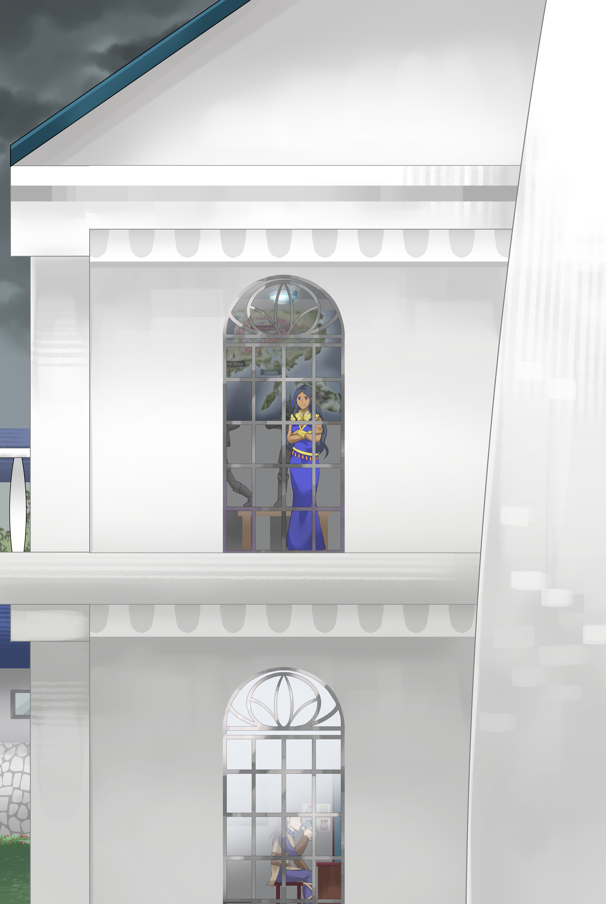

This is a work of fiction. Names, characters, businesses, places, events, locales, and incidents are solely the products of the author’s imagination and are used in a purely fictitious manner. Any resemblance to actual persons, living or dead, or actual events is purely coincidental.

Art by Mitsukiven

© 2023 Deovandski

Do not share, print or distribute in any form without written consent from the author.

**Contents**

Prologue

Chapter I – What If?

Chapter II – Sanbi-Eye

Chapter III – Fake Harry

Chapter IV – Lab Experiment 

Chapter V – Growing Remorse

Chapter VI – Lab Passion

Chapter VII – Buhraies Research

Epilogue

Afterword

**\[INSERT WORLD MAP HERE – WILL BE THE SAME EXACT SAME AS BOOK 1 AS IN EXPANDING THROUGH TWO PAGES, AND HAVING THE FOUR KINGDOMS WORLD MAP TITLE ABOVE IT\]**

**Prologue**

# 1 

The stagnantly lukewarm soapy bathwater felt serene when paired with the fost lamp mildly hissing, lighting up the bathroom he was in. He felt like he hadn’t moved in an eternity—or not. As he was lazily glancing towards the open window, the outside felt familiar. A specific time of day, or even which day it was, allured his conscience. *Hmmm*, the thought of poking his head out of the window came through, but just something about doing so felt foreign—perhaps forbidden? He seemingly had nothing due today anyways, so the faint thought now slipped out of his mind like a silent fart in the middle of the night.

Looking forward, he paid close attention to the curves of the shadow’s petite body frame. Something about it seemed really familiar, so much so that Harry could almost see its fiery red hair in the shadow and the maidly black headpiece that would typically sit on top of it. “Sora?” His weakly inward call didn’t echo in the bathroom; instead, it felt like it had just traveled into a void, forever lost.   
The energetic girly voice that would be a telltale of Sora did not respond to the call; rather, everything in the room remained the exact same.   
*Maybe it is her\!* The gentle touch that washed Harry’s upper back, with perfect rhythmical precision and care, somehow kept on hinting that it was her. *She’s kinda shy and all.* As he kept staring towards the shadow, Harry felt this manly desire surface outwards as his second brain hardened its longing for her. His first brain, meanwhile, was in a stalemate war. One camp filled it with thoughts of turning his head and seeing the true wonders of humanity hidden under her black and blue maidly clothing. The other half seemed impotent, with a mix of fear of hurting her for taking advantage of this situation, all while being scared of an ominous feeling lurking in his chest that could become real if he faced her. As the war in his brain raged on, he slowly filled his lungs to the brim, then let out a long-winded breath that pushed the stale bubbles away in his bathtub.   
*Wait—how did I get here? Wasn’t I fighting Maiara?* The latter faction won the stalemate, now asking that question far louder than anything else. Unable to remember anything immediately, Harry’s mind rewound to his earliest memories. Arriving at a cluster of quite jumbled, corrupt memories he had before awakening at Sanbi Kingdom. These memories somehow felt as if they belonged to someone else. Yet, he felt a strong connection to it—kinda like when you see a video of you from twenty years ago, and you know it is yourself in the picture. Still, you’ve changed so much that you’re no longer the same person. In one of the faded memories, a kid that resembled himself was seated between a couple that had to be his parents. He couldn’t tell their faces or anything about their characteristics anymore, but the feeling of calling them Mom and Dad was there. They were together, chowing down tacos and watching TV, while their chubby black-and-white dog was sprawled on the floor near their feet. They seemed simple, yet they were closely connected and happy, even when the dog farted up a storm that smelled like someone was opening a can of expired canned meat and pairing it with heavily aromatic gutter water.  
Somehow seeing the kid’s nauseated reaction turning into a laugh with his parents didn’t make Harry laugh alongside them. On the contrary, his eyes grew wetter and wetter instead, seeing himself longing to relive that exact moment. Forcing his mind to focus on the parents, Harry still could not see any of their characteristics as he felt this ominous sensation of loss curling through his insides. Within a blink of an eye, the dog disappeared. Trying to look at where the dog was, he then felt his parents call him by a name other than *Harry*, but he just couldn’t hear it. Although, it didn’t matter anymore as the parents suddenly disappeared as well, leaving the kid behind alone, except it was no longer a kid but a much fatter version of Harry drowning himself in food and beer.   
Without a choice in the matter, Harry now saw a mental picture of an even fatter version of himself holding a knife against his own chest. The memory brought a strong desire to end it all, but he just couldn’t shove the knife through his frightened, racing heart. With shaking hands, he lost his grip, letting the knife clank on the kitchen counter as the misery and emptiness of his memories pierced deep into his soul.  
Harry shook his head to get that thought out, but the exact memory crept back in. Now his mind seemed to focus on how the counter looked cheap and old—maybe it wasn’t even a kitchen countertop, since nothing else came up in that memory. *When was I this fat? Clearly, this had to be before I woke up at Sanbi Kingdom, but when? I hope Eiri will find out for me—*  
A sudden mental lock cleared out, bringing with it far more vivid memories, full of details and even stronger feelings—like going from 480i to 8K. Harry slightly smiled, remembering how welcoming Sanbi royalty was after he woke up in the bloodied room that smelled like a wet dog—or, technically speaking, the smell of bagarisa musk. He chuckled inwardly, remembering how once Nina tried to prank him by putting her finger on his belly button then proceeded to profusely gag when she smelled the pungent musk off his dirty belly button for no apparent reason. The same not-so-smart kid dressed in pink was the one to give him his name *Harry* after making a spectacle of it, ending on a high note by nearly falling to her death.   
Another memory popped into his head of that same odd day. It was when Nina threw a rakuja at him at some point during dinner; he could still taste the tangy, sweet juice from the rakuja as it exploded on his face. The chuckles began to wane when he saw Eiri’s and Maiara’s faces. More memories of them began surfacing, specifically when Eiri gave him a pink promise over the secrets she spilled—or rather, her commentary of what really happened to him. *She was so nice to me, but—*  
Harry now remembered the tension he felt when the contract was laid out in front of him for the first time at the dinner table. Even with Itagiba’s drunken stupor, Harry remembered more vividly how Eiri kept to herself while Neferteri kept observing him the whole time. Her demeanor was subtle, but something about it felt far more threatening than the bulging muscles of Itagiba’s forearm wrapping around Harry’s neck, feeling droplets of spit hit his face as Itagiba drunkenly blurted an outward monologue about the king of Sanbi not being good enough for him. *Why did Eiri say all of that if she wasn’t going to help me anyways?*  
“Will it hurt?” Harry’s own voice echoed in his head as his mind skipped forward to later that night, when he was crying on Eiri’s shoulder, having no idea what to do with the offer he was being given. *Oh wait—she did.*  
*Yeahhhh, but look on the bright side\! It’s a one-time thing.* Eiri’s voice felt like a warm lullaby. Soon after, memories of the Gandew duel started to roll past his brain, from facing Maiara in the duel intro where she cursed like a sailor towards him, to being embarrassed when Sora smelled him up and down like a security dog sniffing for cocaine at an airport.   
*When she is about to strike you, raise the Tolerideme shield so that your arm takes the brunt of it, then stab her in the belly with the other hand.* Harry could still feel this sort of fatherly moment from Itagiba as he prepared him for the fight by wrapping an odd shield on his arm and giving him a short sword. But then that feeling grew dissonant when he also remembered Itagiba saying, *That should make things interesting for everyone*.   
*Why did Itagiba help me?* Harry closed his eyes, seemingly blind to whatever else was in the room. A solid answer did not seem to form in his head. *I guess why even Eiri helped me?* He could see their faces in his head, both looking friendly, but he couldn’t feel the same energy coming from them. *Did Eiri ask me to keep this quiet because she feared Itagiba as the king? But isn’t she the king-maid?* A silence grew in his head as he searched for the definition of that strange term. *Why does king or maid alone feel normal, but king-maid doesn’t?*  
The memories of fighting Maiara on the Gandew duel, or Forway duel, or whatever it was called, came to mind; the deafening throbbing pain that he felt from the broken bones still felt real as she struck him with all her might. In response to her attack, he could still hear the crowd chanting his name as he sensed this wired-up feeling taking over him, making him rush with a knife towards Maiara on his turn, only to then have everything go black when he saw her roundhouse kick come flying towards his neck, unable to even react to how quick everything flew by.  
That was until he suddenly gasped, waking up back in the bathtub, sitting forward while Sora was still carefully brushing his upper back in the same spot. Harry wanted to look at her, but it felt like he couldn’t—her tantalizing petite naked body was calling out for him, but he just couldn’t bring himself to actually do it. He wanted to know more, but at the same time, he didn’t want her to stop caressing his back. Plus, the warmth of the bathtub was simply too great. Hugging his knees, at least as much he could because of his massive belly, Harry let out a deep breath, looking at the bubbly water slowly waving around, having a rather calming effect.

# 2 

The stagnantly lukewarm soapy bathwater felt serene when paired with the fost lamp mildly hissing, lighting up the bathroom he was in. He felt like he hadn’t moved in an eternity—or not. Plus, a feeling of déjà vu was growing ever-present. As he was lazily glancing towards the open window, the outside felt familiar. A specific time of day, or even which day it was, allured his conscience. *Hmmm*, the thought of poking his head out of the window came through, but just something about doing so felt foreign—perhaps forbidden? He still seemingly did not having anything that required his attention, so the faint thought disappeared into the vastness of his mind like rain falling in a lake.  
Looking forward, he paid close attention to the curves of the shadow’s petite body frame. Something about it seemed really familiar, so much so that Harry could almost see its fiery red hair in the shadow and the maidly black headpiece that would typically sit on top of it. “Sora?” His weakly inward call didn’t echo in the bathroom; instead, it felt like someone had cast silence on him.  
The energetic girly voice that would be a telltale of Sora did not respond, and she kept scrubbing Harry’s back in the same exact spot as if she were a robot.   
*Maybe it is her\!* The gentle rhythmical, precisional scrub that washed Harry’s upper back somehow kept on hinting at her being there. *She’s kinda shy and all.* As he kept staring towards the shadow, Harry felt this manly desire surface outwards as his second brain hardened its longing for her, now throbbing with carnal desires. His first brain, meanwhile, was in a stalemate war. One camp filled it with thoughts of turning his head and playing with the true wonders of humanity hidden under her black and blue maidly clothing. The other half seemed impotent, with a mix of fear of hurting her for taking advantage of this situation, all while being scared of an ominous feeling lurking in his chest that would become real if he faced her. As the war in his brain raged on, he slowly filled his lungs to the brim, then let out a long-winded breath that pushed the stale bubbles away in his bathtub.   
The fost lamp flickered, coincidentally calling more of Harry’s attention to Sora’s shadow. His mind formed imagery of him grasping and sucking on her tantalizing perky breasts as his hands slid down her body, inviting themselves to her playground. His second brain throbbed firmly at the thought of feeling her warmth. His heart began pounding with an eagerness never seen before while his mind focused on a single purpose of furthering his genes. Harry tried to move his body, but it didn’t obey him at first, so he kept trying. With each attempt, the light coming from the fost lamp seemed to respond with a flicker of its own; the more mental fortitude Harry placed on seeing what had to be Sora’s naked body, the more reactive the light became.  
*Just a bit more\! C’mon\!* The muscles on Harry’s neck and upper body began bending to the will, allowing him to peek more into the familiar bathroom he was in—his clenched-up face and gritted teeth looked like he was trying to pass kidney stones rather than trying to stare at boobs. With a sudden sharp turn, Harry’s body caved in and allowed a full view of the girl’s petite body, now scrubbing the air as if nothing had happened. His eyes went straight to her small perky breasts, deliriously calling to be played with. His right hand moved on its own, feeling Sora’s warmth and softness while his index finger and thumb pinched her erect nipples. His left hand was summoned towards his throbbing second brain demanding to be stroked.  
Meanwhile, the fost lamp in the background behind the girly figure began to hiss louder, sounding like a tea kettle boiling. Accompanying that deafening noise was a white light from the same lamp that quickly grew blinding.  
With his eyes hurting from the light, he blinked a few times, causing Harry’s attention to snap back from purely carnal desires, allowing him to see an empty face with only a wild grin staring him down. “No no no no no”—like a snap of a finger, the fost lamp flickered intensively as the petite body began morphing between multiple girls’ bodies, with the grin remaining the same. Amidst his arrhythmic heart, his mind brought back something that seemed to have slipped through the cracks: Harry was sleeping when a girly figure pinned him down and injected something into his neck. He could still feel the large needle penetrating deep into him, releasing a cold concoction into his bloodstream that poisoned his mind and body.  
He felt this sensation within him explode as if he was in extreme danger, and he had to do something right that instant—somehow. His heart pounded painfully hard, and his breathing got so brief he felt like his diaphragm was about to snap. The sound of tinnitus ringing in his ear was like that of a flashbang going off.   
Remembering a girly figure flipping him belly-up during that savage attack in the middle of his first night at Sanbi Castle, he saw a girl with a vicious grin right before she started to suffocate him with her privates. Maybe she had long hair or short hair. It was impossible to tell based on the amalgamation of feminine-looking bodies that created this humanoid-looking figure both in his corrupted memory and in the bathtub in front of him.  
“EIRI\! HELP\!” Harry clamored out loud in the bathroom, snapping back from his memories, but his voice didn’t seem to reach anyone, not even his own ears. He curled away from whoever that was, seeing that humanoid thing scrubbing the air instead as if nothing had happened. Noticing the fost lamp appearing to be exploding as it shone like the sun, Harry tried to get away, but the white light consumed him—

# **Chapter I – What If?**

# 1 

Harry slowly opened his eyes to the blinding light of a sunny day. His head, then his upper body, felt a gust of humid breeze pass by. His nose picked up a familiar salty with a slightly fishy smell filling up the room; it kinda smelled like home. His body felt tender, somewhat warm too. Not only from the sun tickling his skin but from within as well—like that funky feeling somewhere between dull pain and fever you get when going to bed after spending all day playing on a sunny beach, getting wasted on cheap beer while gorging on seafood.

“How are you feeling, honey?” A sweet grandmotherly voice spoke softly nearby. Her older gleeful appearance contrasted the wrinkles in her face, giving her a sense of tenured compassionate servitude. Her red thatch hat was just as bright as her cheery appearance, giving her maid-style black-with-blue-accent clothing a unique look as well. Her body had thicker proportions and well-endowed breasts, which she seemed proud of by wearing the same maid clothing as other far younger Sanbi maids. She masterfully crocheted away, waiting for Harry to regain his senses. “Looks like you had a nightmare, hon?” Her eyes noticed a bump on the sheets, coincidentally where Harry’s second brain would be. “Or a good dream?” Her sweet voice didn’t seem to imply anything—more like just treating whatever that bump was as a fact of life.  
Harry looked as if he had just come out of a stampede. “Arrggh—” His brain was overflowing with warnings—like suddenly, his brain stem, commonly known as the body’s autopilot, disengaged. Harry felt like he had to force himself to stay alive consciously. He felt like he was telling his weakened heart to keep pulsating as he manually tried to draw a pained, laborious breath. Amongst the warnings, an accompanying pressure and dull pain surfaced where his bladder was and radiated down to his privates. He tried to bend his neck forward to see better what was happening, but it felt like his head was as heavy as a solid iron ball.  
The grandmotherly maid touched Harry’s forehead. “It’s okay, honey. Your body is still recovering. Take your time.”  
*Ohhh. This sucks\!* A sense of being overwhelmed as he tried to stay alive kept going, but it didn’t appear like he was on his last breath—maybe the last ones based on the agony. He tried breathing deeply again, but it didn’t hurt as much this time. He tried to lift his neck again; it was still cumbersome but not as heavy as before. His eyes were no longer sharp, but the blurry ceiling he stared at was familiar. He then turned his head towards the maid, immediately recognizing that he had seen her before when dining with the Sanbi royalty. The clothing reminded him of the other maids, including Sora. That suddenly caused him to catch a glimpse of the dream, or nightmare, or whatever it was, where Sora was washing his back with a massive grin on her noseless and eyeless face.   
The grandmotherly maid glanced over quietly, still crocheting away.  
Feeling an ominous sensation invading his brain as Sora’s vicious grin lingered on his mind, a notoriously familiar sense of having just gulped five energy drinks at once struck him like a train. The wired feeling pushed his body to sit up, but as he groaned to do so, his body just tweaked slightly instead as this eerie feeling kept making his heart pound harder, at least as hard as it could pound. More memories began flashing back to him, including when Sora licked his neck during the check phase of the duel with Maiara. *I need to tell Eiri\!* Harry fought his body to say or do something. His hands did go up a bit but then came back crashing down as he muttered, “H—w—”  
“Oh, honey—I told you al—”  
Sounding like a heavy smoker, Harry let out a cough filled with phlegm stuck deep in his lungs, almost choking himself in the process. “—where’s Eiri?” His voice sounded a bit croaky. “king-maid?—”   
The caring eyes of this older maid looked up to the ceiling in search of an answer. “Today is Tollday—oh\! She’s getting caught up with paperwork with Sora.”  
*Sora\! Oh no\! What if it was her?* Harry tried to sit up again, but only his hands complied with the request—until they came crashing down against the comfort of the bed sheets as they grew limp.  
“Oh, hon\! Don’t struggle so much\! I’m here for you.” With dull eyes and a downturned smile, the maid looked at Harry’s labored, pained breath, like he had been forced to run a marathon at gunpoint.  
“But—Sora. I have—to go\! I need—to tell—Eiri\!” The words barely came out in between his breaths. His dilated pupils looked at the maid with all the remaining will he could muster, as the vision of being suffocated by a girly figure was prominent in his mind.  
“I can’t bear this anymore.” The maid spoke under her breath, putting her crochet kit back in the thatch bag and pulling out a vial about the size of a shot glass with a cork holding back a black goo filled to the brim. She brought it closer to Harry’s lips, apparently awaiting him to open his mouth. “Please don’t tell anyone about it, hon\! Eiri told me to do it without anyone seeing it.”  
Harry felt a familiar sweet honey smell from the black goo hit the back of his nose with such intensity that it was repugnant. His empty stomach curled up, forcing him to dry-heave like some cats do when smelling cheese or sour cream.  
“I’m sorry, honey. I know it’s strong, but you will feel much better.” Her eyes shone with the worry of a grandmother who is told she can’t feed her grandkids whatever she wants to. “King-maid told me I couldn’t bring you back to how you looked before because it was an order from the queen. I’m truly sorry, hon—I can only give you this much black honey.”  
*Black honey—yeah*. The memory of Arukia’s tea came to mind. Opening his mouth, Harry began tasting this honey’s molasses-like taste characteristics, plus the crystallized sugar’s grainy texture as it rolled down his tongue. His stomach was on the fence at first, but then it made peace with it. *This is not as bad as the stuff Arukia gave me.*  
Carefully pouring the rest of the black honey into Harry’s mouth, the maid went to the bathroom to clean away the vial. A familiar gush of angry water sounded from the bathroom when she pulled the handle above the sink.  
Harry was mesmerized by the familiar blurry ceiling as the gush of water filled the background, louder than the noises from the city and birds chirping outside. A natural radiance of energy began to spread from his throat into his guts and outwardly into his body. Harry felt like someone had just transplanted his brain into a new body full of energy—the same energy you get when you wake up late in the morning without an alarm clock on the weekend and have a hearty breakfast with an excellent export-grade roast coffee. With a coughing fit, as he sat up in bed, Harry cleared his lung and felt the leftover sweet taste of the black honey taste mix with a salty, foul taste of the phlegm that was nearly choking him before.  
“Here, hon, spit on it.” The grandmotherly maid rushed back into the bedroom with a pot.  
Harry let out a phlegm that looked like a slime you would fight in a JRPG game—if you looked closely, you could almost see it coming alive and awaiting its turn to attack. With narrow eyes and curled-up lips, Harry felt a wave of gagging coming in the distance in response to the foul salty taste, but the sensation of being able to breathe freely counterbalanced it.  
“Feeling better, honey?” The maid touched Harry’s neck and shoulder all over. “How’s your neck feeling?”  
Shivering from the touch of her cold hands, Harry cracked his neck by just moving it slightly. It was tender, but it seemed to be working fine. “I think so.” Embracing the left side of his neck, a flashback of Maiara’s leg rushing towards his neck sprung on him. “So—what happened?” Harry looked around the blurry familiar room. Everything seemed to look the same when he went to sleep. The drawing of the old Itagiba-looking guy fishing in the clouds and the desk where he signed the contract were still there, but he couldn’t see the bloody mess he had made—even after squinting his eyes. The fost stone lamp was still on the nightstand, but this time it was dead, revealing a whitish pearlescent-like stone inside the glass; removing the sheets covering his lower body, he noticed he was wearing nothing but a blue-with-white-stars boxers. *I don’t remember wearing this—AH?\!* Something else, or rather the lack of something else, called to his attention—his gut was gone. “Wait\! When did I lose all of this weight?”  
“During the past days.” The grandmotherly maid spoke from the bathroom, raising her voice above the angry gushing water as she cleaned the phlegm-filled pot.  
“Days? But—but I fought Maiara this morning\!” Harry placed his feet on the cold wooden floor and peeked towards the open window, seeing a sunny day shine down in the lively city. “*Ahh*—right?”  
“You fought Maiara on the morning of Paulin fifteenth. Today is the seventeenth, close to Sunnohigh right now.” The maid returned from the bathroom and hid away the vial deep in her crochet kit with a victorious smile on her face—if one were to guess, it’s not every day a lovely old grandmother goes against the rules. “I’m really sorry, honey, but when you lose that much weight that quickly, you will feel funny for a bit. King-maid told me that the queen’s order was because of the Sanbi-eye job.”  
Harry touched his beating heart. “So—you’re saying—I actually died?”  
“Yes?” The grandmotherly tone of the maid was still there, but her eyes seemed rather puzzled as she brought clothes to Harry. “You know what, hon? I saw the fight too, and you had it rough.” Going back to the same crochet bag, she dug around and pulled out a rectangular thatch box and slid it open, revealing a yellowish-with-red-chunks cake the width and girth of a finger inside. “Here’s a consolation prize from me, so keep this just between us, okay?”   
With a rumble, Harry’s stomach groaned over his full bladder, still pressuring him. Picking up the cookie from the thatch box, he looked at the maid’s caramel eyes. “Thank you—*ahh*—” His mind drew blank, not because he forgot her name, but surely never heard it in the first place.  
“Aurora Toleri—sorry. Sanbi. I lived over there for a long time. Pleased to meet you, Harry.” Aurora tipped her red thatch hat with a significant smile—one that enhanced her wrinkles but one that would make you beg to replace your grandmother with her.  
The excessive crunchiness of the finger cake was scraping the roof of Harry’s mouth. That was at least until his teeth dug into its center, giving away a moist filling with red chunks inside. Like orange yet tarter, a sweet, tangy taste contrasted the crunchy outer outside. It was so good that Harry closed his eyes and clicked his tongue, chowing it down with a loud humming—like a kitten tasting meat for the first time. As he kept chewing it, the red chunks grabbed all the attention by releasing a crisp apple-like flavor into the mix. Within three bites, the cake became one with Harry. “*Hmmm*—this is really tasty\! Thank you, Aurora\!”  
“You’re welcome\!” Aurora remained standing up, now looking at the clothes laid out by Harry. “Honey, do you need any help with that? You don’t need to bathe; I did that last night.”  
Harry’s face reddened as he imagined the situation, feeling a certain defenseless vibe rising as he was dead or passed out—or whatever state he was in. “Eh—I think I’m feeling better now. Thank you—for taking care of me\!” His eyes got the courage to look at Aurora’s caramel eyes, still showing the same genuine caring as before.  
“You’re welcome, hon\! In that case, I’m going to go ahead and let King-maid Eiri know you’re awake. Take your time.” The maid gave another big smile as she picked up her crochet bag and left the room, closing the door carefully to avoid making too much noise.  
By himself now, Harry could only hear Aurora’s footsteps slowly clacking on the stairs while the familiar rustles of the city and gusts of humid salty wind rushed into the window. “Wait—these clothes are different.” The clothes Aurora laid on the bed beside him didn’t look as fancy as his previous clothes. They had a brownish base color, with Sanbi blue scales as accents. *This looks like a company logo?* On the right side of the shirt, there was also a Sanbi fish drawing sewn into the clothing. *Oh shit\! I really need to pee.* Harry let go of the shirt and walked stiffly towards the bathroom. His bladder somehow made this issue even more urgent the closer he was to the oddly square toilet.  
Harry propped himself forward to ensure he wouldn’t fall backward by the sheer force and volume of the torrential pungent dark yellow stream coming out of his body that smelled worse than the bar’s back alley—maybe his urethra feeling like it was about rupture overstated the actual amount coming out, but in case like these, facts don’t matter, feelings do. Harry’s eyes drew attention to the bathtub where the dream, or rather, nightmare, or perhaps a past reality, surfaced. He could feel as if the same vicious-grinned girl was still sitting at the bathtub, waiting for him even though she clearly wasn’t there. His breathing became shallow, and his heart began to rise again as he was getting close to finishing peeing. As this chaotic feeling inside him took hold, a sense of urgency struck him. Or perhaps it was the incoming gag that came next. Taking a step back as a cold sweat rushed through his body, Harry propped himself on the nearby sink so tightly that his knuckles turned white. Tinnitus then struck him like a flashbang. With a pained groan, he held back the incoming gag with his dear life. *I HATE THIS\!* His mind was growing tired of whatever the fuck was happening inside him.   
In the back of his mind, a thought rushed by. Perhaps this whole thing was nothing but a vivid bullshit nightmare fueled by several sleepless nights of working in a meaningless cubicle job that he compensated with binge eating like a hog. He must still be plopping his big fat ass on the same old fart-soaked recliner with beer on one side and tacos on the other. *C’mon\! Just wake me up already\! I wanna go home\!*  
	Except, no alarm rang for Harry. This wired feeling slowly dissipated as his memories kept churning in his brain, taking away from the fact that he was somehow still alive despite having a heart attack at some point. *Maybe that was the nightmare, and this is my reality? Wait. But then why stuff still feels weird here?* Harry looked at his moist eyes and pale face.   
	No answer came to mind.

# 2 

Harry made his way into Sanbi Castle, walking into a familiar mix of a parlor and game room located on the southeast corner. “Maiara?” Harry blurted out, looking at a blurry image of a girl that had to be Maiara—or Itagiba dressed in drag. It was kinda hard to tell.   
“Are you retarded? I’m Yacamim.” The girl finished pouring herself a bright green drink. Her hair was loose rather than tied in a pigtail. Her blue base cloth with leather overalls clothing seemed close to Maiara’s, but not quite the same. It also looked really pristine, like she had just bought it. Not even caring to make eye contact, Yacamim stuck her finger in the drink, gave it a nice swirl, then sucked it clean before hamming a large gulp down.   
“Yo\! So, I guess you’re the Harry guy?” A stronger-willed gruff voice of intense bass came out of the scary-looking large humanoid sitting at the bar by Yacamim. It was a Darfaries, a humanoid species known for its large size with girthy tusks, floppy ears, and a nerve resembling a varicose vein that pops up from the tip of the middle and ring fingers and travels through the back and down the other hand.   
Harry couldn’t help but stare at the badass-looking red and green mohawk. The flashy silvery ear piercings looked really, really cool, too—or an indication that he was a power bottom. Either way, he was a true adventurer; his chitin and leather outfit looked sturdy but not too over-cumbering in its weight. “Y—yeah? That’s me.”  
“So, that’s him, huh?” Yacamim measured Harry, pouring the leftovers from her shaker into the glass—most of it at least, as she seemed too buzzed to care, or she’s not the type to care about it to begin with. Letting out a single long, wet inwardly burp, she began walking away in a mostly straight line. “No wonder sis whooped his ass.” She tonelessly but loudly spoke to herself on her way out.  
“Hey, aren’t you gonna make a drink for us too?” The Darfaries seemed attentive to Yacamim’s muscular but still feminine body as she kept on walking away towards the exit to the atrium, where the stairs to the second floor, bathrooms, and kitchen door were.  
No answer from Yacamim. At least not verbally; a single flip of the bird raised on her hand as she took another sip of her drink, going out of sight.  
“Hehehe. Go figure.” The Darfaries adventurer raised his deep voice towards the open door where Yacamim had just walked through. “Hey yo\! Monnahigh at Shaved Bagarisa?”  
“Yea.” A loud womanly voice, slightly gurgly from perhaps taking a big gulp, echoed in the atrium through the half-open door. It was for sure Yacamim.  
“Aiight. Harry, my man, pleased to meet ya\!” The massive man stood up and looked down at Harry, not in a threatening manner, but rather literally, as he was almost as tall as a skyscraper. He opened both hands, then raised them high up in the air. Spreading his feet apart to lower his height, he puffed his stomach towards Harry. “Come here, brotha\!” It sounded like an ultimatum, not because of the cherry tone but because it was this brute of a man just speaking up.  
“*Ahhh*—hi\!” Harry froze up, seeing this ridiculously buffed man, even more so than Itagiba, standing in a weird pose, asking Harry to come at him. “Ehh—I’m sorry, but—I need to go see Eiri.”  
Apparently, the massive Darfaries man quickly didn’t seem to take kindly to being left hanging; at least one could tell by his souring face as he kept on holding the pose. Somehow, his large tusks now looked quite pointy and threatening. “No shit\! You really don’t know about the Darfaires handshake?” Pure disbelief coursed through his voice as his large eyes stared Harry down—like a guy trying to pick a fight with you at a bar.  
*Oh shit.* Harry remained frozen, “Eh—sorry? I-I don’t know. I-I—I just remember waking up a few days ago and—”  
“Spare the deets. I got the gist from Itagiba.” This brute pointed towards the door. “Her sister went overboard like usual.”   
“OH?” A gasp came out of Harry. Feeling his tension washing away, he blurted out, “So—Maiara is always like that?”  
“Yeah, she’s always trying to prove that she’s better than Yacamim—at least she’s good at Homeegg.” A more soothed, but still just as deep, voice came from the Darfaries male as he kept on holding the strange pose. “Aiight. Repeat what I’m doing.”  
*Homeegg? Huh—interesting.* Harry did as told, but now he no longer had the same belly as before, so there was so much puffing out he could do.   
With his hands up and feet spread apart, the humanoid mountain of muscle began approaching him and spreading his feet even more apart in an attempt to level the plane field—as in trying to touch belly to belly, hand to hand. He then stared at Harry’s eyes with a display of willpower that looked like he was about to declare, *DESTROY ALL HUMANS\!*   
Harry could feel this odd ritualistic bonding happening with him, but he couldn’t break away. Even his respiration froze for a few seconds. He sealed his lips tighly, worried about a possible sloppy kiss.  
“HIROMI GANDEW TOUGH-HAMMER\!” The voice reverberated through the parlor with such intensity that the window shook. “Now, say your name.”  
Harry’s ears rang. With spit on his face and a burst of weirded-out estranged laughter, he felt the ritualistic energy taking hold. Remembering what his badge said when Kibe handed it over to him, he shouted back, trying to match the same firmness as the behemoth of muscly humanoid, “Harry Sanbi\!” It wasn’t a bad attempt, but not even close to Hiromi’s.  
“YES\! That’s how it’s done\!” Hiromi let go of the pose and embraced Harry with a friendly, brotherly tight hug. “Glad you came back\! Now let’s celebrate life\!” Walking behind the bar, he perused around the alcohol cabinet. “Do you remember having lolish-floaters?”  
“No—wait. I actually need to go talk with Eiri first\!” Harry pointed towards the still half-open door Yacamim had left through to the atrium, remembering the royal offices were upstairs.  
“Pfff—there’s plenty of time\! It’s only Sunnohigh\! Celebrating life comes first\!” Hiromi searched the cabinets down lower, making rustling noses, including a noise akin to opening and closing a chest freezer. “Aww. Yes\! There you go\! Fresh gyut, and lolish\!” He pulled out two small wooden containers. One was filled to the brim with a fruit that looked like cherries but with color hues between red and orange spectrums, while the other was a piece of root that seemed pretty close to ginger. Hiromi checked the shaker Maiara had left behind but then shoved it aside and grabbed a far bigger one from the cabinet—capable of holding enough booze to make a typical human forget everything bad, good, or even life itself. Placing all the gyut berries inside, he grabbed a muddler and muddled the gyut as if they had dishonored his family.  
*Is that how you do it?* Harry couldn’t stop gazing at the pure muddling muscle action. He looked at his own arms for comparison, and they were downright feminine compared to Hiromi’s.  
With the somehow still intact muddler set aside, Hiromi went after the lolish root next, pulling out a smaller mandoline slicer from a specific cabinet below without even having to search. The slicer was made out of slightly discolored wood with a steel blade in the center that had seen better days—it looked ready to be retired, but the beautiful green and blue tribal carvings built into it were probably the reason it was still in use.   
Harry kept looking, assuming Hiromi would abuse the slicer like he did the muddler, maybe even break it in half. However, he didn’t seem to apply all his pent-up anger to it. Instead, he moved the root on the slicer with good enough precision to avoid slicing his giant hands in the process, making several slices of lolish root, some thin, some not so thin. The slices were being plumped on the table. When he was done, he waved the slicer in the air to dry it, letting juices drip all over, before shoving it back on the cabinet below—perhaps the real reason this mandoline slicer was fucked up wasn’t age after all, but abuse by certain functioning alcoholics.   
Next in line was a specific bottle containing a clear white spirit Hiromi grabbed from the alcohol cabinet behind him—it had a small handwritten label hanging from the side, looking like it was either a small batch or homemade production. Pouring the whole thing into the shaker, he gave a silent sign to Harry as he placed the empty bottle back on the cabinet; he grabbed another clear white spirit that looked similar and kept pouring until the shaker was overflowing. He tightly capped it with the strainer and cap, and then began to shake the shit out of it with ultrawide motions that would for sure make an ordinary person strain—if his hands slipped up at any point, booze and fruit flesh would have painted the walls, floor, and ceiling of the parlor. One could safely presume it would cause enough grief for Eiri to snap, flip her shit, and cut Hiromi’s balls off.  
Meanwhile, Harry remained sitting, silently appreciating the showmanship displayed as Hiromi finished swinging the shaker widely, then not so masterfully poured the contents into two glass containers—a mug that would get you drunk and a jar that would put you in a coffin. Finally, he tried to pick up the sliced lolish roots with his big fingers, but they kept slipping through—the table and his hands were soaked in booze.  
Harry let out a chuckle. “Can I help?”  
“No\! I got this\!” Hiromi placed one hand at the table’s end, swiping the booze-soaked sliced lolish off the table and into his hand. He squeezed the excess back into the table and plopped the sliced lolish into both drinks. With a triumphant smile, he wiped his hands on his armor. “Aiight\! Let’s go\!”  
With a hearty amount of booze in his hand, Harry brought it close to his nose. The smell of something akin to gin mixed with vodka was strong, but it went along nicely with the fruit’s tropical, tart, sweet smell. Meanwhile, the gingery aroma of the lolish kinda went along with the rest—like the ginger that comes with sushi. Although, usually, those are a palate cleanser between shoving sushi into your gullet, not part of the experience per se. Cheering with Hiromi, he brought the drink to his mouth and sipped. *OH FUCK\!* Harry’s mouth felt like it was on fire, and the source of the fire was now invading his throat, choking him. His breath felt like he was inhaling ghost peppers.  
Bursting out laughing, Hiromi almost choked on his drink as well, seeing Harry looking like he had just drunk gasoline. “I think I did it a bit too strong—oh well, you will get used to it. By the way, have you been told the story of how I met her?” He pointed towards the door to the atrium, where Yacamim was long gone.  
*Ufff. This is really strong.* Harry shook his head, trying to take another sip to see if it improved his situation. “I—” he coughed up. “Never seen—” He kept coughing. “—Yacamim before.”   
“Really? Well, then this will be like a what-if story for ya.” Hiromi sat by Harry, wetting his lips with his coma-inducing jar of booze. 

# 3 

Harry took another sip of his strong drink, vividly picturing *The Dead Wozen* tavern Hiromi was describing, including the other adventurers with him.   
“Why do you expect me to be all happy and shit about this?” Kaiana spoke up gratingly, waiting for an answer as she sipped her beer. She was a woman of minor port gifted with cutesy, youthful attributes and spirited energy, somehow endowed by disproportionately large breasts that attracted attention whenever she went—or known as *Oppai Loli* for the cultured ones.  
“C’mon, Kaiana\! I was just saying—” Hiromi took a gulp of his beer. The glass was twice as big as hers—so big it had to look bigger than her head. “We got it done\! That’s what matters\!”  
“And for what end? To have this dead meat drain all my nari stones?” Kaiana slapped hard on the table, making a nice echo in the bar and catching a few glimpses that didn’t seem to care about her babbling—but were interested in her jiggling. She looked towards Takeo with a bitter dammed smile—the kind of smile that a boy will never forget because that’s when they realize they goofed it up and there’s no taking back.  
Takeo was sitting silently with a ponderous face. He didn’t seem to take the bait.  
“Not only did we not make any profit; now we’re wasting personal funds here\! We need to be out there\!” Kaiana waved outwardly, letting her unnatural gift jiggly around freely.  
“Just let it loose a bit—it will all work out\!” Hiromi gently said, taking another gulp. His eyes glanced towards Kaiana’s breasts for a sec before looking back at his mug. “You two ready for food?”  
Takeo politely declined with a slow shake of the head, standing up as he stated monotonously, “We finished the quest. We celebrated. We all spoke our minds. Now we say our goodbyes.”  
“SO YOU’RE GOING TO LEAVE JUST LIKE THAT?” Kaiana angrily shouted at Takeo, who was walking out of the bar with determination in his step and not even a glint of wanting to look back.  
“Just leave him be.” Hiromi watched him disappear out of the door. “He didn’t speak his mind, but I guess not saying anything is also saying something?”  
“Ow, fuck off with that\!” Kaiana took a sip of her drink. “You’re the one who introduced him to the team anyways. Do you have someone else that doesn’t suck as much?”  
“Maybe?” Hiromi finished his drink with a nice chug. “I mean, not everyone can handle your sassiness.” He belly laughed, letting his tusks enhance his wide grin.  
Kaiana crossed her arms underneath her enormous boobs, making them even more salient. Her silent pouting seemed like a chord was struck. “Fine—he did give me his cut after all. Still, we could have made much more if he didn’t act alone, so it’s his own fault, dammit\!”  
Raising his empty beer mug and shaking it in the air towards an unsuspecting server, Hiromi’s lips longed for more happiness liquid. “Can’t argue with that—well, she ain’t looking towards here, so I’m gonna walk up there instead. Need anything?”  
“I’m not hungry.” Kaiana stood up, adjusting her large wizard-like white-with-black-and-red-accents hat, then her alluring tight-fitting color-coordinated clothing that revealed her slender belly with a perfect belly button. “Thanks for the beer, Hiromi\! Send me a winga mail if you do find someone that doesn’t suck as much\! I will do the same if I come across a decent party.”  
“Aiight.” Hiromi also stood up, approaching Kaiana with his hands up and belly facing forward. He then lowered his hand to match her height.  
Kaiana pulled a chair, then stood on it—perhaps she was aware enough of their height differences that, without a chair, her head would be awfully close to Hiromi’s junk when they touched bodies. Matching Hiromi’s pose, she got face-to-face with him. “KAIANA DELTACROSS\!” She shouted in the bar, catching everyone’s attention as her breasts got squished against Hiromi’s armor.  
“HIROMI HIGH-GANDEW TOUGH-HAMMER\!” Hiromi said in a powerful, deep voice, echoing in the bar loudly enough to be far above the chatter. The Darfaries folks amongst the crowd, who were few and far between compared to other races, seemed to almost in unison raise their mug towards them—like a sort of acknowledgment. Meanwhile, most of the others present didn’t seem to give two shits.  
Kaiana and Hiromi smiled at each other as they finished the ritualistic Darfaries hug, then Kaiana jumped out of the chair and waved goodbye as she walked out of the door.  
“Might as well eat my fill.” Hiromi walked with his empty mug towards the bar when his eyes caught a glimpse of a well-built guy with fantastic long, voluptuous blackish purple hair. He gawked at his shining hair, touching his own perfectly cared-for mohawk to compare. “BROTHA\! YOUR HAIR IS AMAZING\!” He grabbed this guy’s shoulder as he rested his body against the wooden countertop, clacking his chitin armor. “What do you—OHH NO\!” Hiromi’s pupils flared up, realizing his grave mistake.  
The bar chatter quickly died down, as if everyone’s mother was insulted simultaneously. A tense atmosphere took over the place as if a grand jury were about to state their verdict to the defendant.   
The “guy” with amazing blackish purple hair slapped Hiromi’s hand away, then took a big gulp of “his” beer.  
“YOU’RE NOT A DUDE\!” Hiromi blurted out in a panicked voice, for sure getting caught up as to why the room was so tensed up.  
Without notice, a fist flew through the air from the “guy” and flattened Hiromi’s noise, sending his body backward, clashing against a table, making beer and food fly everywhere. With a bloody fist, this “guy” kept staring murderously at Hiromi. “I’m Yacamim, you meathead fuckwit. Remember the name next time you try to fuck with me\!” Yacamim cleaned away her bloodied fist on her own bluish clothing and then pounded the rest of her beer as if nothing had happened.  
Hiromi, coming back to himself, stood up as food juices, beer, mead, and blood dripped onto the floor. With a straight face, quite literally since his nose flattened, he slowly raised his hand to check his green and red mohawk. Not only was it soaked in all kinds of substances but he felt that part of it also got chopped off. His uneven breath, open wordless mouth, and wide eyes glanced at a sharp weapon on the table. Right by it, he saw the missing piece of his mohawk resting peacefully on the table. If he had an aura that instant, it would have turned bright red and blown up the bar into smithereens, killing everyone around. He began screaming with such horrendous guttural violence that his vocal cords were about to snap. Without hesitation, his bloodshot eyes aimed at the perpetrator, Yacamim. He ran towards Yacamim with a punch, ready to explode her brains out.  
Uncaringly walking out of the bar, Yacamim had her back to Hiromi, but his guttural scream gave away his intention. Evading the brain-exploding punch at the last split second, she blocked two more punches from this massive humanoid, ready to tear her limb by limb. Everyone could hear her bones splitting and cracking with each blocking, yet she seemed to swallow the pain with ease.  
Hiromi threw a four-punch streak with all his might, but Yacamim kept evading and blocking everything. “I’m too drunk for this\!” He defended two sloppy punches, and then a solid kick from Yacamim that took away his breath. “Fu—” He couldn’t even curse as he felt his chest muscles tearing under the skin. Redoing the same punch streak again, but on the last punch, he faked it out, then threw a forward kick with all his might, probably to show her off his own lower body strength.  
Yacamim lost her balance, possibly a combination of booze and assuming that this colorful-looking adventurer was a mongoloid beast.  
With this opening, Hiromi then punched squarely on Yacamim’s face, throwing her backward. “Not bad for a human girl\!” He made a low, hoarse belly laugh as he saw Yacamim splattered on the floor with a flattened nose just like his.  
Meanwhile, the bar was completely lit up\! The verbal bets and cheering in the background filled the room with noise and excitement. “Go, Yacamim\! Go Yacamim\! Represent Sanbi\!” The room blew up even more when she began to stand up, regaining her foothold and tightening her fists in her version strength display.  
As if this kind of event was not uncommon, people started to rustle around, forming an impromptu battleground by pushing tables away and creating a battlefield in the middle of the bar. 

# 4 

The hinge of the blue atrium door creaked softly, breaking through the laughter. Next, a monotonous female voice said, “Hiromi, I see you’re teaching Harry well, but Eiri is waiting on him.”   
Harry gleaned his blurry eyesight towards the familiar black and blue clothing, trying to recognize the taller girl, or maybe girls, wearing it—at first, it appeared like there were two maids, but then it clicked that it had to be the one and only maid Itanema. *Do I even know other people named like that? Eiri\!* Something else far more pressing came to mind. “OH SHIT\! I’m sorry\!” Harry tried to chug the rest of his drink, but it spilled down his face and onto his clothes.  
Hiromi touched Harry’s back and pointed his half-drunken jar of lolish-floaters at Itanema, spilling some on the floor. “Just put it on my tab\! It’s fine\!”  
Itanema’s eyes were drawn to the drink spilling on the floor, then the mess on the bar table. She glanced back at Hiromi with her usual neutral expression—even though she would likely be cleaning it. “There are no tabs here.”  
“Then bring Eiri down here\! We’re having fun, right, Harry?” With a charming but still kinda threatening look, Hiromi looked back at Harry. Perhaps the terrifying part was due to his heavy, warm hand weighing down on Harry’s shoulder like a sack of potatoes.  
Looking at Hiromi, then back at Itanema, Harry flashed a big smile. “Yeah\!” A fuzzy, warm feeling was dwelling inside him—or it was the alcohol filling up his belly.  
“Go ask her then.” Itanema turned around and returned to the atrium, closing the door behind her. “Bring him with you.”  
Hiromi placed one hand by his mouth while the other raised the jar towards the atrium. He shouted brightly, but still in the same deep, ultimatum-sounding voice, “Come drink with us too\! The more, the merrier\!”  
No response came back from Itanema.  
Taking a large sip from the jar, Hiromi let out a burp. “I gotta say, from all my traveling around—Sanbi people are always ready to enjoy watching shit going down. Except her\! She needs to loosen up a bit, amirite?”  
“Really?” Harry yelled out as the images of the duel with Maiara still lingered in his head, specifically when the people were helping him up and even chanting his name. *So they didn’t care about me but instead just wanted the fight to continue? I guess that makes sense.*  
“Yea. You can take that to your soul death.” Hiromi clacked his jar on Harry’s glass. “But anyways, you want to hear the end?”  
With a firm nod, Harry’s mind focused solely on the what-if story—so much so that what just happened with Itanema might have been forgotten already. He took another sip of his nearly finished drink.  
“We just kept going on the brawl. I thought I had it in the bag, but she quickly learned my body cues, even my fakeouts. For a Naked Bruntos, a female Naked Bruntos, mind ya, her kicks were out of this world\!” Hiromi placed his hand on the right of his belly, the upper right region. “She did get one right in my liver that I still remember to this day. She thought I was done for, but that’s when I took the opportunity and charged her with my shoulder.” Hiromi took another sip, taking the time to chew on a few sliced lolish roots. “My memory is foggy after falling on the ground and bashing my head, but I for sure remembered when the room got rowdy when we started making out.” Hiromi grew even redder in the face as he stared into the distance. “I can’t even remember who started it, but yea.”  
With his mouth open, Harry tried to imagine the scene of two people with bloody flattened noses making out—something about it lacked the amorousness of a kissing scene, although it definitely must have been passionate in its own twisted ways.  
Hiromi let out a long hum as his eyes seemed to long for her already. “After we used Body Restore on each other, we went back to her room.” Hiromi let out a smirk, seemingly just talking aloud to himself. “I still remember pulling that awesome blackish-purple hair like it was yesterday. I just couldn’t stop cumming—”  
With a messy spit take going everywhere, including Hiromi’s armor, Harry’s reddened face seemed lost at what to say amongst the coughing, trying to clear the invading alcohol to stop burning his lungs.   
Clearing his throat, Hiromi seemed to have caught up to what he had just said. His big hands swiped the excess drink off his chitin armor as he laughed it off. “They might look alike, but they are pretty different after all. If it was Maiara, I bet that would have never happened—there you go. That was the grand tale, but hey, at least you can still suck on the kingdom’s tits with an easy job\!” Hiromi brought his nearly-empty jar closer to Harry with a bright smile that even made his large tusks shine.  
Harry cackled, raising the glass to cheer. “I never thought it that way\!” A rush tickled his insides—or it was his stomach giving a warning.  
“SEE? It’s all about mindset\! You know what, Harry? You’re cool\! So why not play a bit of territory snipping to celebrate?” Hiromi pointed to the nearby odd-looking dartboard. It kinda looked like a bird’s-eye view of a baseball field—that is, if you rotated the field to make a complete circle. There were multiple zones with different colors each.   
“Yea\!” Harry’s fruity voice sounded like a true adventurer’s. He pounded the rest of his drink, then slapped it back on the messy bar table with a nice clack as he scrubbed his mouth on his forearm, blurting out in a drunken slur, “You’re coolio too\!”  
“That’s the spirit\!” Finishing his massive booze jar with one gigantic gulp, Hiromi stuck it hard on the table, then stood up and stumbled towards the bags of different colored darts hanging on a nearby wall.  
Harry stood up as well. “Ohhhhh\!” His legs were wobbly, and the room felt like he was on a boat, but his steps seemed firm enough that he could walk towards Hiromi. “Oookay\!” He could feel the booze slouching in his stomach with every step he took.  
Grabbing two handfuls of metallic darts with colored feathers on the back, Hiromi handed red with blue darts to Harry and kept yellow with white for himself. “You played this before, right?”  
With his blurry eyes, the board looked more like an avant-garde painting than a dartboard. With the set of colored darts in his hand, there was a feeling of familiarity. “Kinda? Was the board always this big and colored? I thought it was rounded too—” Harry pointed his hand towards the colored squares in the board, almost in reverence to its bright colorfulness. “OH YEAH\! The center is worth more, right? Like we’re scoring to—three-sixty. Right? No less or more?” He squinted his eyes at the edge of the board but didn’t see any numbers whatsoever. *Wait—Maybe one-eighty?*  
Letting out a dissonant hum, Hiromi also looked at the board. “I haven’t heard of that, but yeah, I prefer targeting the yellow ones, as those are worth more if you snipe all territories.”  
“Snipe all territories? That’s—different—I think.” Harry adjusted his pants, feeling his privates glued to his inner thigh, nearly falling backward as he performed such simple task. “Can—can you explain?” Harry released a wet burp that sounded dangerously close to being upgraded into a puke.  
“Aiight\!” Hiromi threw a dart at the board, but it clung and fell to the ground. “Just a hunk—that was me warming up\!” He threw another, and it landed miraculously on a green section close to the center. “Now try to throw on a green section or anywhere else.”  
Doing as told, Harry used all of his strength to launch the dart, but his hand held it for too long, making the dart fly towards the wall and lodging itself below the dart board. Harry’s body almost fell forward, but he caught himself on his knees and held it there for a bit as the feeling of falling forward kept happening.  
“Good try\! Good try\! C’mon\! Try again\!” Hiromi grabbed a dart from Harry’s hand and threw it towards the same green, but it landed far above it in a purple zone. “Aw, my chitin ass\! Anyways, the goal is to land on the same color region to score a point. If you land on a region with someone else’s dart, you two cancel each other out. Ehh—right? Right—right. The smaller the region, the more it’s worth when sniping it. That makes sense?”  
Blinking, Harry stood up slowly as his brain got caught up with the complex rules—at least for his current state. “—Yea? So I play next?”  
“We all play at the same time. GO\!” Hiromi threw a dart, making it land on another purple. He then kept throwing darts as if his life depended on it; with each throw, sweat began dripping on his forehead.  
Trying to get caught up, Harry began throwing darts too, but it looked like he sprayed dartboard repellant on them as most were clicking off the board or the nearby walls. With each dart throw, Harry was slowing down. His face was growing paler, strained. One of his last darts clung tightly against a sizeable orange section in the board, giving him a rushing feeling, or the rushing sensation was from his stomach rumbling as it began its final preparations before pressing the nuclear button. Throwing the last dart as he breathed heavily, the room started to move too much. He clashed against Hiromi as he lost his balance.  
“Brotha—you suck at this—Harry?” Hiromi held Harry; then, his eyes were wide open when he took notice of his paleness. His floppy ears then noticed a dreaded sound of retching coming out of Harry. “Ow, Harry\! My brotha\! Hold it\! Hold it\! HOLD IT\!” With the same worried voice of a husband telling his wife going to labor to hold it just a few more seconds until they get to the hospital, Hiromi grabbed Harry and began to charge towards the atrium at full speed. Clashing against the door, smacking it wide open, he struck Harry’s head against the wall as he lost his balance; Hiromi didn’t even seem to notice it at first.   
Another gagging sound came out of Harry as he held his mouth. Whatever he clashed into gave a nick on his forehead, and he started bleeding.  
“MY BAD\! MY BAD\! WE’RE ALMOST THERE\!” Hiromi’s tensed-up voice sounded like he were trying to defuse a bomb before it exploded.   
Harry groaned as if he was losing the battle. The groans and gags coming out of his mouth sounded worse than a dreaded *cat gag EDM drum beat* waking you up in the middle of the night. He didn’t even know where he was anymore as he only felt a constant rush of the atrium scenery spin around him as the vomit was pressuring the back of his throat.  
“STAY WITH ME\!” screamed Hiromi as he kicked down the bathroom door square in the middle, making a loud boom that sounded like a grenade going off.

# 5 

Feeling like he was breathing fire, Harry felt his body shiver as everything came out from up top in a powerful stream that looked like a geyser from a fire hydrant. Amongst the material things being ejected from his body, Harry felt the voidness and loneliness energy within him being purged out as well. Everything was being violently purged—perhaps alcohol is the interface for soul healing, or it is a temporary placebo before the cruel reality resurfaces when sobriety hits.  
Chuckling, Hiromi patted Harry on the back. “Just don’t breathe it in. Let it all out first. Good job\! Good job\!”  
Doing so, Harry felt his throat burn just as much as when the alcohol was going in. He could feel the waves of vomit swelling deep in his gut, powerless to stop it. It felt like the stomach was puppeteering his whole body; all he could do was fight the urge to breathe.  
“My man—did you eat gyut early on, or is that pieces of your stomach?” Hiromi laughed as he pulled the handle above the toilet, letting an angry gush of water wash it away.  
“I’m—sorry.” Feeling lightweight, Harry dry heaved a few more times, but only thick spit seemed to come out next. His teary eyes, snotty nose, and puke mixed with saliva dripping down his mouth were not a pleasant sight to behold, but his shivering died down, and with it, the feeling of spinning—perhaps that dark feeling inside him too.   
Hiromi pushed the handle, stopping the gush of angry water. A relieved sigh came out of him as he patted Harry on the head, shuffling his short black hair. “Harry—my brotha, good job\!”  
Hearing a boot clacking towards them, Harry glanced at it and saw a blurry of a maid that felt too familiar. Her unnaturally bright cyan eyes and red lips were unavoidable to look at. Her dark brown hair shone against the sun’s natural light poking through the atrium windows, while her almond skin added a mysterious beauty to her aura. The tight blue corset on top of the black clothing enhanced her natural curviness and the eye-magnet power of her breasts. It was none other than Arukia. The maid that teased him to no end. *Does she really like me?*  
“Eww—” With curled lips, Arukia looked away from Harry, who looked half-dead, and focused on Hiromi’s reddened cheeks. “Did you just kick down the door? Why? What is wrong with you? You could just have turned the knob\!”  
Harry felt like a knife had been shoved into his heart when he saw Arukia’s reaction. He couldn’t do anything but look down as he felt like he wanted to curl up into a ball and disappear out of her sight.  
Helping Harry towards the sink, Hiromi glanced back at Arukia with narrow eyes and a sulking face that made his tusks look even more threatening. “I made the job easier for you, or did you want to clean puke off the floor?” His pointed voice sounded like an actual ultimatum this time.  
With a click of the tongue, Arukia clapped back with a sarcastic tone, “That’s not an excuse to blow the door apart\!” She stood at where the door was, looking around the bathroom for something, then suddenly her sensual red lips formed a smirk—it appeared as if she was readying herself for a mic drop with the same energy of a rapper about to fire a you-momma joke in a rap duel. She picked a piece of a doorframe from the floor with a partial imprint of a nonhuman-sized foot with clear indents of a spiked boot. “That’s all the proof I need to make you never set foot here again\!” She hid the piece behind her, winking at Hiromi as she stepped backward. “I’m sure I can even get him as an accomplice.”  
Hiromi stepped out of the room towards Arukia. His balance seemed slightly off, based on how he propped his hand on the doorframe as he stared Arukia down. “Say that to Yacamim’s face—she’s the next queen, after all.” His voice grew more profound.  
Arukia tilted her head up to look at Hiromi; his cheeks and ears were plump and red, but his eyes, mouth, and even tusks looked ready to throw down. With a huff from his nose, Hiromi looked downright threatening—like she was staring at a bull ready to charge. Arukia did another click of her tongue as her eyes rolled back in her head. With her free hand, she waved Hiromi off. “That’s the best you got? You and Yacamim are barely here—why would they hand you the monarchy department?” Pointing back to the parlor, she drilled her finale statement with a gotcha smile, “You only show up because of the open bar\!” She then pointed at a boxy contraption resting above Harry. “Get him some soap\!”  
*I didn’t know that, but I guess it makes sense. Somehow the oldest kid rising to the throne feels like something I learned somewhere—but where? School? Did I go to school?* Harry meanwhile washed his face in the cold water in the sink when he felt something touching him. It was Hiromi dumping a whole bunch of flakes of something in his hand that melted into soapy bubbles. He brought it closer to his nose, and it smelled like mint. *Wasn’t it supposed to be like a bar or something?* He scrubbed it on his face, feeling its soapiness aromatically soapy.  
Hiromi’s threatening expression began waning as he placed the empty soap container back on the shelf. His silence and severe facade came crumbling down as he swung his head in an apparent denial that turned into acceptance. “I’m too drunk for this. You got me there. Fine. I will just give it to you then.” Hiromi turned back and walked closer to Arukia, digging his hand up into his short kilt-like clothing, getting close to his crotch.  
“You already have Yacamim\!” With a reddening face, Arukia put the piece of the door she held in front of her, then threw it at Hiromi’s feet as she backed away, her hands holding her chest.  
“What?” Pulling his hand out from underneath the kilt, Hiromi had a leather bag about the size of his hand—luckily, it was his balls bag instead of his ballsack. “How many balls?”  
Looking at the bag in Hiromi’s hand, Arukia’s eyes seemed thinkative for a second, but then she looked away. “I’m not touching that\! Take that to Eiri yourself.” She sensually walked away, waving her hair around—perhaps trying to tease Harry and Hiromi with her swinging hips to gain upper hand in whatever game she was playing inside her head.  
*Shit\! I completely forgot about that*. Harry was drying his face with a hand towel. “I need to go to Eiri right now\!”  
“Hold a hunk, brotha\!” Hiromi opened the leather bag, pulled out a single amethyst crusted in golden metal, and handed it to Harry.  
Looking at the detailed handiwork of the golden metal, Harry couldn’t stop noticing how pretty but foreign it looked. “So this is what people were talking about costing pearls or amethysts?”  
“You forgot about the balls currency too?” Hiromi seemed ready to give a brotherly goodbye hug, but perhaps seeing Harry bringing the amethyst ball to his eyes like a kid would pick up a frog off the street and scientifically analyze it, he opened his leather bag again. “I don’t have any sapphires—I don’t think I—oh, there it is\!” Hiromi pulled out a single aquamarine, then a few pearls—all the same size, with the same golden metal crust—and brought them closer to Harry’s squinting eyes. “Fifty pearls is one amethyst. Ten amethysts is one aquamarine, and ten aquamarines is one sapphire.”  
“So, the door cost one amethyst?” Harry looked towards the pieces of door scattered on the bathroom floor.  
“Dunno—” Hiromi placed the balls back in the leather bag and shoved it up his skirt, hiding it somewhere most people wouldn’t dare touch. “But I have more drinking to do, and math ain’t my thing. You know where Eiri is?”  
Harry nodded, holding the single amethyst tightly in his hand.  
“Aiight. Come here\!” Hiromi embraced Harry with a big brotherly hug. “Harry, or should I say Sanbi-eye? I hope you have tons of fun, my brotha\! Next time I’m on a quest nearby, I will send you a winga mail for us to meet up\!”  
Harry felt this cuddly warmth coming from this beastly humanoid. His breath smelled strongly of ginger, with a tangy tropical twist, while his armpits developed a strong manly musk that would keep many people at bay. However, Harry was too happy to care for that, so he hugged him back just as tightly. “Thanks, Hiromi\! Brotha\!”

# 6 

Harry presented himself to Eiri in her office with a sloppily clean face. His smile shone brightly; water drops ran from his wet hair, down his reddened culpable face, and dripped onto his shirt.  
With bright eyes of her own, Eiri, also commonly referred to as king-maid, smiled back at Harry. “How are you feeling, Harry? Or should I say Sanbi-eye?” As she was sitting in her comfortable chair, one of her eyebrows rose as she curiously glanced at the single amethyst ball in his hand. “*Hmmm*—whatcha got there?”  
“I’m—” Harry’s smile began to wane, his blurry eyes noticing another familiar face in the room—Sora, the maid that made his heart flutter. Although it didn’t flutter this time, it pounded in his chest in fear. The tinnitus in his ear went off again, sounding as loud as a fire alarm. The awful energy inside him, which presumably was ejected from his mouth not long ago, resurfaced deep inside his bowels. With them, intrusive memories crept back into his mind. He placed his hand on his neck, feeling as if his breath was still being taken away.   
“Harry?” Eiri asked.  
*WAIT\!* Harry looked at Sora’s cutesy petite body, glancing at her hand, which was moving quickly through an abacus while the other hand was writing down things and her eyes were scouring through lines of a receipt. *Was it her?* His blurry eyes focused on Sora’s thin lips, comparing it to the vicious grin of the girl suffocating him in his memories. Maybe it had something to do with his lingering buzz, but something suddenly clicked deep in his mind—*something isn’t right\! The person that did that didn’t have tusks\! The red thingy in the arm—yea\! Darfaries interface\! The person didn’t have that either\! It can’t be Sora* after all—wait—*why did I think it could be her in the first place?* Harry kept staring at Sora, his eyes duller than before, as his hands lowered on his own, hiding away the amethyst ball. *Then who was it?* He openly stared back at Eiri, observing her developing a slightly mischievous smirk; his mind drew blank in an attempt to refuse to believe she was the one.   
Eiri played with her quill as she stared back at blank Harry. “You know, that’s pretty ballsy coming to the king-maid’s office and then flat out ignoring me.” Eiri kept on looking as Harry’s expression seemed stuck in time. “You okay, Harry?”  
*You okay, Harry?* Eiri’s voice reverberated deep in Harry’s brain, snapping him out of his drunken daze. “I’m sorry, Eiri—it’s just—” Harry took a deep breath to fight the tightening feeling in his chest. “It’s just—” The words were not coming out. *It can’t be her, can it?* This feeling that he had drunk a pot of coffee was still there. Looking towards Sora, still just as busy as before, the words in his brain seemed jumbled, impossible to just flat out say in front of her.  
A grin appeared on Eiri’s face; she winked towards Harry, then moved her head to Sora and spoke stridently, “What? Do you want to ask Sora to marry you? You need to take her to the Sanbi fountain first, then scream in front of everyone that you love her to soul death.”  
Sora snapped her neck towards Eiri, then towards Harry, apparently only then realizing that he was right there. Her hands covered her quickly reddening face. Her eyes widened so much they were about to fall from their sockets as her body turned into stone—she even seemed to stop breathing because of how tensed up she was. The winga feather in her hand succumbed to the pressure and snapped loudly.  
As he reddened in the face as well, Harry’s heart didn’t know whether to pound in fear or race in passion. His brain swirled in a mix of emotions as his mouth moved to say something to Sora, but no words came out.   
Like a rabbit fleeing a wolf, Sora jumped out of her chair and exited the room so quickly that it felt like she had superhuman or, more specifically, super-wozefaries capabilities.  
Harry kept on standing there, with an estranged smile and wrinkled eyes forming as the thought of being turned down again was added to the pot of emotions. Lots of words flew through his mind, but he still just couldn’t develop a sentence.  
Eiri let go of her writing feather and stood up slowly. She patted her skirt as she spoke truthfully, “Yeah—you clearly have something you want to tell, so get it off your chest.” She came closer to Harry but then looked to be taken aback as her nose was attacked by something. “WOW—what were you doing? Did you drink lolish-floaters or what? Your BO is pretty bad too\! *Hmmm—*why do you smell like a Darfaries armpit? Didn’t Aurora bathe you yesterday?”  
Looking down like a puppy caught chewing on sandals, Harry showed the amethyst ball again to Eiri. “Hiromi told—told that I should just—enjoy life a bit. I had a bit much and—almost puked in the parlor. He brought me to the bathroom, but he broke the door.” Harry gave the amethyst ball to Eiri. “He gave me this to pay for it—I’m sorry.”  
Eiri placed the amethyst on her desk. “That explains the bang I heard. Well, it’s not the first time he had to pay for stuff either—but he is the prince, so what can I do? *Hmmm*, at least he doesn’t wait until I generate an invoice like Itagiba.” Eiri placed her gloved hands on Harry’s shoulder, profoundly looking into his blue eyes. “But doing that wouldn’t cause your mood to swing like this, right? There’s something else you want to tell me about Sora? I already know you have the hots for her.”  
Harry shook his head, his droopy eyes searching for any other person in the room as his voice gathered its will. “I-I thought I had this dream, but—but now I know that it wasn’t one—I think—*ahh*—it actually happened. Remember during the duel when Sora mentioned my neck?”  
Narrowing her face, Eiri nodded soon after. “I think I—yeah. Yeah. I remember it—hard stuff injected but no longer active\! Yep\! That was it—it was solid proof that your corpse came from the Sanbi slums in some shape or another. Sora wouldn’t lie about what she sensed.”  
“I—this dream I had—I thought it was a dream, but now I remember more—I think—” Harry glanced at Eiri, his voice growing weaker.  
“We’re in this together, but you gotta tell me\!” Eiri let go of Harry’s shoulder and rested her weight against the table, crossing her arm as her perked-up ears looked to be hanging at every word of his babbling.  
“This girl injected something on me—on my neck. I remember it paralyzing me, making my mind murky. I can’t say for sure exactly when, but I think it happened on my first night here.” He closed his eyes, trying to relive it. Inside him, he could feel the anxiety rising. “The ceiling\! The ceiling was the same ceiling as my bedroom, but it was nighttime. The—the girl suffocated me—”   
“What? How?” Eiri’s voice sounded like a verbal two-combo word punch; however, her serious gaze didn’t seem aggressive but instigative for a solid answer.  
Harry felt this ominous sensation of being mocked, but a more potent force within him made him utter, “She sat on my face—I—”  
A burst of constrained laughter sounded from Eiri at first, but then it died down as she seemed to notice Harry wasn’t laughing. “*Hmmmm*—are you sure it is not a nightmare? Like a really vivid one? I mean, some would say that’s a wet dream—” A small smirk broke through the corner of Eiri’s mouth.  
Harry’s voice sounded a bit mixed as embarrassment took over. “Eh—I guess true, sorry—” With a more resolute tone, courage finally came through to face Eiri’s snarkiness. “But I—” He took a deep breath. “I can’t shake off this feeling I’m getting\! I don’t know what to do—it feels awful when I remember it.”  
“Me neither, to be honest\!” Eiri pursed her lips as she held her arms tightly. “I believe you suffered abuse at some point in your life, probably in the Sanbi slums, before Gabiro did something to your soul. It’s like what they say—painful memories are easier to remember than happier ones, so there’s a chance that you didn’t lose your memories but they are locked away instead because they were too painful\! Honestly, I don’t know why someone would do such an unacceptable thing\!” Eiri gasped as she seemed to cheer up; she stood up and looked brightly at Harry’s eyes like she had owned the lotto. “That’s it\! That’s the ticket to remember where you came from\! Do you remember any characteristics of the person? Or exactly where it happened?”  
“But—but what about the ceiling?” Harry pointed up, then looked up as well. “Oh—” Harry’s crap eyes saw the same blurry white ceiling in Eiri’s office.  
“*Hmmmm*—” Eiri pointed at the same ceiling with a smile. “Think of it this way—this ceiling style is more of a Sanbi thing, so it reinforces the point that you were not too far off from here. So who was doing that to you?”  
Trying to surface the memories of the event also brought this anxiety and perturbed feeling alongside it. Harry tried to concentrate on the moment this girl went towards sitting on his face, but the memory seemed floaty, with details merging into one another. “A vicious smile? I’m—not—sure? Maybe long hair? Greenish? Darkish? Or was it short?” The nightmare, or whatever that vivid thing was, where Sora had a similar vicious smile, seemed to be interfering with the memory of the nightly attack as well, making the person who suffocated him appear even more so as an amalgamation of multiple people. “I can’t tell for sure—it’s all blurring together\!”  
Eiri sighed as the shine in her eyes faded. “It couldn’t have happened within the castle grounds. There are always guards at the main entrance, and my maids are handpicked and vigilant—for all we know, the memory seems so vague that it could have been a guy. I’m sorry, Harry, I am\! But all I can say at this point is to have you keep trying to dig through your memories. They must have injected some nasty stuff to scramble your brain, but if you get me any specific details, then I can help you by opening a missing person search quest\! That way, we can gather hints of someone who crossed paths with you without accusing anyone\!” Eiri gave Harry a motherly hug. “Not that I don’t want to bring justice to whoever did this to you, but we can only accuse someone if we have proof. Or we’re the ones who will be punished.”  
Harry smiled softly as his head rested on her warm shoulder. “Thanks, Eiri\! I don’t know either, but once in a while, I have this thing inside me that makes me feel like my heart is about to explode if I don’t do something about it. But I just don’t know what to do\!”  
Eiri let go of Harry, firmly holding him by the shoulders, then caressing his head. “That’s PTSD right there\! I heard something similar from a friend who cared for an older adventurer too. His whole party got wiped out by a massive walking flathead when they pushed too far into the depths of Bahyum Castle. He would start sobbing uncontrollably out of nowhere, sometimes even trying to kill himself, or get naked and run around screaming from the top of his lungs.” Eiri pointed towards the portrait on the wall of someone who looked awfully close to her. “I bet it is not easy to deal with that, but Mom always said to make life your bitch, not the other way around. *Hmmm*—so make life your bitch and have it choke on your little thing instead?” A chuckle came out of Eiri as she pinched Harry in the side of his gut.   
Harry forcibly laughed as he felt the small leftovers of his once enormous love handles being squished. He tried to defend them against Eiri’s pinches, but her pinching abilities were far too masterful.  
“For real, though, this is your opportunity to shine as Sanbi-eye\! Go out and have fun\! A friend said that PTSD is basically the past trying to screw over your future, so try to focus on the future instead\!”  
A warm feeling arose in Harry, contrasting that annoying feeling lingering within. “Thanks, Eiri\! I guess I will\!”  
“Or if you want to hear Itagiba’s pep talk—” Eiri chuckled, deepening her voice, and slapping Harry on the shoulder. “Harry, my man\!” Eiri grabbed his head from the top with a handful. “You need to get out of your own fucking head\! You’re too deep inside\! Don’t worry about it\!”  
Harry could nearly see Itagiba apparating in front of him. *I—guess so?* A chuckle of his own broke through the ominous feeling stirring in his chest. *I have to enjoy this Sanbi-eye thing.*  
“I’ve been working on this one for a while. Glad it worked\!” Eiri smiled cheerfully. “Now, are you ready? How’s your stomach feeling? Do you need anything to eat?” Eiri checked Harry’s new uniform out. “Actually, since you shared your secret, I will share mine too. You look better with less weight, but I still don’t agree with the monarchy’s department, or rather Neferteri’s decision.”  
Harry touched his stomach; it felt a bit tender and very empty. “It felt really weird at first, but I think I’m getting used to it. Actually, I’m not sure if I am that hungry at the moment. I think I drank too much.”  
Eiri began leading Harry out of the room, pushing his back towards the door. “Let’s get you some water and food then\! At least I can help with that\!”   
“Can you also help me with my eyesight again too?” Harry carefully stepped down the stairs, aggressively squinting his bad eyes to see a little better.   
“Dang it. Aurora gave you Nari Refresher. *Hmmm*—I think there’s still a dose left from the one Eori made for you. Let’s go bug Kibe right now\!” Eiri chuckled. “Unless you want it for dessert?”  
Harry’s body and soul shivered in disgust at the thought of slurping an eyeball on top of coagulated jelly hors d’oeuvres with a full stomach. The awful taste of coagulated bloody salty mixed with vinegar taste of the nari gel still felt like he had just slurped it down last night—except that happened days ago instead.

# **Chapter II – Sanbi-Eye**

# 1 

Harry was seated silently in the kitchen, making ASMR sounds as his teeth ripped apart the crunchy multigrain bread of a meaty sandwich. His palate was pleased from no longer being bombarded by strong alcohol, instead tasting the leafy greens contrasting the spiciness and saltiness of a nice chunk of meat loaded inside—it had a cured pork-like taste, chewy texture to it, but it wasn’t overly salty. Everything seemed quiet and peaceful, at least until a certain maid by the name of Arukia burst through the swinging door with teapots and mugs, dropped them in the large sink, looked around the room, then invited herself to sit right by Harry. She approached so close that he could smell her slightly bubblegum-with-grape perfume—very girly, yes, but at the same time, it was kinda ruining his tasty sandwich.  
“Since the so-called Sanbi-eye is still here, tell me then—what is Itagiba’s father’s name?” Arukia’s pointy nose looked like it was about to stab Harry in the face like a swordfish.  
Harry’s eyes, initially entranced by the beauty of her fierier-than-the-fireplace cyan eyes, felt a gravity tug towards the valley of fun that her breasts looked like.  
She placed her right hand right over her fun valley and spoke softly with a half-smile. “Guess right, and you can take a closer peek.”  
Gulping, Harry looked away, his cheeks reddening. *What do I do now? I have no idea.*  
“Not even a guess?” Arukia retracted away from Harry with a snappy tone. Looking towards Itanema with a smug chin up, she asked tightly, “Do you even know?”   
“Celerino Sanbi Royal.” Itanema promptly replied like a reflex rather than a memory. She kept brooming the dirt towards a corner with a slow but steady rhythm.  
“Next one—your final chance.” Arukia lowered her voice, and now a promiscuous tone took over as she bit her lips. It seemed like she was ready to crank up the heat. “I’ll even let you squeeze it if you get this right—what are the three departments of Sanbi kingdom?”  
Harry’s eyes widened as that challenge seemed too good to be true. Resting his plate on his lap, he narrowed his eyes towards the same white ceiling, but now his eyes were no longer a blurry mess. *Eiri just mentioned that\! It was—oh yes\!* He began blurting the answers out, “Monarchy\! And—and—soul energy\!” Harry kept on searching, but his memories came up short.  
“E-co-no-mi-cal\!” Arukia enunicated with the same promiscuous tone as she grabbed the rest of Harry’s sandwich, dipped it into a hearty amount of green sauce, and took a small bite, leaving a red lip mark. With her hand in her mouth, quickly chewing the bite down, she then said, “Who’s the boss of each department?”  
“Eiri for economical?” Harry looked at Arukia like he were asking for a plea deal. His eyes looked only, and only, at her brightly cyan eyes—even though there was still the same gravity pull towards the fun in between her breast valleys.  
“What? I’m not going to tell you as you go\! You’re the Sanbi-eye\!” Arukia’s frown and pout looked like her tolerance for his stupidity was quickly drying up. She took another bite, but this time she chomped at least half of what was left, hiding away her chewing mouth behind her hand.  
Trying to juggle his memories again, Harry remembered another factoid. “Neferteri for monarchy\!”  
Still chewing the monstrous bite behind her hand, Arukia shook her head. She snapped her fingers towards Itanema, but she didn’t seem to get a reply. With a nice gulp and a pinched expression, Arukia spoke up to the other maid, “Itanema?”  
“The king and queen of Sanbi, Itagiba Sanbi Royal and Neferteri Sanbi Royal.” Itanema once again replied from the tip of her tongue as she kept brooming—one could even think the spontaneous game show was rigged.  
Arukia took another large bite, leaving barely a bite-sized piece left. With one hand still hiding her chewing mouth, she brought the leftovers towards Harry’s mouth.  
His stomach revolted at Arukia’s fuckery, growling at only getting back barely a piece left, with her girly perfume still wrecking the taste. Still, better than having nothing left. Harry then noticed the red lip mark she left on it—subconsciously, he wondered if the sandwich would taste any different as it neared his salivating mouth.  
Arukia bamboozled him at the last second, bringing the sandwich to her mouth instead. She then whipped her hand on Harry’s uniform and stood up to grab a glass of water by partially opening a handle attached to a large pipe on top of the sink. The usual angry gush of water didn’t seem as loud.   
Harry silently watched Arukia take small sips of a full glass of water. Part of him wanted to ask for it too, but the other part internally loudly exclaimed, *Nope—you don’t deserve it.*  
With a click of her tongue, Arukia came back to Harry and handed over a half-drank glass with a bonus faint red lip mark. “Here’s your consolation prize.”  
Drinking from where the lip mark stained the glass was, Harry could taste the defeat as he saw Arukia swing her tantalizing hips towards the door that separated the atrium and kitchen.  
Arukia looked through a window hole in the swinging door, then a sassiness rushed through her voice towards Harry, “Why are we wasting money on you? I can’t believe why the monarchy department agreed with Maiara’s stupid request\!” She looked at Itanema, apparently waiting for her to pitch in.  
Itanema, still silent, finished brooming the dirt to a pan, then threw it in the fire—rather than the trash.   
“You’re still doing that? *Argh*\! The trash is literally over here\!” Arukia clicked her tongue loudly this time as Itanema pulled on the handle to wash her hands. Arukia’s tone grew taut as she spoke over the angry gush of water roaring in the kitchen, “Fine\! I will tell her that you washed your hands this time.”  
Itanema glanced at Arukia, and Harry, then back at her hands without saying anything. Her neutral expression didn’t appear to have much to say either as she pushed on the handle to stop the angry gush of water, bringing a silence to the room.  
Meanwhile, Harry’s eyes looked to be moistening up on their own. *I actually don’t really know shit\! Was I supposed to learn stuff? But how? Nobody even told me about it\! Not even Eiri\!* Harry dropped his head as he held the mostly empty plate in his lap. Fingering the leftover sauces, he nibbled on them to appease the culpable feelings rattling in his chest. The white sauce tasted like homemade butter mayonnaise, while the greenish one was akin to black pepper and cumin mixed with a tangy chlorophyll accent. Good on their own, but when he mixed them with the meaty sandwich, they elevated the taste from something bought at a supermarket to one handmade by a world-renowned chef—or perhaps Harry’s hunger could be pushing the flavors to new heights.  
Itanema opened a drawer, grabbed long metal tongs, and started flipping over the meat cooking in the fireplace. The fire roared with each drip of meat juices as she turned them over, letting a meaty, smokey smell escape from the chimney and tantalize everyone in the room.  
“What? I’m not the one in the wrong here. We could have gotten a raise instead of this useless guy being pandered\!” Arukia, resting against the door, twirled her hair. With an annoyed sigh, she pulled the clothing covering her breasts slightly towards Harry—more teasing than revealing. “Next time, the questions will be tougher, so come prepared\!” She disappeared towards the atrium.  
Harry, with sauce on his lips, looked towards the closed door, then back at Itanema behind him. *I wonder if I can ask her for another sandwich.* He saw her struggling to turn over the hunks of meat, then using her bare hands to help flip the meat.   
Itanema didn’t seem to flinch or care much about the skin of her fingers sizzling like the meat cuts roasting over the fire.  
*Doesn’t that hurt?* Harry kept looking at her blistering fingers as she kept turning the delicious-looking and delicious-smelling meats.  
“Harry\! Ready to go?” Eiri slowly poked through the swinging door, holding a furry, leathery bag with a shoulder strap. The bag had red strands of hair on the side, accenting its brownish fur.   
An effervescent, butterfly feeling arose within Harry. He left the empty plate back as he stood up and began walking towards her, but his curiosity took the best out of him, taking one last look at Itanema before leaving the kitchen.  
Itanema sucked on her blistered fingers of one hand for a hot second, taking them out when they healed completely. She then devoted herself back to the fireplace, grabbing a boiling sausage from the flames and taking a bite. Boiling steam came out of her mouth like she was puffing out a cigar, but she seemed pretty intent on eating it. Not even a single tear came out of her eyes; her face looked in some trance, or a pain-induced meditation, not far from the people who do body suspension.  
His brain could not believe what his eyes were seeing. What was supposed to be a glance from Harry turned out to be an open stare. “You—you okay?” he spoke softly; part of him didn’t want to disturb whatever she was doing.  
“Really? Are you trying to get a harem by pursuing her too?” Eiri smirked with mischievous laughter as she propped the kitchen door open. “Itanema does like it hot and steamy more than anyone I’ve seen\!”  
Jumping at Eiri’s voice, Harry turned around. “Sorry\! I—ehh—was just looking at the meat\!” he said, smiling like a child caught with his hand in the cookie jar.  
“Don’t call her that\!” Eiri laughed it off as she nodded her head towards the atrium.  
While he walked to where she pointed, butterflies flew in Harry’s growling stomach as he saw a familiar face averting her timid eyes away from him.   
In the middle of the atrium, surrounded by stairs and a sizeable fost lamp above, Sora stood by with her hands up front, already red in the face—maybe she had rosacea after all or was in a constant state of embarrassment. She bowed apologetically, speaking at such a fast, worried pace that she wasn’t a rap god anymore but the rap universe itself. “I’m sorry, Harry, but I don’t want to marry too young. I have the family business to care for—and—I’m waiting for my prince to arrive\!” She quickly paced towards the door leading out of Sanbi Castle, then opened it wide for Eiri and Harry.  
“Huh?” Eiri elbowed Harry. “Maybe you have a chance on the harem after all—if you put her as the primary.”   
With nothing but an embarrassed laugh, Harry walked together with the two maids out into the sunny afternoon. He felt the sunshine play warmly with his skin as the same breeze of sea mixed with fish ruffled the grass and plants. Meanwhile, a butterfly feeling tickled his inner gut—perhaps it was a hunger for food, hunger for Sora, or both.  
Hugging Sora from the side, Eiri patted her head and spoke with a motherly tone, “That’s new coming from you—but you could have just said no to Harry instead of all of that. He won’t bite, right, Harry?”  
Harry scratched his head as another embarrassed laugh came out of him. *Wait—so that was a rejection too? I guess I’m getting used to it now.* Harry took a deep breath of the outside air, arriving at a familiar tall door with a large jumping Sanbi fish carved and painted on it—that massive door was the only way in or out of the round walls encircling the castle grounds. A flashback passed through his mind as he stood in the same spot where Kibe handed over his badge. “Eiri—can I ask about my badge?”  
With a cutesy motion, Sora’s small hands handed a credit card–sized object towards Harry with his name on it.  
As if he had reclaimed a piece of himself, Harry grabbed his badge, lightly touching Sora’s fingers in the process, making her blush even more—if that was even possible. “Thanks, Sora\!” Looking at his badge, he placed his thumb on the base of the thermometer-like apparatus, making a glimmering light appear on the thinner portion. He looked back at Sora with a broad smile, showing the glimmering light to her.  
Sora grabbed the side of her long black and blue skirt. Her rosacea grew intense as her wavering eyes had something to say, but her tiny mouth seemed inept. Deeply bowing, it looked like she was on the verge of booking it at full speed back towards the castle, but perhaps being by Eiri gave her the courage, or outright convinced her beforehand, to remain close to Harry’s hungering eyes.  
Harry couldn’t help himself but take another glance at her utterly waifu qualities. In the depths of his brain, the word *simp* flashed into existence.  
“BY THE ORDER OF EIRI SANBI ROYAL, OPEN THE DOOR\!” Eiri spoke loudly at the gate, and sure enough, the familiar sounds of screaming hinges began as large, heavy doors creaked open towards them.  
Feeling even more so like a déjà vu, Harry could almost see the hundreds of people gathered outside, all curiously looking at him as his previous undersized clothing was so stretched that it made his belly appear twice as big. However, this time, only tens of people were around, and they were all busy going about their business. Some carriages passed by, others walked, and some even curiously glanced at the door as they kept on going. A few gave a nod or a wave as they passed by, but that’s it. As they walked outside, Harry noticed a couple kissing passionately in front of the Sanbi fountain. Their kissing was so intense, it looked like their faces had been glued.  
Eiri helped Harry put the bag over his shoulder, then took a step back to look at the complete uniform—her appearance was like that of a mother about to let her kid go to college but treating them as if they were still in kindergarten. “Everything you need is in the bag. Make sure not to lose it, especially the purse\! The badge too\! Otherwise, you can’t withdraw more balls at the embassy\!” Her eyes grew kindly trembling, coincidentally getting wetter. “I’m happy for you, Harry.”  
Gripping his badge tightly, Harry nodded as his eyes also grew wet. “Thanks, Eiri. Thanks, Sora\!” He could feel this sensation of freedom he had never felt before, but part of him still wanted to stay at Sanbi Castle for a bit longer. He looked back at the massive door as the guard strained himself hard to close it. His chest gripped with a longing already developing, but it wasn’t as strong as the excitement of jumping into the unknown.  
With a motherly hug, Eiri spoke in his ear. “Don’t worry too much\! Just live day by day, and send me as many winga mails as you want\! I will be sure to reply to them\!”  
*Winga mail—Hiromi\!* Harry smiled, making a higher-pitched agreement hum. “I forgot to ask Hiromi about it\! He mentioned he would write to me too\! Can I ask how to do it?”  
“It’s easy\! Just find an embassy, and they will take care of you\!” Eiri pointed at Harry’s badge. “That’s why I told you not to lose that, or you’re gonna be boned.” Eiri chuckled. “Like, really boned\! Not the good kind of boning either\!”  
Sora withdrew her head in shame. She would be a clump of carapace if she were an armadillo.  
Noticing Sora’s armadillo mode, Eiri poked her sides. “C’mon, Sora\! I didn’t even say banging this time\! *Hmmm*, or is the shy mode because you actually don’t want to say bye to your future husband?”  
With a shameful shake of the head, Sora seemingly refused to make eye contact, leaving Harry to hang like a sheet being dried in the wind.  
“I’m kidding\! I’m kidding\!” Eiri pointed at a nearby carriage. “Neferteri told me all you need to know about your new job is in the bag and that Sinoi would give you extra details, so have fun, Harry\! Sora and I will be here waiting for you\!” Eiri winked. “I will make sure no one else proposes to her\!”  
Harry nodded with a smile from ear to ear. Feeling like a bird about to jump the nest, he walked towards the carriage Eiri pointed at. *That’s kinda old.* The carriage looked like the oldest of all the carriages he had seen passing by, even more so than another parked nearby. It looked like it had survived at least three wars—world wars\! *That’s huge\! I thought they were the same size as horses\!* The egua pulling the cart seemed to be taken good care of, at least based on its shiny and voluptuous mane. An old-looking person was up front, holding the coachwhip to control the horse-like mammal. “Hi, Sinoi\!” Harry said to the old man, who looked like he was about to fall asleep—or already deeply sleeping.  
“Get’in.” A jumble of tired words came out of Sinoi’s mouth as he kept on chewing on a wooden stick.  
“Hey, Sinoi\! Take good care of my Harry\! I will do the same for Itanema too\!” Eiri exclaimed from afar, waving a friendly goodbye.  
“Ah’wi’do\!” Sinoi replied, but his words did not reach Eiri—heck, they barely reached Harry’s ears. With a lazy pull of the egua reins, the wagon creaked as the egua began trotting with the same laziness as its owner.

# 2 

Harry waved goodbye to Sora and Eiri, seeing them grow smaller with each constant lazy trot against the rocky road that shook the carriage. The massive Sanbi Castle gates grew smaller and soon vanished from Harry’s sight. The only sight left of familiarity was the Sanbi castle’s round wall as the egua kept trotting on the road around it.   
Excitement and anxiety are born from the same root: wanting to see the future, and for Harry, that future was right now. The familiar feeling of drinking a gallon of coffee was there, but somehow he didn’t seem to hate this feeling in his chest this time entirely—if that was even the same feeling he had felt before. Perhaps it didn’t feel bad this time as he was doing something about it, as in looking around and absorbing as many details as possible of this new place he now had to call home, or that was his home, to begin with, and he just couldn’t remember.   
He looked around, trying to transform the unknown into know.   
Strangers passed by, from Cruros to humans, Darfaries, to even Sorefaries. They all looked unique in their ways, with some being as much as eye candy like Sora, to others giving you a bad feeling from just crossing your eyes with them. Animals he had never seen or heard about before were either alive with people, being sliced apart, hanging from hooks, or being fried in parked wagons that were selling street food, competing with the restaurants for people’s hunger. The smells of the streets tickled his nose with a head-spinning amount of new things, from street food he had never tasted before to perfume. Amidst all those smells, something quite familiar rose above everything else—the smell of horse shit. Harry looked towards the ground, expecting to see horse shit staining everywhere, but found nothing. *Where is that coming from?* Another wave of the same rotten gaseous leafy smell came from a rustic-looking but not as worn-out carriage passing by. A heavy-looking bag underneath the bunghole of the passing egua looked like it was about to rip apart and splat shit everywhere.   
Sinoi lazily pulled the reins towards the right, keeping the egua encircling the round castle wall rather than turning left in a T-intersection. Somehow that was the only second signal Sinoi inputted so far. The egua apparently had a decent autopilot to keep encircling the round wall, avoiding people, things, and even the sturdy-looking brick fost lamp that littered the middle of the streets, equally spaced out from one another.  
Staring at his badge and seeing his name written near the glimmering thermometer-like apparatus when he touched his thumb on its base, Harry felt a sense of realness strike him. He looked back, hoping to see Eiri and Sora still, but it was for naught as he was already far away. The buildings looked different, but not too different from the ones in front of the castle door. Harry glanced at the signs and noticed some didn’t even have names written but just a logogram of what it was about. A mug of beer with a hearty-looking drumstick was carved in one of them. *Tavern? OH\! This one is a nari gel place?* Harry saw another wooden carved sign, but this time it was a nari gel glass container, including a metal cast writing *Manana’s Nari Shop* into the cork—giving the sign a fancy-like vibe. Below it was an open door where he could peek inside for a second, seeing a wall of nari gels with various colors and things inside.  
“I’wil’rop’y’off’fath’awa’—jus’lax’” Another mumble of words came out of Sinoi’s mouth, barely breaking above the rustling noises of this vibrant kingdom.  
*What did he say?* Harry scooched forward on his seat and brought his head parallel to Sinoi’s. “I-I am sorry—Sinoi. Can you say it again?”  
Clearing his throat with a deep cough that sounded like he was coughing up his lungs, Sinoi spat a brownish substance from the corner of his mouth onto the moving ground that looked like a murderous blob, viciously wanting to swallow people. His chewing stick then started to move about his mouth as he chewed on it like a horse would chew hard candy. “I’will’dropya’off’fathe’away’—jus’relax’”  
*I will drop you off farther away—just relax?* Harry just gained a level in his decryption skills. “*Ahh*—thanks? Oh, Eiri said you would give extra details too?”  
“I’dro’y’off’share’wago. Ya’go’fishi’tre—” Sinoi coughed like he had lung cancer, then spit another blob from the corner of his mouth. His eyes didn’t seem open at all—maybe the egua was controlling the whole thing after all?  
*I drop you off the share wagon. You go—fish tree?* The difficulty of that decryption was a bit too high for Harry’s ears. “Fish tree?”  
Sinoi let out a long, tired, loud exhale—like someone would if their boss suddenly asked to stay overtime on a Friday night. “Che’ya’map” He spoke louder but just as mumbled as usual.  
*Check, map?* Harry scooched back on his seat and rested his brownish furry leather bag on his lap. Untying the strap in the center, he opened it up. He saw a collection of goodies inside. Two journals with leather strap cover, a folded heavy-paper pamphlet, a writing feather, a somewhat-small leather water bottle filled to the brim, one tube of ink corked tightly, a wax seal toolkit to make blue Sanbi wax seals, Sanbi mail postcard-sized envelopes—whitish in color, and a leather purse. Pulling out the purse, it felt somewhat heavy. Hmmm*—kinda looks like what Hiromi had?* Once he opened it, he saw nothing but a bunch of pearls wrapped in the same golden medal. *No amethysts? Oh well.* Harry looked for a spot in his bag to secure his badge but found none. *I guess I will just put it with my money before I lose it.* He placed his badge into the purse; Harry closed it tightly, then slipped it back into the bag. *Now that I think about it—I thought money came in bills\! Like paper-shape, greenish—oh yeah\! There were cents too\! Like in the shape of round metal things.*  
Making his first significant body motion, Sinoi waved his hand left as the other pulled on the reins, bringing the carriage to a slow stop in the middle of another T-shaped intersection. Going forward would keep encircling the castle walls, while turning left would go on another straight road just as large as the one they were in. This road had the identical sturdy fost stone lamp posts equally spaced from each other, each surrounded by a small garden of bluish flowers that vibrantly shined in the sunlight. Sinoi waved for a few more carriages to pass by, then he shook his reins, creaking the carriage as it turned left towards this new road.   
The carriage now began leaving the large castle walls behind. Marching to the East.  
Harry kept looking around, noticing so many new things, but one thing in particular called to his attention. It was a group of Cruros seated at a table outside a bar, writing stuff in their journals and showing it to one another. *The map\!* Harry pulled out a pamphlet from the bag. Its thick rough paper felt almost like sandpaper, with whatever was written or drawn on it leaving textured grooves—like holding a used carbon copy paper. Carefully unfolding, Harry saw *Sanbi Kingdom Shared Wagon Routes* written up top, with black inkings of what appeared to be a bunch of interconnecting dots in the roads and rivers with names, prices, and schedules. The whole thing felt familiar—*yeah, this is the same Sanbi Kingdom map I saw before\! But bigger? Wait—is this a bus route map of the kingdom? Wait\! What’s a bus?* Harry felt something come to mind. It was large, and it could fit a lot of people. Pretty boxy in shape, rectangular too—*rubber wheels\! Yeah—* Harry looked at all the passing-by carriages and noticed some of them had something blackish akin to rubber, but it was just a thick strip at the end of wood or metal wheels. *Did they look like that? I thought it was smaller and the whole thing was covered in rubber—*  
*OH\! Fishing Tree\!* His eyes spotted the village northeast of Sanbi’s capital, by a river flowing into the ocean. Seeing how to get back to the capital, Harry’s eyes followed the dots as they traveled the river upstream to Sanbi East village, which had a connection back to inland travel. From that village back to Sanbi kingdom, it looked like there were multiple stops along the way, with several more throughout the capital. The most populated part, the kingdom’s central region, where the capital lay, looked like a downward triangle. Smack in the middle of that downward triangle was *Sanbi Castle,* written in large font. *Twenty-two pearls? Does that mean it’s far away?* Harry’s sense of distance was purely a gut feeling. “Haaa—Sinoi?”  
“Wa’?” Sinoi replied in a short burst of wakefulness, his tone seeming more annoyed than before.  
“Sorry, but how far away is Fishing Tree?” Harry brought the map upfront, pointing right at the center of Sanbi Kingdom.  
Sinoi just made another short burst of noise that resembled words, now sounding more annoyed, “Ju’sta’i’ridg.” He didn’t even look at the map or Harry.  
*Just stay in ridge?* Harry sat back, scratching his neck beard as he looked at the map. *Ridge? I don’t see any stop by that name.*  
*The Dead Wozen? That’s the tavern Hiromi met Yacamim\!* Harry’s eyes lit up, seeing a shared wagon stop towards the eastern edge of the map. With a broad smile, as he looked at how to get there from Sanbi Castle, he counted the cost to be nine pearls, and shared wagons were passing by every day. *Cool\! It’s on the way to Fishing Tree too\!*

# 3 

With six shared wagon stops left behind him, Harry saw the sun getting ready to set. The feeling of discovery was still there, but not as strong as before. Harry’s lips longed for water; his stomach longed for sustenance; his bladder longed for relief; and his coccyx longed for a bed. Passing by a shared front yard of four houses, Harry heard a loud clash of wooden swords; three kids cheered on while another two battled. One of them stood his ground while the other came rushing towards him with an upward attack—Harry could almost see him and Maiara as kids doing the same thing too. Maiara’s uvula dangling as she grunted loudly, swinging her hammer at him, was still far too vivid in his memory. Pain and fear still lingered in his brain, but quirky happiness rose through them. *Did I really grow up here like Eiri said?*

Meanwhile, the egua’s autopilot kept marching along this empty narrower rough road while Sinoi kept on chewing his mostly gone stick, looking even more immobile than before.  
Harry looked behind the kids playing some sort of duel. Not far from them, three ladies talked amongst themselves under a bright fost lamp, while a guy not far from them brought another lamp to life—similar to what Sora showed to Harry. By him, two other guys seemed very busy drinking and chatting away, roasting a nice hunk of meat. One of them raised his mug towards Harry, and he waved back. With the smell of sizzling skin spreading through the air far and wide, Harry imagined himself sitting alongside them, wetting his lips on beer and helping them utterly destroy that barbeque with his salivating teeth.  
The carriage kept moving along this darkening rough road, leaving the cluster of houses behind. Another carriage not far ahead coming in the opposite direction had a fost lamp on both front and back, illuminating the road brightly against the setting sun. It was larger than most carriages, with four eguas trotting pulling its chunky weight. It had many seats inside with extra ones on the ceiling, but there weren’t many people. Sinoi made a hustling noise as his hands dug deep into a pocket, taking out what appeared to be a wooden container about the size of a lighter. With a slight clicking noise, he slid his hand vertically on the side wooden gear to unlock the top, then slid the top to the side. He dumped what had to be salt from that contraption into a fost lamp by his feet, making it come alive too, and placing it by his side.  
The light from the fost lamp shooed away the encroaching darkness; Harry’s shoulder slumped slightly as his old carriage now felt like a haven against the forest’s darkness. *Is that a shared wagon? Oh\! It is\!* The passing-by wagon had *Pamto’s Shared Wagon* written on the side. Exchanging eyes with the passengers, his eyes were drawn particularly to a girl sleeping—or rather, passed out in the back by herself. Her black undershirt and leggings and white and pink unique clothing looked pretty worn, and they were all soaked in blood and mud stains. Her backpack and bow were resting by her feet and weren’t in good condition either. Harry felt a familiar sense out of her, but he couldn’t pinpoint where or when. He raised his hand towards her, but when he tried to raise his voice to her, the wagon had already passed by.  
Sinoi returned to being immobile while the egua carried on, trotting through this darkening road. A few clusters of white gloom shone on the darkening road ahead, with a stronger white gloom in the sky far ahead—perhaps a village was waiting for them there. As they trotted towards it, the noises of the forest were overshadowed by echoes of live music—whoever was playing the trombone was going above and beyond.  
*I hope this is it\!* Harry looked at the gloom in the sky growing closer. *Wait—this is going to The Dead Wozen stop, so are we going to ride all the way there? We’re gonna be riding all night\!* Harry looked towards the dark forest around him. An eerie vibe hampered the thrill of discovery. “Sinoi?”  
“Wa’?” Sinoi blurted back, still immobile.  
“Are you riding all the way to Fishing Tree? Can we stop at The Dead Wozen? I—isn’t the forest dangerous?” Harry scooched forward to listen to Sinoi’s babblings.  
“I’SID’STA’I’RIDGE\! I’NOT’PAYIN’A’SIN’BAL\!” Sinoi blurted out loudly, spitting another blob from the corner of his mouth, and then lashed his reins, increasing the speed of the carriage. “I’ha’a’contrac’t’fill’too—” Sinoi blurted out loudly, with a rather saddening tone. The white sky gloom and the music were growing closer; the village outskirts were mere tens of seconds away.  
*He has a contract to fill too?* The bumps of the carriage grew more intense, making him feel pinching in his bladder. “I’m sorry, Sinoi, but I need to pee\!”   
“FIN’” Sinoi angrily shouted. “Aft’Dea’Woz’I’stop—” Sinoi lashed the egua again, making it canter harder.  
“Thanks—ah, Sinoi.” Harry let out a constrained grunt as the egua’s canter made the carriage shake even more. Clenching his face as his bladder pinched with each bump, he tried to focus away from it by focusing on the village coming into sight ahead.  
The carriage entered the village. A cluster of cheaply put palisades defended groups of homes surrounding the main street, where a few shops and taverns were packed closely together in a widening straight road. In the center of the road, a small town square, or, more accurately, a village square, was accented with a giant bonfire contrasting the white light of the fost stones.   
A band of six people led the party with loud live music, and a single girl with an unnaturally bulged throat sang away a cheery song that had to be medieval bluegrass. *The city folk with their fancy life don’t have nothin’ on our way of life\! City girls salivate over sapphire balls\! But we village girls never left our mates with blue balls.* The crowd sang the chorus outright perfectly. They joyfully danced to the fast rhythm, almost trying to outdo the musicians’ energy.  
Harry laughed with a bright smile alongside the cheery villagers’ shouts as the banjo player went off on a drunk solo—perhaps for just a moment, he felt as if he really had grown up in a Sanbi village somewhere, or perhaps he wished it. As the carriage kept chugging along the main road, he placed his hand over his belly to appease his aching bladder, also noticing something by the side of the road after the bonfire. There were a few empty benches against the wall of a store, while above it, the words *The Dead Wozen Village Bar* was painted up on the wall, lit up by two nearby fost stone lamps trying to compensate for the faded paint and moss growing in the building*.* *I guessed right\!* Harry had built a solid mental map of the shared stops to Fishing Tree. This stop was on the easternmost edge of the Sanbi kingdom’s downward triangular shape, one stop away from what had to be a boat transfer due to a river.   
The carriage continued, passing the shared wagon stop without signs of slowing down, and instead heading towards the dark forests at the end of the village. The music was loud, the booze flowed, the bonfire was hot, and sweaty big tits bounced around—it looked like nobody noticed or cared that a carriage was passing through. “Ahea’\!” Sinoi blurted out, lashing the reins to force the egua straight into the darkness.  
Feeling the road getting bumpier again as the carriage exited the modest-looking village, an eerie sensation came back to him as he stared into the darkness of the forests. The stabbing pain in his bladder grew more intense, putting more pressure on a decisive action. “Sinoi—sorry, but when can we stop? Urgh—I really need to pee\!” A bit of pee came out as he clenched his detrusor muscles even more, begging them to be a bit more patient.  
“I’shor’bit\!’” Sinoi curtly replied as he guided the egua left on a split on the road, leaving the echoes of the live band behind.  
Harry looked at the passing ground; if he were to jump off right now, it would probably hurt a lot. Inside his mind, a vision of him getting closer to the edge, pulling his dong out, and letting it rain in the wind seemed plausible. As he scooched closer to the edge to make that a reality, the ground rushing by beneath him and the unsteadiness of the carriage made that nearly impossible.   
Sinoi verged right on another split off on the road, towards a new road that seemed less frequently used. The forest was overgrowing, trying to reclaim the narrow road. Only far echoes of the lively band and villagers could be heard, with the white gloom of the village also growing distant in the sky.  
A tree branch smacked Harry in the face, forcing him to retreat towards the center of the carriage. *I thought the road was straight?* Harry wiped away the scratches and leaves on his face. The narrow road made the forest creepier, as if it was ready to jump on him at any second. Harry then jumped in his seat when a cluster of wingas flew from off a nearby tree, screaming at the top of their lungs. His heart pounded as quickly as the live music he heard before. This wired energy feeling inside him grew more real, trying to tell him something, but he just couldn’t figure out what.  
Sinoi was reactionless to it—perhaps some folk stop giving shits to the fact that soul death is coming sooner rather than later for them. Suddenly, a short double high-pitched call echoed from the forest as they rode on that dark road. Coincidentally, Sinoi began slowing down to a stop, yelling out, “L’ve’bag’er’n’G’pee\!”  
*What was that?* Only the forest, its animals, and the egua neighs made a sound. The same odd short double high-pitched call echoed in the woods again, making the hair on Harry’s back rise. The thought of stepping out of the carriage made his feet hesitate, but his bladder was on its limits. The tree’s leaves seemed to mock him from the shadows cast by the fost lamp in the carriage. “But—leave my bag here?”  
“Ya’lots’mud. G’pee\!” Sinoi pointed backward. “G’G’it\!” Sinoi made a higher-pitched squeal. “G’pee’in’th’woods\!” He moved his hand outwards with an energy never seen before—at least for Sinoi. “W’can’t’b’stop’fo’too’lon’.” He said more in this short span of time than the entire afternoon.  
“But—but—what about—” The short double high-pitched call kept rubbing Harry’s conscience the wrong way.  
“I’DON’CAR’. G’PEE\!” Sinoi cut through Harry’s cowardly call.  
*I-I guess so.* Harry felt his bladder muscles about to rip, giving him no choice. He looked at the supposed muddy ground, but it didn’t seem too bad. Slowly stepping out of the carriage, his boots didn’t make the squishing sound he had presumed. He looked back at his bag in the dry carriage as his mind told him to pick it up. *But what if I do lose it in the dark?* The same ominous wired feeling lingered in his brain and chest, but his bladder overrode his inaction. With one careful step after another, he approached the vegetation on the side of the road and pulled out his junk, wetted from slightly pissing himself beforehand. Apparently, holding it in for so long made his bladder seem stuck at first, but with enough pressure, a torrential stream came out of his body; the overwhelming relief sensation spreading through his lower body was so good that he couldn’t stop himself from letting out a moan. *Finally—*  
A splat sound, one of a leash hitting an animal’s tough hide, cut through the forest noises.

# 4 

The sound of the egua trotting merged with the usual creaks of the carriage as it gathered speed. Meanwhile, the fost lamp in the carriage left the darkness to swallow Harry.  
Harry kept on releasing a torrential stream of piss as he saw the carriage gather speed. The situation seemed so unreal that Harry initially thought it was all a product of his imagination—or perhaps just a dream and that he was about to wake up on a Monday morning, staring at his phone, yearning to call in sick or tell his boss to get fucked rather than deal with that shit. *Wait\! What the fuck am I thinking?* Harry snapped out of it as the carriage kept going. “MY BAG\!” He shouted as he was still peeing.   
Putting his long Joe away quickly, he kept pissing in his underwear and his pants were getting wet as his feet took off after Sinoi. “SINOI\! MY BAG\! PLEASE STOP\! SINOI\!” Harry continued running towards the carriage, but his feet struck something, and he came crashing down forward, tasting the fresh earthiness as his mouth, face, and eyes were plastered with moist dirt. He pushed himself forward with burning eyes to stand up and run again. His heart felt like it was about to explode as the same old feeling of drinking an entire pot of coffee surged even stronger than before, taking away his breath. He tried to tap into that raw energy to keep running at full throttle, but then his legs gave in. Once again, his whole body slumped forward like a tree falling in the woods.  
The carriage veered off to the right, disappearing and taking the white light of the fost lamp with it. Sinoi never looked back.  
“My badge\!” Harry cried out amidst shallow breaths. Standing sloppily up, he cleaned away the dirt from his eyes as he forced his spazzing leg forward. The stitching pain contrasted with the lightheadedness he was developing. All that slowed him down to a zombie crawl as he pushed himself to move forward, one step at time.  
Harry’s reddened, watering eyes still had dirt rubbing against his irises. Clearing it again, he focused on the dying sky switching from a reddish-purple-orange into a greenish blue hue. Everything else was covered by darkness. He felt a brisk wind pass by, chilling his scratched arms and the tears pouring down his face. His hearing tuned to every little sound around him. The whistle of the wind against the rustles of the leaves and the animal calls in the night seemed to be taunting him, waiting for him to break down in tears and call for his mommy.   
The same odd short double high-pitched call echoed in the forest again, but it seemed louder and closer this time. Goosebumps rushed through Harry as he made himself small, trying to retreat from the source. His teary, dilating eyes made it a tad easier to see the path versus the forest, but he couldn’t see the details of the rough ground anymore as it was way too dark. *What should I do? What should I do?* He tried to mask his intense breathing by opening a large, wide mouth, but one could still hear the panic swelling with each breath. Cold sweat poured from every pore in his body as he continued to walk backward, clashing his back against a tree.  
A sharp metallic bang on wood sounded off from deeper in the forest on the other side of the road. A whooshing sound flew by Harry, striking the tree he was resting against. His hand perused where the noise occurred and felt a long, thin, smooth stick by his head. *Feather? An arrow?*  
“This fucking thing\!” A girly voice very loudly whispered from the same direction where the sharp metallic bang sounded off. Harry felt a familiar tone to it but couldn’t pinpoint who it was.  
Harry hid himself behind the tree, then tried to peek towards where the arrow came from, but didn’t see anything. *Is someone hunting me? Was Sinoi with them? Wait\! Did Eiri know about this too?* Harry looked around, hoping to see anything or anyone else, but it was even darker inside the forest. *I have to get out\!* Harry pushed himself forward, trying not to make noise as he walked deeper into the woods, away from whoever or whatever that was. With his hand moving outwardly, he was trying to find another tree to hide behind.  
Another whooshing sound came through, but this time it didn’t miss. It struck Harry from the back right between the clavicle and scapula of his right shoulder. The arrow lodged itself deep in the muscle, rupturing tendons.  
“*ARGH*\!” Harry screamed in pain as his shoulder made a popping sound. His right arm grew weak, and he couldn’t lift it properly anymore. He tried but was met with more popping sounds as hot, aching pain radiated from deep in his shoulder and into his neck and right arm. The pain conflicted with a sudden wave of cool, refreshing sensation emanating from the tip of the arrow lodged inside him. That weird sensation began spreading through his shoulder.   
A vicious girly laugh emanated from behind Harry, making its way towards him.  
Another wave of sensation began emanating from the same tip lodged inside Harry, but this time it was numbness followed by a paralyzing feeling. Harry’s mind threw a *master warning* alert as the vivid memory of when something nasty was injected into his neck came to the forefront of his mind. *The numbness is the same\! Shit\!* Without thinking, he grabbed the lodged arrow and tried to pull it out with all the strength he had left. “*AHHH*\!” Harry screamed in pain as the arrow got partly out before snapping in the middle. The tip of the arrow was still lodged in his flesh, still releasing whatever nasty concoction it contained. He took off, running deeper into the forest with his left hand, trying to feel ahead, but then he struck what had to be a large root and fell forward onto a bush.  
Another sharp metallic bang went off, making another arrow strike him in his lower back, deep into his stomach. The same vicious girly laugh ensued, now closer than before.  
“ARGGH\!” Harry screamed in pain. The concoction now began to quickly spread and numb his gut as well. The concoction, at this point, had reached his lungs, diaphragm, and heart, forcing them to calm down, suffocating Harry from within as his wide-open mouth couldn’t draw as much oxygen as he desperately needed. His right arm was now wholly numb even though the pain was lingering there, but it now felt like it was happening outside his own body—like the pseudo pain you feel when you see someone else get badly hurt. A loud thought passed through his brain as if his instincts took the shape of another voice in his head: *Hide\!* He slumped himself out of the bush, then wobbled his way forward as he began to lose the sensation of where his body ended and nature began. Striking a tree with his shoulder, he groaned, then slumped towards the ground behind it, resting on his side. With the last remnants of his will to control his numbing body, he covered his mouth with his mostly numb, somewhat responsive left hand to attempt to silence his anguished breath.  
The vicious girly giggles grew quieter.  
Harry could hear multiple footsteps coming close by, slowing down as if searching for him—for sure, there was more than one person. He tried to stop breathing, but the feeling of suffocation overrode his power and forced him to take another anguished breath. *I wanna go home\! I just want to go home\!* He closed his eyes and tried not to listen to the footsteps growing closer and closer, but that’s all his mind focused on. Curling up in a fetal position, at least he thought his body was doing it; tears ran down his eyes and into the moist ground beneath him. A sniff involuntarily came out as the tears grew into a sob. *Eiri\! Please help me\!* Eiri’s image came to Harry’s mind as the footsteps passed close by.  
“My own lab soreno\! Fucking, finally\!” A familiar girly voice spoke right in front of Harry as if she was squatting in front of him.  
“With due respect, please finish him already.” A male voice pleaded to the girl, but it didn’t seem remorseful. Instead, its deadpan delivery sounded like he was trying to get this over with. “We are diverging from the schedule.”  
Harry could not get himself to open his eyes; he remained in a fetal position while sobbing profusely. He pictured himself with his parents and the dog as they ate tacos and watched TV. He still couldn’t remember anything about them, but the feeling of being home was still there. *I wanna go home.*  
“Ya—ya—ya—thirty-seven will erase it anyways\!” A girly voice stated in a dismissive tone as a sharp metallic bang went off right in front of Harry, piercing itself deep in his trachea.  
Harry squealed like a dying pig, sobbing with pure anguish from his heart. The sob became gurgly. The gurgly noises grew weaker as Harry felt a wave of calmness surface from deep within—telling him to just let it go. *Wanna—go—home*. Harry let go of everything.

# **Chapter III – Fake Harry**

# 1 

1039 A.G. Paulin 18th, Sannday at about Sunnilow, close to brunch time. The city had mostly woken up to what could be described as a slow Thursday. People were moving about on a lazier spectrum, taverns and restaurants were getting ready for lunch without any rush, and Sanbi guards were strolling around without a worry in mind. This otherwise beautiful average summer morning was completely overcast, requiring the fost lamps littered in the middle of the streets to be brought to life. The same humid wind carrying hints of salty, fishy air now gave you goosebumps if you didn’t have a jacket. It seemed like it could start pouring at any moment, but not even a single drop had yet fallen on the streets.

Within the warm office of Sanbi Monarchy, Neferteri stood silently on the east-facing window, watching over the kingdom she managed. Neferteri minced over her memories, remembering when Eori was about Nina’s height. Her purple hair was still just as long, but her energy was not even close to Nina’s—at least in terms of how a usual kid is physically energetic. Eori instead had all her energy invested in her mind, at least in the way she sat quietly, viciously staring at everyone and everything with a cold, dead stare—like a cursed doll in a horror movie.   
Neferteri glanced over to the royal desk, coffee table, and couch behind her, where private monarchy meetings were often held. She could see a specific meeting playing out in her mind. It was her, Itagiba, and a younger Eori seated in a kiddie chair between them. Sitting on the couch across from them were two representatives of Forway, both dressed in black leather, with perceptible sapphire nose and ear piercings, plus black with sparkling grounded nari eye and lipstick makeup. The only thing they were missing was a *The Drab Four* shirt. Coema, the previous king-maid, sat by herself on the sidelines, writing things down with her signature adulterous smirk.   
Eori kept quietly sitting, looking coldly at these Forway guests like she were trying to hypnotize them. Halfway through discussing one of the comparative advantages grants, one of the representatives broke from the in-depth subject with a stentorian tone, “WHY SHE WON’T STOP STARING AT ME? Does she have a problem with the 1029 Moacir fashion trend? My style was the cover page of *Forway and You*\!” The representative stood up, spinning around for everyone to be amazed by his eye-catching style.  
Eori’s eyes remained with the same cold, dead stare while a vicious smirk arose as she bluntly replied, “Because you look like a fag.” She filled the room with fiendish, manic-like laughter, even taking away attention from Itagiba, who was trying to hold back a laughter and failing at it as he broke into laughing under his breath.  
A visible frown appeared on Neferteri’s face as the vivid emotions of that memory were still boiling inside her to this day. She held her hands tightly, constraining the wave of anger from within, remembering the damage control she had to endure. *I am glad that facet of her is no longer as blunt.* Neferteri then remembered that once she clamped down hard on that snapping behavior, Eori grew even more cold, distant from everyone, and everything, even towards herself at times. *Even though it was at the cost of her growing colder than expected, it was the right decision to maintain her on the right track to be an even greater queen.* Neferteri visibly recalled that suddenly Eori began to change once she hit her pubescent years. She was still just as cold but now would actively flee her assignments, if not curse her assigned mentors until they caved in and resigned. *Puberty must have been a component of this swift change, but it cannot solely explain what transpired.*   
*No\! Mom\! Fuck off\!* Eori’s girly pubescent teen voice echoed in Neferteri’s mind. She was now barely fourteen, and Neferteri caught her in her room reading journals stolen from Gabiro instead of being with her mentor. Eori blew up at Neferteri when she demanded that the journals be returned and that she walk back to her tutor swiftly. Her explosive reaction extended to such heights that she screamed obscenities at her, slapped her across the face, and literally kicked her out of the room and shut the door in her face*. My expectations did not account for her suddenly developing such a relentless passion.*   
She remembered how her cracking down hard on Eori resulted in her refusing to leave her room, which got worse by her throwing a food strike unless she could participate in research. Neferteri took a deep breath to let all of those memories wash away. *I still need to find a satisfactory answer concerning how Gabiro imprinted his personality on her.*  
Remembering talking with Itagiba and him replying, *You only live once\! Eori should do what she wants\!* made something inside her boil again. She had to suppress it with another squishing of her hand as she kept looking outside, seeing a carpet of clouds hiding away the sun as far as the eye could see. *After all, she is one of his daughters, but how can that spike in personality be solely attributed to pure spite and a sense of anarchy? Perhaps it was the due course she would take an interest in something else—just like Yacamim and Maiara.* Nina’s happy smile and candid loud voice passed through Neferteri’s mind. *I technically still have her—*a vivid, pretty recent image of Nina throwing a rakuja squarely on the Sanbi-eye’s face and then shoving a picker in Maiara’s hand came to mind in the middle of dinner. *Curbing these behaviors will be far more challenging.*  
While she put her hand on her chin as she saw a group of adventurers walk amongst the Sanbi citizens, Neferteri’s mind flooded with more memories of Eori when she was in her fifteens and sixteens, complaining about her limited ability to research. Neferteri did not give much to the complaints, which was fine initially. Suddenly, Eori tried to sneak into one of Gabiro’s expeditions two years ago by changing her body to a sayna, a foxy-like mammal with big black ears, and burrowing herself into the luggage compartment. *Her unprecedented audacity nearly broke through my protocols and revealed my network of agents. I’m glad Morika was present to cross-check, and determine a disturbance in the schedule.*  
*The continued laxation of her foray into scientific research in exchange for keeping up with her queen mentorship has been playing out within the boundaries of my expectations.* Remembering how these outrageous spikes died down since she formally granted Eori research time, a picture of the failed experiment, Harry Sanbi, came to mind*. Now that I presented her the opportunity to experiment on a human without it tainting her public image, this is the most genuine moment for her to quelch this unnecessary desire and move on to become a worthy queen.* With a long, soft blink and a slow breath out of her nose, Neferteri’s shoulders relaxed. *One day she will realize that she was born for bigger things—for that moment, I have to ensure any of the agents can burn down the hideout and evidence at—*  
The office’s door opened wide, and Itagiba, the king of Sanbi, came in walking with a puffed-out chest like a wrestling fighter entering the ring. “Who just got us a new kingdom-funded stop point for shared carriages? And without paying a single ball?” Itagiba pointed at himself. “This fucking guy\!”  
*Yes—you, but then I have to deal with the aftermath.* Neferteri ignored her husband and kept looking outside as she tried to purge the curse words she had just heard from corrupting her higher-intellect mind. “Did you notify the king-maid?”  
“Already talked to Eiri\!” With a toothy proud smile, Itagiba talked over Neferteri as he approached her.  
“Are there any handover agreements or expirations I need to be aware of?” With a constrained smile and closed eyes, she could still feel him growing closer. *Again he forgets to mention this to me prior to executing it.*  
“Five years\! I can persuade them with another deal before it expires, so this won’t be an issue\!” He invited himself to a warm tight hug, hugging Neferteri from behind, imprinting his privates on her buttocks. Possibly trying to provoke subconscious thoughts within her, he then whispered in her ear, “I got this, Nefi\!”  
“I know you do, dear—” Neferteri felt a tight hug from Itagiba she could not escape from. His slightly cold clothing and skin seemed to suck away her natural warmth. She touched his cold hands to pull them away from her shoulders, but they were not going anywhere. “—but I insist you warm yourself by the fireplace first.”   
“You’re my fireplace\!” Itagiba whispered in her ear, rubbing himself further on her, smelling her neck and hair before smooching her cheek.  
Letting out a small sigh through her nose, she looked outside at the lazy morning of her kingdom, still going about its day. *Nothing comes for free, and I will protect this peace from being tampered with by the other kingdoms and aristocrats to my soul death—Eori must realize that as everyone else, including Itagiba, doesn’t fully comprehend those threats.* A small but visible smile appeared on her.

# 2 

Itagiba’s body seemed to grow into its own fireplace, paying back for some of the stolen warmth—perhaps Neferteri stoked the fire inside him. “How are you, though? I know it must have been hard letting Eori on her first scientific expedition, but I know deep down that’s what she always wanted to do\! I know you’re sick of hearing it from me, but don’t worry so much about who’s the next queen. Everything will work itself out\!”  
Neferteri felt a bubbling wave of hundreds of argumentative memories about this subject come to mind, but she kept it mostly bottled with a long, deep breath. “She will surely enjoy this extended break from her mentors at first, but as time passes, she will grow unfulfilled with being a scientist when contrasted with the opportunity of becoming the next queen of Sanbi.”  
Itagiba’s mouth held back much to say with its clenched muscles. “Yeaaahhhh—” He let out a long-winded dissonant hum, while his skeptical eyebrows probably told some truths about how he felt. With a shift of his tone back to the usually confident, upbeat self, he kept going as if nothing had happened, “Nefi, I gotta say\! People are loving that we’re opening an official listening channel with the Sanbi-eye thing\! People love the idea of one of them being the listener and just getting it\! Even city folk seemed pleased that villagers would get more attention from us too. I knew we could benefit greatly from this project, but Sanbi shit\! It’s the talk of the town\!” Itagiba’s red iris was observing the same lazy kingdom Neferteri was seeing. “Although—we kinda screwed up in not putting up street posts of Harry, so people are confused as Sanbi shit on that\!” He let out a constrained groan. “—someone even told me that someone called Kunya dressed up as a guard, telling people that they were a Sanbi-eye temporary replacement, and for a pearl a piece he would write down their request.”  
Meanwhile, Neferteri felt this wave of being under control flowing through her, like she had several invisible hands coming out of her and everything was under her control. A wide grin escaped through her teeth before she flexed her mouth muscles to tame it back down to something more neutral and elegant. *Exactly as expected\! This confusion will allow enough time for Sinoi to finish setting himself up as fake Harry, then work with Morika to cover up any evidence of the body switch.*   
“Didn’t think of that possibility? That’s rare\!” Itagiba probed a silent Neferteri, giving her a few squishes with his strong arms.  
“Apologies, my dear, but I will admit fault of assuming that the duel event Maiara wished to happen would be enough to establish the Sanbi-eye identity.” Neferteri tapped her husband’s strong hands, perhaps telling him to ease the pressure. “Assuming Kibe failed to handle it, can you resolve it instead?”  
“Sure thing.” Itagiba let go of Neferteri and walked over to sit on his chair. “By the way, Eiri told me you forced Harry to lose weight on his recovery. Is that to make him look better at representing the kingdom? But wouldn’t that make him harder to recognize, right?” Sitting on a red comfy chair, Itagiba scratched his hair. “We really dropped the ball on that one. We need to put up more details of what the Sanbi-eye job does on the street posts as well.”  
“Also in an attempt to increase his mobility.” Neferteri turned to her husband, slouching on his chair, opening a couple of winga and Sanbi mail on his desk. The winga mails seemed all standardized in size, about the size of a postcard, with the envelope being in different colors—black, blue, red, yellow, or green. A Forway standardized black seal ensured the contents were kept secret. Contrasting it were white envelopes that looked simpler and contained blue seals instead. “And you’re correct that I overestimated the duel’s capability in establishing Harry as the one and only Sanbi-eye.”  
“Well, it probably sucked for him, but chicks around here like thin guys a—” Suddenly clearing his throat, Itagiba’s red pupils widened. With a deeper voice, he quickly continued, “I mean, Harry will be more approachable if he looks closer to the usual Sanbi citizen.” He continued looking busy with the winga mails. “So when are we getting more?”  
*That is indeed the real Itagiba.* Neferteri continued looking at the man she loved, and controlled. “Are you implying in contracting more Sanbi-eyes?”  
Itagiba picked up a blue winga mail envelope and tore the seal. “On my way back from the meeting, at least four people asked about the Sanbi-eye schedule\! It’s gonna look bad if we say next month, or worse, next year.” Itagiba narrowed his eyes, looking towards Neferteri. “Huh—did we even talk about his schedule?”  
“Sinoi dropped him off at The Dead Wozen stop and instructed him to head towards Fishing Tree. From there, he is supposed to head south.” Neferteri approached her husband and sat by his side, grabbing a winga mail from a black envelope he had just opened. Skimming through the beautifully crafted handwriting, Neferteri quickly realized it was just another needless summoning request for wasting their valuable time. “I spared you from arranging his schedule since you were occupied with other matters.”  
“Thanks, Nefi. So when?” Itagiba slid a few more opened winga and Sanbi mails towards Neferteri.   
Neferteri didn’t immediately reply. Her eyes were drawn to a white envelope from *Funima Sanbi*. She picked that up promptly.   
*Dear Queen of Sanbi, the speculations regarding production quota changes to fish oil rules are growing by the day. We can no longer hold them at bay and keep prices from rising at this rate. Please give us your wisdom. Regards, Funima.*   
Neferteri felt the anger festering inside her start to bubble to the surface again. Her eyes stared like daggers at the sloppily handwritten letter. *The other kingdoms are interfering at a rate far more than I presumed. I must manage my agents closely to ensure things remain within expectations.*  
“I think I talked with Atiena last week, and she complained that sea storms are worse than last year. She didn’t say anything about that, though\!” Itagiba pointed to the mail in Neferteri’s hand. “Actually, she did mention something about someone forging letters and making people believe her factories had to stop for a few weeks because of broken machinery.”  
“I do not yet know, dear. I will further research into who is involved in planning a pump-and-dump scheme with the prices.” Neferteri continued reading the other letters while her mind still focused on the previous letter. *The explosion on Paulin 14th must be at the epicenter of this increased spying and tampering actively around Sanbi. It is feasible that another spy is hunting down Sinoi right now to question him. If they discover he is wearing a Fake Body of the Sanbi-eye, things will escalate quickly above my expectations.* Neferteri set aside a letter from Nooru, king of Gandew, requesting a stay at Sanbi Castle for Coema’s birthday on Paulin 29th. “I will handle this matter. He must not have heard that Coema left for Newland.”  
Suddenly lighting up like a Christmas tree, Itagiba jumped out of his seat. “YEAH\! I fucking got it\! Let’s create an annual competition for people in the slum to fight, and whoever wins will get the next Sanbi-eye\! We can have a big-ass event at the homeegg stadium\!”  
Neferteri looked daggers towards her husband; her fixated violet pupils would make many people fold instantly. “Dear, we cannot fool people into thinking we are solving all their problems by just increasing the frequency of hearing their pleas.”  
“But there are so many villages around\! Aren’t we being too conservative?” Itagiba sat down; the enthusiasm in his voice grew weaker, but his pushy tone looked like he hadn’t completely folded.  
Neferteri grew silent, placing her hand on her chin. *Outright refusal will eventually raise suspicion. Rather, this could be advantageous in setting up the normalcy of the role, specifically having the Soul Energy department be in charge of aiding all the slum participants. That would create a precedent and further obscure the facts surrounding the explosion a day before the duel and Gabiro turning into a Fanchaki. This will be my insurance to isolate blame towards Gabiro and himself only if someone raises a dangerous or fringe research allegation.* Neferteri touched her husband’s bulky arm. “As you wish, dear. However, only one Sanbi-eye may be contracted from the annual event, and their contract will last until the next event.”  
“YES\!” Itagiba pulled out a drawer on his side and took out what appeared to be an emergency ratio of celebration liquor. He popped the cork and chugged a healthy dose of the unlabelled deep blue liquid. “Woooo\!” He shouted amidst clearing his throat, almost losing a grip on his manliness. “Fuck\! That’s stronger than before\!” His blue-tinted lips and teeth grew an amorous smile as he offered the glass to Neferteri.  
Shaking her head, Neferteri followed up, “Given Harry will be the only one on a long-term contract, he will be assigned as a trainer and supervisor.”  
“That’s fair\!” Itagiba took another celebration chug of the deep blue spirit, then hid it back in the drawer. “Eiri seems to have liked Harry too, so she’s going to enjoy hearing that\!”  
*Precisely as I presumed\!* *This will be the gateway to bringing the new king-maid fully under my control, preventing another Coema.* Neferteri, unbeknownst, let out a vicious smirk on the corner of her mouth, grabbing another letter to read. “I ask you not to speak on this matter to her yet. I need time to consider the potential ramifications of this project.”  
A blue-tinted toothy smile appeared on Itagiba, and a wrinkle around his shining eyes. “Cool with me\!” He raised a thumbs-up.

# 3 

1039 A.G. Paulin 21st, Freeday at about Sunnuhigh—about when people would go for a siesta. Neferteri watched Eiri babbling about the failed experiment once again, carefully analyzing her tense posture as she kept flapping her jaw. *Her protesting has grown over the previous meeting. At this rate, her Coema facet will awaken if I do not curtail that behavior. Albeit, bringing up Harry’s potential promotion now might be considered too convenient and give the false impression of being far too willing to negotiate.* Waiting for her to pause her babbling, she curtly replied, “I see no benefit for our kingdom to establish an internal ruling where a revival must bring the body back to pre-death weight. This is not Tolerideme. This is Sanbi\!”

“But—but—this is not about the kingdom\! It’s about personal choice\! Personal freedom\!” Eiri exclaimed, gripping a paper with the meeting minutes. “Nobody gave Harry a choice about having his weight forcibly removed from him\!”  
Itagiba let out what appeared to be a loud thought, “Or they could just eat themselves fat again—honestly, I don’t see what’s the big deal here.” Itagiba held up a winga mail towards Eiri. “Can we put up a vote and move on? I need to get ready to leave for Forway\! Not like I want to, but they are cranky after discovering I did some direct business dealing with Jimmie—those Forway guards sure are thorough in their cargo check.”  
Meanwhile Neferteri pulled on a specific small drawer of the cabinet by her, pulling out a scroll made from a fancy glossy paper, with a highly detailed blue border and blood stains everywhere. “Personal freedom is irrelevant when he willingly signed a contract with the Sanbi monarchy.”  
Eiri chewed her lips as Neferteri’s words must have jabbed deep in her conscience, “FINE\! One last thing\! Nobody recognized him as the Sanbi-eye when I walked him to Sinoi\! That hurt your guys’ marketing campaign too\!” Eiri held her badge up, putting her thumb over the thermometer apparatus’s base, making it glimmer. “That’s why I propose a ban on revivals not restoring the body to its previous weight.”  
The room grew silent. Nobody else lifted their badge.  
“Even you, Kibe? Don’t you understand my point?” Eiri looked towards Kibe, but he was motionless—as if someone had paused him.  
“Not my problem.” Kibe shrugged, then returned to being motionless.  
“Next topic.” Neferteri sat back, her face holding back a slight smile as she rested her hands on her lap. *I’m truly thankful that Gabiro’s and Coema’s erratic decisions no longer harm my expectations of this meeting’s outcomes.*   
Looking like she swallowed her tongue, a regretful tone slipped out of Eiri’s mouth. “Yes.” With a feather, she quickly jotted something in the meeting minutes, then read aloud. “One yes. Three no. Next topic—Kunya.” Eiri gave the floor to Kibe with a hand motion.  
Kibe, who had an otherwise neutral expression, looked back at everyone with fast blinking. “What?” Nothing else came out of his mouth.  
Itagiba let out a groan, “Fuck me. Really? You’re the courtroom scientist\!”  
“Like I wanted it\! I’m busy trying to bring Gabiro back.” Kibe waved towards a jar on the coffee table before them. It was packed to the brim with a weird mixture ranging from purple to red and white flesh, each with its own textures that somehow connected into a unique blob—at least it looked dead.  
Itagiba raised his badge. “I will deal with it. Next one.”  
Eiri seemed to be itching to ask questions, at least based on her pursed lips and interest aura towards the blob on the table, but somehow she didn’t. She raised her badge instead as her eyes kept taking potshots at it.  
*As I suspected—Itagiba taking over aspects of the courtroom scientist job at this late stage will not allow him to coordinate the guards properly.* Neferteri raised her badge.  
Jotting down notes quickly on the same paper as before, Eiri continued, “Four Yes. Next topic is Gabiro’s—soul—” Eiri glanced at Neferteri, firmly enunciating the word *soul,* then continued, “—experiment.”  
The room turned over to Kibe again.  
“Noth—” Kibe started to speak but stopped mid-sentence, looking back at Neferteri.  
“Before I concede the floor to Kibe, let me preface with a question. Do we have the word soul written on any public records?” Neferteri’s eyes turned into daggers, ready to kill Eiri on the spot with just her threatening aura oozing into the room.  
“No? I’m—just adding some additional insights to—*hmmm—*clarify\!” Eiri looked back at Neferteri; her narrowing eyes seemed ready to go off on a classic Western standoff, but she didn’t seem to have the same mojo as Neferteri after being on a losing streak on her verbal combat—if only she could roll a twenty.  
“This insight must not be disclosed outside of this meeting, for you are not the owner of the Soul Energy Department. Furthermore, you do not have the expertise to confirm that was the case.” Neferteri gave the nod towards Kibe to start speaking. *I must research if the failed experiment has triggered her uptick in Coema-like behavior or if another source is at play. Coema is still at Newland, and I firmly believe she wouldn’t come here on a Fake Body, for she’s the conspicuous type. Perhaps she sent a letter through the latest ship, which fueled Eiri’s behavior, with him being the first symptom of it.*  
Meanwhile, Kibe waved his hand at the jar with mutated-looking flesh, appearing to be emptying his chest. “Blame Gabiro for not writing down what he was doing. I browsed through the books we had here, and I can’t figure it out, even after Neferteri told me he was using the Buhraies interface—I don’t know what you all expect me to do at this point\! I’m even going out of my way to try to counteract it, but nothing works\!” Kibe’s slumped shoulders and face looked back at Neferteri, awaiting a response.  
“Buhraies interface? Is that what that thing is?” Eiri’s tone grew probing, reaching out to grab whatever that monstrosity of flesh was with her yellow-gloved hands.  
Neferteri silently stared daggers at Kibe, holding her hands tightly under the table to keep the emotions from bubbling up to her face. *Gabiro was right in his assessment that Kibe is unfit to become the next courtroom scientist. To lack the intuition to realize he just revealed private information is grave. Malleable as he is, the lack of secrecy and intelligence compared to Gabiro will ultimately harm our kingdom.* Closing her eyes tightly momentarily, Neferteri opened them back towards Eiri with a direct response, “Yes, Gabiro did mention off-handedly to me hours before the explosion he was experimenting with using the Buhraies interface. However, that is the extent of what I know. Kibe, summarize what that ancient interface entails.”  
“Ehhh—” Kibe took a steeling breath, leaning forward in his chair as he stalled for a bit. “Buhraies is old school, and they used blood and mindfulness rather than sigil rings—*ahhhhh*. Actually, I didn’t even know that some of them could use telepathy or reconnect their soul with new flesh until Neferteri told me to read those old fringe researches.” Kibe extended his hand towards the jar, getting it back from Eiri. “Gabiro wasn’t the only one wasting his time on that. I tried all I could, but all I got was either nothing, soul flame, or whatever this is.”  
“That doesn’t look appetizing at all, but I guess I’d try it if Eiri cooks it\!” Itagiba laughed with a playful tone. “What do you think? Serve it with a spicy sauce to make it go down easier? Oh, I know\! Let’s wait for when Nooru is here\! He would totally scarf it down\!”  
“Eww—don’t you dare bring that near my kitchen\!” Eiri sounded revolted at the idea, nearly making gagging sounds.   
“I’m just pulling your leg—Kibe, did you get in touch with—what’s her name again?” Itagiba snapped his fingers, his tongue looking ready to say a name that wasn’t coming out. “She was the one begging Eori to come over to Forway and enroll at the nari school—”   
“Ceralin—she is a peculiar woman, and I would like to avoid making unnecessary negotiations with external parties unless necessary.” Neferteri slowly shook her head, then placed her hand on Itagiba’s shoulder. “Instead, I shall reach out to Luny, given Gabiro was close acquaintances with her. Contacting Cerelin will place us at the peril of further gossip and misinformation. I, therefore, raise the vote that no other person outside this room, other than Luny, may receive any information on this matter unless I authorize the release.” Neferteri raised her badge, making it glimmer.  
Everyone else followed suit except Eiri. “As long as we stop experimenting with the soul.”   
Everyone now rescinded their badge being up. Kibe had it up for a bit, then took it down after Neferteri brought down hers.  
With a loud grumpy exhale, Eiri jotted down quickly on the same paper. “Three Yes. One no. Next is Fanchaki.”  
“Eiri, continuing the previous topic, I would like to make a proposal.” Neferteri interrupted the flow, raising her badge. “I would like to formally announce to the public that an agreement was reached by Sanbi Royals to retire Gabiro due to his age and for recklessness, given he did not disclose any of the potential dangers of his presumed fringe experiments.”  
Eiri gasped. “But—but—Kibe doesn’t know anything\! And there’s not even an apprentice\!”  
“Oh\! we know\!” Itagiba raised his badge. “But we gotta do something, as some people are still pissed at the explosion on the fourteenth. I mean—I didn’t think it was that bad, but I underestimated it, I suppose.”  
Kibe fondled the badge in his hand, but upon looking at Neferteri, he raised it above his head, letting it glimmer.  
Eiri crossed her arms. She bit her lips as she frowned.   
*Not that I require her vote, but having her approval in this matter will certainly make dealing with Gabiro smoother.* Neferteri spoke to Eiri, “Gabiro also placed your maids in unnecessary danger. So far, the official message has been that the monarchy department put a hold on Gabiro’s research while we all investigated his actions. However, people’s desire for action comes from developing rumors that this explosion could have been far bigger and soul-killed anyone close to the castle.”  
Eiri, scribbling along quickly, bobbed her head. “*Hmmmm*—yea. I heard it from Aurora too\! Are they true?”  
“I cannot directly ascertain that. Kibe?” Neferteri curtly replied.  
Kibe shrugged. “I’m not Gabiro.”  
“I also thought, what if the explosion blew us away into nothing and made revival impossible?” Eiri then raised her badge as well. “Yeah—agreed. All voted in favor; next is fanchaki.” She updated the meeting minutes again without appearing to show any resistance—either she rolled a one on her verbal combat, or she had given up.  
“I got this one\! I passed by the experimental farm, and they’re—” With a sudden laughter, Itagiba’s upbeat energy contrasted the severe mood of the room. “Fanbiro was having a lot of fun breeding an entire flock of fanchakis. The eggs looked healthy, according to Gony—I even had some fertilized eggs with toast.” Itagiba furrowed his brow, appearing to still taste its peculiar flavor. “It tasted pretty different—the yolk was blood red and had this lean-cut meat taste added to it like it was fried in lard—but it wasn’t\! Gony swore on his soul\! It wasn’t too strong, either—it felt like eating veal steak and eggs, but the steak was baked into the eggs. I’m sure it will go crazy big in Forway\!”  
Eiri narrowed her eyes. “Wait—so you’re saying you tasted Gabiro?”  
“Ya know—I thought that too—but it wasn’t old and rubbery\!” Itagiba smirked, lifting his badge. “I’d say let’s ship some of the eggs to Forway at a high markup\!”  
Everyone seemed hesitant as the room grew quiet, except for Kibe, who looked like he took what Itagiba said as just another fact of life. He sloppily raised his badge at first, looked towards Neferteri, then swiftly lowered it back.  
Neferteri made a slow nod. “Amendment. That special fanchaki must no longer be named Fanbiro to prevent bad publicity and connection to Gabiro’s accident. Once we eliminate all traces of Gabiro possibly becoming a Fanchaki, we shall sell the eggs and meat under the pretext this is an interspecies breeding experiment between fanchaki and some other species such as Bagarisas.” Neferteri raised her badge.  
Itagiba held his hand up, keeping his badge glimmering. “Fine by me. It would definitely go down easier on the population than saying it’s a soul experiment or whatever it was Gabiro conjured up. Yes\! I got this\! We can also say we didn’t reveal more info on the day of the duel because we just didn’t know he withheld telling us about that experiment\!”  
Neferteri nodded with a gracious smile. *Exactly what I had planned for you given your charisma.*  
Kibe kept his badge up as well.   
“So are we gonna skip the fact that Gabiro is being exploited? Isn’t the focus on just bringing him back?” Eiri’s disbelief tone broke through the silence, her eyes staring right at Nefeteri as she crossed her arms.  
“So what? He was the one doing dangerous shit\! We need to cover the costs\!” Itagiba, with his free hand, pointed up and made circles in the air with his finger, telling something to Eiri—likely to wrap it up.  
“I know\! Fine\! Three Yes. One No.” Eiri took a long breath through her nose, jotting down more notes. “Next, Princess Eori—is the cost allocated for her mentors being reallocated or freed up?”  
“Reallocate it for travel and negotiation costs for the monarchy department.” Neferteri raised her badge. *Princess Eori, you better produce satisfactory results with these expensive BOM requests.*

# **Chapter IV – Lab Experiment**

# 1 

Harry suddenly awakened to a tight grip around his neck. He inhaled air with a guttural sound, trying to fill his lungs. It felt like his life was being taken away, but he could still breathe. The whole thing felt like a nightmare at first, but the surreal pain made it real. *Why?* His bulging, frantic eyes stared at the familiar girl before him—Eori, the princess he had seen when he first awakened at Sanbi Castle. A wheezy voice came out of him. “E—o—agh” He choked on his saliva. The pleasure on her face and her smile seemed almost charming, except for the fact that it was her hands squishing the life out of him. 

“*Argh*—we’re doing this again. What’s your name?” Eori, sounding like an interviewer, loosened her grip on Harry’s throat.  
The same usual feeling of drinking a gallon of coffee rushed in, getting rid of any grogginess—if he was even sleeping before. Harry felt his adrenaline peak, giving his screaming-in-pain wrists a fighting chance to break free from being forced to support his entire body weight. “WHAT? WHAT DID I DO?” The chains in his hand rustled and banged loudly against the wall as he tried to break free. His hanging feet decided to take action and kicked forward with all the strength he could muster—which wasn’t exactly much.   
Eori ignored his feet kicking her thigh and crotch, at least at first. “Fucking stop it\!” The more Harry struggled, the more her smile disappeared, leaving behind eyes seething with acute anger. She squeezed Harry’s neck with all her revengeful might, now truly squeezing his life out. She shook it violently, screaming in his face, “ANSWER THE FUCKING QUESTION\!”  
Harry’s ears ringed as his mind was still trying to flee whatever this whole thing was. However, his body began losing its will to fight as his lungs ran out of oxygen. The urge to breathe was now only growing stronger, feeling something looming on the horizon.  
With a heavy sigh, Eori let go of Harry’s neck and adjusted her long purple hair out of her face. Her furrowed brow and serious eyes gazed at him intensely as she tautly stated, “So?”  
With a deep breath amidst coughs, Harry felt live breath into his lungs again. “H—Harry.” The words came out of his mouth as soon as he could speak them.  
With a displeased smile but still with the same serious gaze, Eori backed away, grabbing an open pinkish journal from the table and perusing through her notes. “Do you remember how you got here?”   
Looking around this unfamiliar room, Harry’s eyes couldn’t see any details due to the blurriness of his vision, but he could mentally assume a few things. There was a writing desk to his left, a grinder in the corner, and a plethora of metallic pointy things shining on top of another table between the grinder and jars of macabre stuff stacked in the wall of the other corner. The grinder had the same bluish hues as the one he had seen on the ground floor of the Sanbi castle’s southwest tower. Same for the wall of macabre stuff, but this time it was even more festive in colors, with the jars in the bottom rows being on the redder spectrum, holding who-knows-what inside, while the jars in the upper rows banded in different hues from cyan, magenta, yellow, to black and artful mixes of them. Looking at the table in front of him, he saw a well-illuminated fost lamp as the only light source in the room, and by it, four mixing bowls all looking reddish with some stuff inside he couldn’t quite see. Inside each mixing bowl was something metallic and girthy. Three of these metallic girthy things were filled with the same reddish concoction.   
“You fucking mute or what? I don’t have all day\!” Eori picked a dirty knife from the same table and pointed towards Harry.  
Even though the knife was blurry in his eyes, he knew what it was and what would happen. However, the memory Eori just requested was kinda malformed in his brain. Even other memories were kinda in an odd state too, as if they were all behind closed doors, and he had to find them one by one—like that unknown weird feeling of self-discovery first thing in the morning, right after a night of heavy drinking where you don’t even know your name or where you are for a split second. With the anxious feeling inside him now frantically searching for his memories, pieces of his day began to surface again. “I-I—left Sanbi Castle with Sinoi?”   
“What else? What’s the last thing you remember?” Eori’s interviewer mood kicked into high gear again.  
Harry could remember vividly getting into the carriage and things here and there, like when he saw the kids playing some sort of duel at some point. “I—thought I was going to pass by The Dead Wozen?” Harry’s memories were murkier after that point. “Wait—I did pass by it\!” A single fuzzy moment came to mind, and it was seeing all the villagers happily dancing away. “Something bad happened after I saw the villagers all happy and dancing.” His eyes grew moist, while everything else afterward seemed blanked in a fog of war of agony, terror with loneliness sprinkled for added taste. “Please, just let me go\! I didn—”  
“SHUT UP\!” Eori’s scream echoed in the room as she stomped towards a cabinet under the stairs, opening and taking out a crossbow.  
“I’m sorry\! I’m sorry\!” Harry recoiled, grinning his teeth as he saw Eori putting a long, skinny wood thing into the other T-shaped thing she was holding. His blurry eyes couldn’t quite figure it out.  
Eori pointed the armed crossbow at Harry, making an odd short double high-pitched call with her mouth before firing it off, making a sharp metallic bang on wood echo in the room.  
Harry closed his eyes and curled up his body as the memories of what had happened poured in. His heart began racing so loudly, he could feel it pounding on the back of his head like he had a migraine. In the darkness of his vision, he could feel glimpses of being in a dark forest, running away from those same exact noises. The imminence of death and despair played with his heart as he could nearly feel an arrow stuck in his trachea while the warm blood poured down his throat, warming his chest as if he had a warm, cozy blanket resting on him. He gasped as he opened his eyes, trying to escape that feeling. He saw Eori putting the bow away, and with short, shallow breaths, he looked down at his own body. The arrow was snapped in pieces, lying on the floor to his left—probably after hitting the same hard wall Harry was chained to.  
“And now?” A scientific glint emerged in Eori’s eyes as the same vicious smile began rising on her face.  
“My throat—I—someone—killed me—” Harry spoke those words as he felt the agonizing terror and ensuing peaceful bliss at the same time—the dichotomy of those two feelings seemed to be washing away each other, leaving Harry with just the anxiety sense that he had to do something, but no idea what it was.  
“Dammit—which variant of thirty-seven I used that day?” Eori spoke under her breath, rapidly flipping through the pages in her girly pink journal.  
“It was you\! YOU KILLED ME\!” Harry’s mind unlocked what Eori said right before she killed him. He tried to break away again, but the chains around his wrists hanging him high from the ground made it impossible. “WHY?”  
“I SAID SHUT THE FUCK UP\!” She bashed the journal in her hand against one of the mixing bowls towards Harry, making it fall on the ground with a big wet slop sound, while the metallic bowl kept ringing against the hard floor until it stopped kicking around. Eori looked at her mess, sighing heavily. “You know? Fuck it. Let’s go to the next variant in the queue.” She picked up a massive syringe from a bowl and approached Harry with it in full display.  
*Syringe?* Harry dropped his jaw at the sight of the behemoth thing in her hand. The needle girth alone was likely twice or three times the ones used for blood donations. A person prone to white coat hypertension would for sure have an anaphylactic shock if they saw a doctor holding that thing. Harry felt his veins scream in terror as his body clutched, preparing himself for the worst. His neck suddenly felt like it was pinched—like a phantom-pain type of pinching you feel right before you get a vaccine.  
With a vicious smile, Eori seemed to grow optimistic again, even appearing to ignore the mess she created. She precisely squeezed the syringe, letting just a bit of the reddish concoction out of the tip of the needle.  
Like a sun piercing through the clouds, that nearly macabre-looking smile pierced through Harry’s foggier recent memories, bringing a bright, clear vision to his mind. “That night\! It was you\! But—but why?” Eori’s unique, overly pronounced ear-to-ear grin in front of him was the exact same as the one appearing on that amalgamation of bodies burned in his murky memories. Harry could now vividly see her girly naked figure on top of him as well. Her long purple hair, perky breasts, tantalizing nipples, and smooth-as-a-bald-man privates shone in the greenish moonlight as she sat on his face no longer felt like a hallucination.  
Eori shoved what appeared to be a third of the needle deep into Harry’s belly button. Her vicious smile grew even more assertive, reddening in the face as she bit her lips. “What did I do to you, then?”  
A piercing cold pain invaded Harry’s belly, irradiating through his body as the sensation of something stuck deep inside him kept calling for his attention. “*Ahhhh*\!” He screamed in pain while the cold sensation from the metal syringe quickly began to wane, allowing another sensation to be felt instead; a warm liquid seemed to emerge from within his belly button, tickling his skin as it gravitated down his legs. Looking down, Harry saw blood trickle out of his belly button, covering the massive syringe stuck there. He groaned as he tried to speak out loud, “*Ahhh*—Y—you sat—my face\! Urgh\!”  
Eori slowly pushed the syringe further in; her eyes had a mix of pleasure and scientific glint as they took mental notes of his reaction. “Really? If black market Mind Enabler can be that shit, then I can do better—”  
With another grunt as his inner organs begged for mercy, Harry’s brain went blank as a surging wave of cold sweat hit him, making him look pale. “What—what—do you—want from me?”   
Eori squeezed the syringe dry with constant pressure, slowly letting the red liquid deep into Harry’s body before taking it out and placing it back on the table, farther away from the mixing bowls—possibly preventing cross-contamination.  
Meanwhile, the cold liquid deposited deep inside him felt like it had sand on it, hurting his insides if he moved slightly, even if he was taking a deeper breath. Unlike that night, he didn’t feel his senses tingling. He didn’t seem to be feeling anything—at least not at first. Maybe, just maybe, there was something different—like that odd feeling where you don’t know if you are high or not right after inhaling something of dubious quality.   
Her sense of pleasure still coursed through her face as she grabbed a scalpel and approached Harry. She held him by the throat with one hand while the other ran the scalpel down his chest, making a thin superficial cut. “Do you feel this?” Eori asked, looking at the blood pooling on his chest wound, releasing the grip on his neck.  
Harry looked down and had a jerking reaction. Somehow seeing that there wasn’t a massive syringe poking his belly button, and it wasn’t bleeding either, just felt incredibly weird—as if it was still there even though he saw Eori putting the syringe back on the table. His brain jolted again, now telling him his chest was being cut apart even though his eyes saw it had already happened. “Why? Why—” Harry froze with his mouth open for a few seconds. “Eori? Please\! I didn’t do anything\!” His droopy voice spoke pleadingly, with the scalpel pain kicking in, bothering him like a paper cut.  
Eori grabbed Harry by the neck, holding it firmly in place, and banged his head against the wall. “STOP IT\!” She glanced over the scalpel injury on Harry’s torso, finishing healing by itself, then she slid the scalpel on Harry’s stomach, making a deeper cut. “Let this be your fucking lesson.”  
Without a flinch, Harry felt one of Eori’s hands move towards his throat while the other did something he couldn’t see. “M—my head hurts—”  
“What else?” Eori’s voice sounded feminine, but the probing tone sounded like a yandere girl suspecting her boyfriend was cheating.  
“My chest—” Harry shut himself up, now feeling a tight grip on his throat. He really wanted to move his hand to scratch his chest; his brain told his hand so, but it didn’t move or even flinch.  
Eori backed off and watched over Harry as she held her bloodied scalpel. Her proud smile looked almost as if she knew what would happen.  
Looking down, the same jolting feeling appeared as his brain tried to cope with an apparent dissonant reality; his torso was healed while his gut was sliced open vertically. His innards poked through the wound, curiously wanting to plop out. However, he only still felt his chest being itchy—it was like he was in VR watching somebody else’s body being messed with.   
“Dammit\! Now he had to go and shit himself too\!” Eori’s grating voice slowly echoed through Harry’s brain. “Mixing Time Slower was fucking stupid.”  
*Wait*—*is this me?* His voice slowly developed in his head as the pain of his guts and blood pouring out of his belly kicked in, but no scream came out of his mouth. Even moving his eyes didn’t seem actually to do anything. His ears were now picking up a bunch of jumbled noises that sounded deeper and deeper coming from Eori as if everything was progressively grinding to a halt.  
Harry froze in space and time—at least, that’s what it felt like. His mind was still full of thoughts, sensations, and worries, but he couldn’t process them. It felt like he had taken a massive hit from a dank bog, getting so unbelievably baked from the real sticky-icky-icky that his mind could only say *Bruh.*

# 2 

Opening his eyes slowly, Harry regained the sense of who he was; his name came back to him as if it had been on the tip of his tongue for a while. The basement’s cold, slightly stale air smelled like piss, and the only light source in the room was slowly dying—just like him on the inside. Harry’s back felt the moist cold wall, while his shoulders and arms felt nothing but a constant numbness. Using what was left of his willpower, he moved his heavy head up to look around the room. The blurriness of his vision after an arm’s length was still there, and even though it was kinda dark, he could tell exactly where he was but not how he got there. *Wait—how long have I even been here?*

Memories poured in, all blurred with one another, with some blurrier than others, while some were somewhat vivid, with a few even feeling psychedelic. However, all these memories shared core similarities—he was always in the same spot, seeing an amalgamation of bodies converging to the same purple-haired girl experimenting on him. He kept seeing her injecting stuff into him, abusing him, and sometimes even slicing him open. He couldn’t figure out the order of it and what she was saying in the memories, but he could still feel the associated pain and what appeared to be either a vicious grin or an attentive seriousness. Not even a single tear came out of him; he felt too tired to even sob his heart out in this dark lonely basement. *I just want to go home.*  
The muscles in his neck began to cave under the weight of his head, making it fall forward. Harry wet his dried lips, holding back his growling stomach as the thought of the food he had at Sanbi Castle came to mind. Harry could almost taste the purple-meat sausage on his dry, raspy tongue; the burst of chicken flavor, specifically from dark meat mixed with bone marrow, made him salivate a slaty sliver of thicker spit. His stomach rumbled even more when he remembered that the fat within the sausage balanced the other spices out to create this smooth meaty goodness palate.   
He then saw Eiri’s face in his memories, specifically when Eiri explained what the role of Sanbi-eye would be. *Plus, you could think of it as having a stable job for the next thirty-nine years, just traveling around the countryside in a peaceful job which does have its own charms.* Eiri’s voice echoed in Harry’s mind as the realness of his current situation was getting way too fucking real. *Was Eiri lying all along? She did not help me during dinner when Neferteri gave the contract, so maybe it was all a lie? Then is the story about me being from the slums even true?* Harry let out a long, pained breath—*I don’t know anymore. Maybe everything is a lie, including the stuff about Itagiba asking whoever it was to create a fake skin that matched what Maiara wanted.* Harry moved his tired eyeballs towards the stairs leading up somewhere unknown. *If only I could escape—but where would I go? I don’t know where I am; I don’t know anyone; and I guess I can’t trust anyone either, even Hiromi—*  
Crackling steps in the stairs gave Harry a familiar signal, bringing an anguished feeling with it. He felt his heart wanting to race again, but it was sluggish to do so, beating arrhythmic instead as he saw a familiar girly body dressed in pajamas walking downstairs, eating a sandwich. *Wait—that’s Eori\!* Harry could now see clearly the face of the girl with purple hair experimenting on him, unlocking all other related memories and feelings too. The feelings themselves were so many and so intense that one would go crazy trying to process it all—maybe Harry somehow didn’t go crazy because he was too weak to feel anything thoroughly.   
Meanwhile, Eori’s hands were full. One hand carried a tantalizing half-bitten sandwich that had red and purple meat contrasting the hearty amount of leafy greens. On the other, it was a mug with a blackish liquid. She finished the sandwich as she approached Harry and lifted the mug towards his mouth.  
Without saying a word, Harry opened his mouth and tilted his weighty head back like a baby bird in a nest. The blackish liquid tasted of black honey, mostly diluted in water. There were still clumps of it; some had to be pieces of honeycomb that nearly choked him as they slumped down his throat. The diabetic, nauseating taste was not there this time—maybe Eori had done something to it, or perhaps it was the only thing Harry had eaten or drunk in a while. “Thank—you—” The words quietly slumped out of his mouth.  
Placing the mug on the table, Eori seemed keen to observe Harry’s frail body, paying close attention to his face. “Who are you?”  
“Harry—” Even the sound coming out of Harry’s mouth sounded half-dead as he felt a warmth tickling his esophagus and down into his belly.  
“Look at me.” Eori held Harry’s chin with her hand. “And who am I?”  
Looking face-to-face at this beautiful pink-eyed girl with long, voluptuous purple hair dressed in comfortable, cute pajamas, Harry knew who she was, so he spoke up, and this time his voice not sounding as dead, “Eori.” He averted his gaze from her pretty pinkish irises as an energetic feeling radiated from his stomach into his body.  
“Eiri?” Eori asked point-blank. “Look at me\!”  
“Yes.” He remained looking at her with a visible frown and droopy eyes that seemed to be just about to break into tears. “I’m sorry—but I still remember everything. Please—please, Eori\! Make me forget\! Ple—”  
Eori threw the empty mug on the wall across from Harry, making a loud bang that sounded like a shotgun had gone off. “FUCK OFF\! YOU’RE THE ONE WHO’S SUPPOSED TO MAKE THIS SHIT EASIER\! I’m not getting any results, and now I have to fucking babysit you too\!” She then took what appeared to be a salt shaker and shook it into the fost lamp, bringing it back to life and brightening up the room. “Don’t you fucking dare\!” With a sneer plastered on her face, she slumped forward by Harry and picked up the wooden bucket that smelled strongly of piss. With a large groan, she strained her face and lifted the bucket towards the sink. Removing the stopper from the sink, she dumped the piss down the drain and doused vinegar into both to curb the piss stench. Placing the empty bucket back where it was, she added the end tube of Harry’s pee cup back into it. “Don’t you fucking dare shit on me again\!”  
With his sphincter tightening up, Harry did all he could to prevent that. Although, not like he had anything on the tank either—a benefit of a diet consisting of nothing but black honey. His eyes were bothered by the brighter light, but he kept on silently trying to follow along with what Eori was doing, now seeing her gruntle as she struggled to remove what appeared to be a barrel from underneath the sink, put a cork on the top hole, then continually scratch it on the floor as she kept pushing it closer to the stairs.  
“*Argh*—why the fuck didn’t Mom tell me I had to do all this shit too\!” Eori kicked the barrel against the wall near the stairs, then proceeded to place a new empty barrel underneath the sink. “I’M SO FUCKING DONE\!” She carefully washed her hand by sliding up the handle of a barrel above the sink—even cleaning in between the fingers and the wrist, too, like she were trying to avoid the plague or the next hot pandemic. Only a trickle of water came out from the handle rather than an angry gush. With sweat forming on her forehead, she gleaned back at Harry’s feeble gaze. “What the fuck do you want? I’m busy.”   
“I’m sorry—” Diverting his eyes from the purple-haired girl in pajamas, Harry clenched his mouth shut, afraid of anything else slipping out and making things worse. 

# 3 

Harry glanced again through the familiar basement and its eerie scientific vibes. Even though anything farther away than an arm’s length was still blurrier than the pixelated privates of a JAV, he could still infer enough details to know there was no way out—except the stairs. His arms usually screamed in pain at him, but lately, it seemed they were growing accustomed to their new position above his head—or perhaps it was a lingering effect of whatever concoctions Eori injected. Harry had no idea anymore, and neither did his dangling feet. They tried everything, from trying to use the table in front of them as support to get his hands free to simply just kicking Eori in her cunt as hard as possible. However, all he ever gained from disobeying was getting slapped, punched, kicked back, strangled, and sometimes the temporary sweet relief of death when Eori would slice him up. He glanced silently towards Eori, his mind ran out of any further defense attempts, or possible plans—or simply gave up. Hard to tell at this point.  
Eori, meanwhile, was busy writing away at her desk. Her hands moved precisely, not lifting the winga feather from the page as the continuous line zigzagged, forming letters, each having its own invisible boxy boundaries. These boxes were then connected to create words like cursive handwriting, with all letters, including space, combining into one another at half-height instead. Reaching the right end of the page, she would dip the feather in more ink by pure muscle memory and continue writing in the line below at the same speed. By her, four macabre-looking jars contained quite the selection: one brownish with chunks of something stalky; two reddish ones appeared closer to arterial blood in color, with one having a fleshy, stringy thing while the other looked like whiskers; and the fourth one was filled with a darker blood-red fluid, rather close to venous blood. A clean mixing bowl and a single empty nari gel glass were also by her side, all waiting for Eori to concoct another experiment.   
Eori laid the winga feather to rest, then curled her hair with her finger. “What colors did the dice land in the duel with Maiara?”  
“Sorry—but I don’t—” The memory of that moment in the duel unlocked in his mind, growing vivid. Though exact details were vague, he could still hear the big metal-colored dice banging on the ground as the crowd eagerly awaited the results. “—something with white, blue—red too? Maiara did go on the first turn—I went on the second, before—”  
“Before what?” Eori checked for split ends on her hair, taking glances at Harry.  
He saw a clear vision of the enchanting crowd roaring as he tried to drive the knife into Maiara’s belly while his body barely held it together, only to see a flash of her legs coming rushing to his neck, sharply ending it all. “Before Maiara kicked me and—I died,” Harry spoke quietly as a sinking feeling came stronger in his chest.  
“What about before you woke up? Do you remember anything new you haven’t told Eiri before?” Eori continued to play with her purple hair. “Any names? places?”  
“I-I—don’t think so.” Harry glanced back at Eori. Crossing gazes with her attentive pinkish eyes staring him down. *Wait—did Eiri tell Eori everything too? So they were working together\!* Feeling a void filling in his heart, he opened his mouth to just spill everything out—like a dying corpse soiling itself, “I still have these feelings that some things just don’t feel normal—like I thought they would look different—like that sink. I don’t think I’ve ever seen barrels used like that.” Harry squinted, trying to capture additional details of the sink’s appearance. “I don’t feel like I belong here—I’m sorry, but I just want to go home.”  
Eori jotted down something in the journal, sighing heavily as she softly chewed the winga feather. She seemed lost in thought for a mere moment, at least until she threw the feather on the table and blurted out, “You know what? Fuck it\! I give up on thirty-seven.” She waved the journal to let the ink dry, then closed and shoved it on the smaller bookcase hanging on the wall above her.  
Harry felt a jolt of energy coursing his insides, seeing the vicious grin forming on Eori as she grabbed the jars by her and walked to the macabre corner to store them away. The sinking feeling became a subdued terror as he saw Eori grab what appeared to be a short blade on her way back. His innards told him to run away, but his numbed hands, limping feet, and tired mind didn’t seem to want to partake in that rodeo of trying to escape again. “Please—can you not make it hurt so much?” He blurted out quietly.  
“Nope\!” Eori’s vicious grin was now forming from ear to ear, picking up the mixing bowl and laying it down at the bottom of his feet. “It will taint the nari gel\!”  
*Nari gel?* An agonizing pain struck Harry, seeing a scoop-sized chunk of meat and skin being flayed off his left triceps. Blood pooled from the wound and dripped down his armpit. In his mind, he saw Eori bursting into anger, making it far more painful if he fought back. “*ARGH*\!” He contained the scream that slipped out his mouth to a loud grunt escaping his nose. He clenched his jaw tightly, nearly breaking his own teeth.   
Eori dropped the scoop-sized hunk of meat into the mixing bowl below with a wet plop sound. With a massive grin from eye to eye, she began taking scoops of meat from the other arm, from the belly, and legs—her eyes seemed to concentrate on making equal-sized cuts. “You’re making it go quick and easy this time—good\!” She then flayed a perfect slice of Harry’s chest as if she had skinned plenty of animals before in her lifetime.  
Harry felt surges of pain and adrenaline run down his spine, his body uncontrollably trembling. A hot sweat began surfacing on his skin alongside the blood pouring from the multiple wounds. “*AHHHHH*\!” A scream came out from Harry, feeling a deep pain strike his privates. Tears ran down his face as his hands shook the chains violently. He wanted to see what Eori was doing, but his head didn’t muster the courage to look down. He felt like his innards were plopping out through a gaping hole where his dick used to be—at least it felt like that.  
“Don’t move\!” Eori muffled Harry’s scream by holding her hand over his mouth, then tore off smaller slices of his face, from the cheeks to forehead, then a bundle of hair while she was at it. “Open your eyes\!”  
The pain all over Harry’s body began to equalize into a kind of generalized numb unwellness. His ear heard Eori’s request, but his eyes clenched further, disobeying her demand and his pleading brain. His body suddenly shook violently in despair as the would-be pain he felt in his eyes became real when the blade forced itself into his eye socket, violating it forcefully.  
Eori attempted to carve out his right eyeball; the blade was going deep in his eyesocket, ready to scoop out his eye. “Dammit\! I popped it\!” Eori shoved Harry’s head forward, shoving her fingers inside his eye socket. “I told you to open it\! But no\! You had to fucking disobey\!” Her tone grew snappier.  
Harry felt a piercing pressure pain deep in his head as Eori fingers raped his eye socket. Next was an acute, pinching pressure that rocketed itself from the socket and deeper into his brain. His other eye opened, and he saw his own deflated eyeball in Eori’s hand with a stringy white thing in her hand. His body shivered as the ambient cold air was seeping into his brain. The abusive pain, terror, and shock began to morph into warmth and numbness he felt over the rest of his body. Harry could feel the sweet relief of death approaching him once again, letting him escape away from this miserable room.  
“Don’t die on me yet.” Eori was washing her hands in the sink.   
Harry heard Eori’s words echo in his head, sounding like she was further away as his blurry eyes grew even blurrier. *Wanna—go—home.* He could nearly feel his soul detaching from his body, leaving this shitty physical realm behind.

# 4 

From clouding darkness enveloping his senses, Harry felt a touch of a soft palm on his skinless chest. A burning, itchy sensation came into his flayed flesh as his left eye saw Eori unclenching her fingers, scraping her nails in his flesh, firmly holding her palm against his chest.  
The five white soul flame rings in her forearm, with the smallest one near her wrists, and the four balls of red double helices strand zipping around Eori’s forearm clashed ahead, fusing into her palm, then into Harry.  
Harry felt a hot-bothered itching deep in his chest exploding through his body. The sensation started accumulating and grew more intense in his wounds. His right eye itched so much that he would rather have it scooped out again than deal with it. The sweet relief of death unbinding him from this plane seemed to be reversed—he felt as if he was no longer sinking in an ocean of darkness, but rather a force was pulling him towards the bright surface even though he didn’t want to.  
“Open your mouth\!” Eori said as she shoved a hefty dose of black honey down his gullet, nearly feeding him the same way farmers do to geese to fatten them up for some deliciously buttery rich foie gras.  
Feeling his mouth violated by a large spoon, Harry’s throat demanded a gag in response.  
“DON’T FUCKING PUKE ON ME\!” Eori pushed Harry’s head out of her way.  
A mixture of gag, cough, and breath all kept trying to happen simultaneously, but there was only one pipe to share all of those actions—a classical race condition. Despite wanting to breathe, Harry felt like his only action was to hold in the urge to breathe and swallow this diabetes-inducing sloppy grainy, thick paste with a big forceful gulp.  
“There’s more\!” Eori shoved another spoonful down Harry’s throat with one hand, but this time not as forcefully rapey.  
Taking a deep breath after another huge gulp, Harry felt a warm, fuzzy feeling in his esophagus slowly running down towards his stomach. This feeling began to spread in his innards, radiating through his body, somehow making his wounds feel even more itching and hot. He flinched and squirmed around like a coked-out addict wanting his fix. His head kept swinging around while his tied arms and legs twitched, trying to escape this horrible torture akin to being tied down and furiously tickled by hundreds of feathers. His mind would do anything and give up everything to make it stop—even a chance to escape this basement if it came to it.   
“Stop freaking out. You’re just making the Body Heal take longer.” Eori said, grabbing the bowl with meat scoops and blood from beneath Harry. She placed it on the table, grabbed a cutting board with an ultra-sharp knife, and carefully sliced the blood-soaked meat into thin strips—like she was trying to make fajitas.  
With his left eye, Harry saw her carefully slice the scoops of his carved flesh as if he had just placed a special order to the butcher, and he was standing there, waiting for it while thinking of what to cook for sides to pair up with his mouthwatering meat. *IT HURTS\!* Harry meandering hyperphantasia of a summer cookout was hindered by what he felt like a rat was let loose inside his right eye socket, trying to scratch its way out. He felt a moistness develop in the area as a sharp, throbbing, shocking pain made him want to shriek like a rageful primate. He felt his lungs filling up and his vocal cords ready to scream until they tore up, but at the last second, his mind held back that urge with another internal guttural scream that half-escaped through his nose. The thought of Eori flipping her shit and making his pain worse was more than enough to force him to contain it all back.  
Eori continued slicing Harry’s meat, including one that looked rather spongy and phallic. They all fell prey to the knife without exception. In between precisely cutting chunks of meat, Eori glanced towards Harry, seeing him tightly clenching his entire face, screaming more through his nose as his flesh healed up in mere seconds. With a crisp nod and a developing vicious smile, her lips began forming words, “Not bad.”  
Harry’s right eye began to emerge from the darkness within his eye socket, feeling tender—like when you get sand in your eyes. In his vision, he saw a shower of stars that was so bright it looked like he was staring at fireworks blowing up in front of his face. He tilted his head back as the feeling grew more intense, right before his center vision began returning to him, expanding outwards to bring his peripheral vision back on line. During that healing process, he could see it clear as day for a few seconds as his right eye grew—just enough to see Eori slicing open one of his testicles. Immediately looking down at his wounds, his brain assumed the worst, but they were all gone, and his lower, floppier member was there again, still growing. Only blood remnants dirtying his skin were proof that it all had happened. With a heavy sigh, he spoke with a brittle quiet tone, “I’m sorry\! Please—just let me—just let me die\!” A handful of salty tears came running down his face. “I’M SORRY\!” A sobbing arose from deep within, but not many tears came out.  
Eori didn’t flinch. She focused on finishing slicing the chunks of Harry’s meat and adding them all into the mixing bowl. She washed her hands, grabbed a scoop of ground nari stone, a bluish grounded crystal, and added it to the mixing bowl. “Don’t you know how I made the Fake Eye that Eiri gave you?” Grabbing a large wooden spoon, she began to mix it up with vigor, adding a bit of vinegar to the mix.  
In Harry’s memories, it felt like it was yesterday that Eiri was being playful with him, trying to make him swallow that grotesque concoction to fix his eyeballs. His sobbing slowed down to a sniff; his tearful tone could only reply, “I—I guess no?”  
Continuing mixing while carefully checking the texture of the macabre slurp, Eori replied without looking at him, “It was someone’s eyeballs. They sold it to a harvester, the soul energy department bought it, and I used to make a Fake Eye for you.” She added a bit more grounded-up nari stone, bringing the concoction to a jelly-like texture.  
“So—so—you’re a harvester?” Harry spoke inwards, his body almost flinching, expecting Eori to flip her shit and throw a glass bottle at him for his supposed probing questions.  
With sulking lips, Eori now started to portion the jelly into glass containers, carefully letting equal amounts of Harry’s meat into each nari gel jar. “Fucking retarded\!” She stated in a somewhat aggressive tone, corking one portion of the nari gel with a loud hand stomp on the cork, then holding it up towards Harry. “I’m a fucking scientist\! You’re my Soreno to experiment on\! What you see is the final product.”  
Something clicked in Harry’s brain; looking at the nari gel of his own flesh, he said, “Wait—are you selling me? Like—people to look like me?” With a gasp, he continued, raising his voice, “Is this how I am repaying my debt? But—”  
“No, fuckwad\!” Eori’s tone began to sound angrier as she finished corking three more nari gels. With the leftovers in the bowl not appearing enough to fill another nari gel, she grabbed a spoon and started scarfing it down into her mouth like a starving dog. Curling up her toes, she looked like she was holding her breath to swallow the whole thing down as quickly as possible. Banging the empty bowl back on the table, she wiped her mouth with a small towel. She then held herself on the table’s edge, grimacing towards Harry, her teeth dirty with red gel. She looked like she gagged, but it was probably a wet burp instead. She kept holding herself against the table as her body involuntarily twitched uncomfortably. A feminine grunt coming out of her began with her feminine voice but ended in a masculine voice, sounding pretty spot-on to Harry’s voice.  
With an open mouth, Harry could not believe what his eyes were seeing; Eori’s clenched face and fists held back what had to be immense pain. She tilted her head back while her bloodshot eyes looked like someone let hungry rats trample through her insides. *Ow fuck—is that?* Harry saw Eori transforming into a copy of himself right before his eyes—he couldn’t see every detail of it, but she was undoubtedly turning into himself. The bone-crunching noises coming from her body sounded like a chiro was adjusting every bone at once. The flesh visibly moved beneath her skin as her hair turned black from the follicles in her scalp and down its length. *Why is she doing that?* Harry nearly felt like he was the one in pain, seeing a near-identical copy of himself reeve in agony—the only difference now being her long black hair.  
“As expected,” Eori said, but her, or perhaps his, voice sounded like Harry’s. “So what does looking at yourself feel like?”   
“I—” Harry watched Eori undress, leaving her pajamaes on the floor below, revealing the rest of her, or technically speaking, his body manliness—or lack thereof as he for sure wasn’t the prime example of sexual appeal. Harry’s eyes were drawn to an identical version of his manly bits. The weirdness of the situation seemed just out of this world. “I—*ahhh*—not—sure?” He gulped, seeing how Eori’s face was exactly like his; apparently, even the shitty eyes as well—based on how much they squinted at each other.  
With the usual vicious grin, Eori, or rather long-haired Harry, came closer to Harry with a rather feminine hip swinging and rubbed her manly finger up and down on his chest. “Your eyes suck\!” A vicious girly laugh came out in a masculine voice.   
*They are now talking with a fake you.* Eori’s voice from before surfaced in Harry’s mind, making a chill run down his bones. “This is for the fake me\!”  
“You’re not that much of a retard after all\! Eiri, Sora, Aurora, and even Itagiba think you’re still out there, wasting the kingdom’s resources with the Sanbi-eye role. Meanwhile, I’m simply putting you to better use.” Eori went back to her clothing on the floor, bending forward to grab it, showing Harry a view of her, or rather his, butthole—looking like it was done on purpose.  
Looking at it by accident, Harry’s mind went blank, and his face expressionless. He closed his eyes tightly, but the blurry image of his own butthole winking at him was burned in his retina and now in his memories.  
A cackle sounded in the room. “How did that feel?” Long-haired Harry placed her girly pajamas in front of her, hiding her manly looking nipples.  
With his eyes still tightly shut and his head trying to disappear into his neck, Harry just responded with a dissonant hum—the winking butthole still corrupted his imagination.  
Eori scratched a chair on the bare floor, bringing it towards Harry. She then stood on it.  
Harry felt the long-hair version of himself getting awfully close to him; he could nearly feel and smell her manly bits about to touch his face. He clenched himself even more, waiting for the worst, but then he felt something happening to one of his wrists. A clacking sound followed by his numb left arm falling limp by his side made a sharp pain go up his shoulder. The other arm now held his entire weight, dislocating it from his shoulder. With another clack, his body was released, and he crashed onto the ground like a disembodied ragdoll. A prickling sensation took over his hands, going up to his forearms, while his shoulders and back felt tender and weak.   
“Don’t move\!” Eori got down from the chair and picked up a new set of chains from the closet below the stairs.  
The cold, damp floor felt like he was in a five-star hotel bed. He could have taken a nap right then and there, but he saw Eori approach with shackles in hand. In his mind, he saw an opportunity to stand up and take off running, but his feeble body didn’t respond. Instead, his body went ahead and moved his hands towards her before his brain had the time to think of anything else.  
Eori placed chains on both Harry’s hands and feet. With her manly bits still flapping, she walked back to another one of the closets beneath the stairs and took out a mop. “Clean this shit up\!”

# 5 

After cleaning the basement with Eori, with him doing all the grunt work, she brought him to where he was now. He looked in front of him, towards the slanted walls of an unknown bathroom, on the second floor of a house he had never seen before. In his peripheral vision, he could see manly bits hanging. Looking down at his own, it looked like a clone, as even the right-slant crook was there too. In his lap, his arms rested with pieces of hair and dried blood dirtying his skin, while his wrists were shackled by a robust chain that was tight but not too tight as to hurt him. His feet also suffered the same fate, ensuring he wouldn’t get far if he were to escape. *I guess at least I’m no longer hanging from the wall?*

Eori pulled his head back and continued scrapping a very sharp razor on his skin, giving him a clean, precise shave despite squinting her eyes.  
In Harry’s mind, a fear of that razor gouging his neck kept him silent. *I guess all I can do now is not piss her off.*  
Eori seemingly stopped shaving Harry’s beard. Her eyes surveyed his body with a specific scientific glint in them. “Were you always this hairy?”  
Harry looked at his kinda hairy arms. “Not—sure? I was fatter—that I remember.” With a frank tone, Harry glanced at Eori, but all he saw was a near mirror image of himself looking down on him, except she was clearly hairless compared to him.  
Eori stroked Harry’s eyebrow, then hers, perhaps measuring density. She then looked at her hairless chest, arms, and legs. Raising Harry’s arms without asking, she carefully analyzed his armpit hair against hers. “Something is off. I will investigate more after dinner.” Eori kept on shaving Harry. “Your neck beard is shit, just like the fat pricks from Tolerideme.”  
The memory of flesh being scooped out of him came back to mind, and with it, the pain. He remained silent as his body tensed up. Suddenly, Arukia came to his mind. *Maybe I am from Tolerideme? She did say I reminded her of them\!*  
Finishing shaving the last spot of his beard, Eori walked over to the sink to clean the razor, sliding up the handle attached to a barrel by the sink to let out a trickle of water—just like the one from the basement. She pulled a sigil ring from the mirrored cabinet above the sink and chucked it towards Harry. “Fill the bathtub\!”   
Harry reacted poorly, letting the sigil ring fall on the floor near his feet. Picking it up, he saw a familiar two-finger hole on the back and a large plaque in front, but the logograms on the plaque looked different; one was four stacked horizontally curved lines, while the other was a plus sign. *This is not Body Restore—something plus? Wait\! Water Create?* Harry saw the writing on the back plate. *Ohhhh. I get it now.* Remembering how Eiri used Body Restore to heal him, he wore the ring on his right middle and ring fingers, then with the same hand, he tried to clench the fingers while leaving the palm exposed. *Wait—is that right?*  
With a shallow laugh, Eori stood there, watching Harry play with his hands like a school kid who watched far too much shonen. “Are you that stupid? You tap the sigil ring on the other palm while laying the fingers flat, then clench the fingers to start the spell.”   
Doing so, Harry managed to follow what Eori said, but nothing happened. The five rings and the fire going up the arm were not there at all—he basically looked just like any other weeb making ADHD-fueled obnoxious hand gestures.   
“Try again\!” Eori came closer, crossed her arms, tapping her feet, carefully watching over Harry. A slightly annoyed frown began turning into a suspicious squint, then a slightly vicious smile formed.  
“I’m sorry—I’m sorry\!” Harry said in a trembling tone, unable to even look at long-haired Harry as he began expecting the worst to happen next.  
“That’s fine,” Eori said in a severe manly tone, pulling the sigil ring from his hand, wearing it on her right hand, and starting the spell flawlessly in her left hand, making a trail of ghastly harmless white fire emerge from her middle and ring fingers, and rush up her arm, in a vein-like pattern, towards her back. Afterward, five circles of white fire popped into existence around her left arm—surging from the white fire in her forearm. Eori turned her left palm towards Harry. “Now try to feed.”  
“Sorry, but how?” Harry felt her hand was on the cusp of slapping some sense into him instead.  
“Like this.” Eori clenched her right hand but left her middle and ring fingers out flat—as if she were flipping the bird. A bluish fire emerged and waved back and forth excitedly to become whatever its master demanded. She then fed the spell into the other hand, making roughly a ball of marble-sized water appear on the smallest ring and spin around like it was trying to escape. “Now, do it too.”  
Harry repeated after her, but nothing happened—not even doing with the other hand or both hands.  
A silent Eori fed the spell using her other hand again, then released it into the bathtub, making the white flames clash and disappear into the back of her hand, coming out as water from her palm.  
Harry’s eyes were mesmerized by the unrealness of it, yet it was real. He could not deny it as he touched the cold-ish bathtub water, feeling it was about ambient temperature.  
Eori went back to the mirrored cabinet and chucked another sigil towards Harry. “Figure it out yourself if you want to heat it—if you dare to try anything else, I will fucking scalp your entire skin.”  
Harry, with his blurry eyes, saw Eori quickly close the door, then he heard it being locked. Rushed footsteps followed after going down the stairs. Alone in this tiny bathroom with a slanted roof, he looked out from the window up top, but his blurry eyes saw nothing but unknown forests. In the far distance, he saw what appeared to be a smokestack coming off a chimney or a small forest fire—there was no way he could tell.  
A significant shadow passed by, blocking the sun. Looking at it, Harry saw a big-ass bird gliding up high. Its blurry shape looked like a plane flying up high, but it was going too slow for it; plus the shape was not quite right. *There are no plane trails at all*—Harry felt that the sky was missing something he was accustomed to. *Yeah—there’s supposed to be at least a few.* A sinking feeling began emerging inside him. *Maybe Tolerideme has them? But how do I even go there?* Looking at the apparent endless forest, he sighed as he felt an itch coming from his chained wrists. *I guess it doesn’t matter even if I find out where I am. I can’t remember my parents’ faces, let alone anybody else’s. But what if they recognize me instead? But how would I know?*  
Harry tried to imagine this safe haven, but his corrupted memories seemed dissonant—something about a grayish large-looking city with metal-looking boxy things that had to be cars everywhere. His phantasia then added lights in the middle of the streets that flashed from red to green, then yellow, then back to red. The symphony of light brought the sound of a reeving engine and horn hooking that felt like they were coming right from outside the window. *Is Tolerideme that different from Sanbi Kingdom? I remember it being red and something about the three smart ladies in that book, but not that. Wait\! Would they even take me in? Would I need the badge too?* Something in his mind, unfortunately, clicked. *Is that why Sinoi took my badge?*  
	Harry felt a sinking feeling—perhaps his fate was sealed the moment he awoke in that tower. 

# **Chapter V – Growing Remorse**

# 1 

Eiri surreptitiously let herself into the first floor of the southwest castle tower, commonly known as the lab—or officially stamped *Soul Energy Department Lab* in the tax papers. She ensured no prying eyes were around as she closed the door behind her and walked up to Kibe. “Hey, Kibe\! Have you heard about Harry?—*hmmm\!*” Her eyes spotted a bloody carcass belonging to something quite familiar. *I can’t believe it\!* Her steps grew quicker towards him, seeing the bloody insides of the black-and-white feathered thing lying on the table in front of him. She waved her hand towards it as her voice grew taut. “Is that Fanbiro?”   
	Kibe silently nodded, continuing to slice through the bone, making an ear-rapping noise as the knife scraped and split the bone apart. The noise was just as ear-rapping as someone rubbing a rock up and down in the chords of an acoustic guitar and calling it postmodern music.  
	Her furrowed brow intently stared at the old gray-haired male in front of her as she clamped her jaw, trying to avoid that bone scratching making harmonical dissonances from getting to her. Her eyes narrowed at the knife he was using, “—*Hmmm.* Is that from my kitchen?”  
	Kibe continued tearing the flesh apart, trying to roughly split the meat into equal-sized chunks but missing the mark by a whole lot—the roughness and unevenness of the pieces looked nearly comical as if a seven-year-old child was assigned the job. A slight but visible nod appeared on his flat older face.  
“How did you get it from Nina? She’s clearly gonna be crying her heart out—” Eiri’s voice quickly grew worried as she looked back at the closed door behind her, then at the stairs on the other end, spying around the room looking for signs of a nosy child dressed in pink. “Why didn’t you lock it? What if she sees it? Can’t you imagine—”  
With an expansive shrug, Kibe shoved his carving fork deep into and sloppily sliced a chunk of purple meat, tossing it on a container on the floor by the table, which made a sloppy wet sound as it landed, splattering blood all around. A mumble slipped out of his mouth. “It’s not my problem. Itagiba gave me Fanbiro, so blame him instead.”  
*What in the Sanbi? Are they not even gonna bring up a vote anymore?* Eiri’s gloved hands petted the long black feather of the desecrated corpse. “You can’t let Nina see this\! She’s gonna have nightmares for years\!”  
“You know, you’re bitching to the wrong department\!” Kibe rubbed his tired-looking eyes on his forearm, letting out a large sigh as he continued to slice up the purple flesh. “I’m just doing my job\! Neferteri was the one who approved what Luny recommended. If you have a problem, then go bother them instead.”  
*Now he’s getting cranky, just like Gabiro would too.* Trying to let Kibe’s words slip by, Eiri walked to the other side to see where Kibe was portioning off the meat, or rather, chucking the chunks of meat at. She chewed the inside of her lips as the sight of a messy gore fest tickled her brain unpleasantly. Seeing blood splattered around two containers, one holding purple flesh while the other contained bones and feathers, Eiri soured her lips, now looking at a heavy-looking wooden bucket about three-quarters full of blood. “Really? You and Gabiro—can you at least try draining all the blood next time?” Eiri squeezed Kibe’s tight shoulder, halfway giving a massage, halfway trying to squeeze the truth out of him. “I will bill the deep cleaning to your department either way—so like—what, or who is the fanchaki with Nina now? Arukia just complained to me just this morning that it pooped on Nina’s bed—she was so pissed when she complained to me that she even asked me to bring up a rule to forbid pets.”  
Kibe’s shoulder seemed to try to push back against Eiri’s hand, but with each squeeze, it seemed like it was caving into the powers of her massaging prowess. His head fell forward as he stopped cutting up another chunk of meat. “Beats me—” The words flatly came out of him. “I didn’t even see Itagiba killing it.”  
*So Itagiba must have gotten another fanchaki for Nina, and she didn’t even notice?* Eiri let out a relieved sigh. *I guess I didn’t notice it, either*. She squeezed Kibe’s shoulder again, aiming for the super tight muscles that felt like there were rocks inside his skin. “Just don’t let Nina see this, okay?”   
With his head still slumped forward, Kibe gave a silent half-hearted nod.  
“So that odd-looking meat you brought to the last department meeting was Fanbiro too? *Hmmmm—*” Eiri eyed the messy containers and bucket. “So, how did you create that thing anyways? I’ve never seen something as bizarre as that clump of—thing\!”  
“Me neither.” Kibe gave another half-hearted nod, letting more slip out monotonously. “It was in one of Gabiro’s books on Buhraies interface. Something about trying to bring back someone from as little as hair or dust from dead skin.”  
A vivid picture of an old person with rubbery leather skin, with a blue stripe painted in the middle of his balding head, came to Eiri’s mind. “So you used his hair alongside Fanbiro?”  
“Yea.” Kibe looked at the carcass before him and brought his hands to continue cutting it. “Also, the hair by itself but got nothing more than another clump of flesh with weird hairs mixed with bug carapaces sticking out of it. Everyone is just wasting time on this stupid Buhraies interface\!”  
*Or is he salty because he can’t repro any of it? Hmmm—*Eiri looked back at the carcass. “What are you even doing then? I never saw Gabiro do that—unless—don’t tell me\!” Eiri’s eyes widened as she remembered what Itagiba first stated when he saw the big-ass fanchaki. “Is Itagiba really planning on getting us to cook it?”  
“He didn’t tell me to do that\!” Kibe held a bloodied chunk of innards and tried to pack it into a blob about the same mass as the rest of the meat in the container. “Luny had a crazy idea of just checking every piece of flesh and bones for a discolor or something weird, and if there is none, then boil it in nari to see if we detect Gabiro’s soul—or at least multiple souls.” Kibe chucked the blob in the container and continued to slice up the flesh. “Never heard of it while I was at Forway.”  
*Or you were not paying attention to the teachers.* Eiri grabbed a knife and started cutting up alongside Kibe. “Discolor? Why are you checking for that?”   
“That’s what I said to her too.” Kibe again rubbed his tired eyes on his forearm. “She said Gabiro’s soul could be like a benign tumor on Fanbiro. Not sure what she meant.”  
“*Hmmmm*—makes sense—I think. So what’s the deal with boiling it in nari, then? I mean, if you boil everything, then for sure you can’t bring him back, right?” Eiri kept cutting up perfect slices of flesh at more than twice the speed of Kibe.  
“It’s Luny’s idea, not mine. She said to keep attention to the fire’s size and shape as I boil everything—Neferteri agreed to it, so that’s what I will do.” Kibe kept focusing on the task ahead, not appearing to even try to keep up with Eiri’s pace. “She told me to bring the boiled nari with Gabiro Soul to her.”  
Eiri looked at Kibe’s baggy eyes, feeling anguish bubbling in her chest. “You’re not an employee of the monarchy department\!” She jammed her knife in the tendons of the fanchaki’s thighs and snapped one of the legs off. The gruesome yet clean cut felt more aggressive, but it still looked masterfully done—like a dentist using a plier to remove wisdom teeth.  
Kibe held his lips at his first, but seeing Eiri cutting stuff for him apparently helped in making it loose, letting a mumble of words flatly slip out, “Gabiro told me a long time ago to follow Neferteri’s orders if I couldn’t talk to him.”  
“But you’re the courtroom scientist now\! You’re the head of the department\!” Eiri’s inspiring speech seemed to lighten the gloomy mood developing in the room. “You’re not a kid following Gabiro around anymore\! You can do what you want\!”  
“And do you think I wanted it? Everything was just fine before.” Kibe chopped up the flesh with more strength but with even more sloppiness than before. He said sadly, his baggy eyes looking even more tired than before, trying to continue slicing the flesh apart without much apparent regard, “That’s what I want back\! Nothing else\!”   
“*Hmmmm*—fine\! If that’s what you want, then who am I to judge\!” With her bloodied yellow gloves, Eiri crouched by the containers to better pack the butchered pieces. “I actually came here to ask if you heard anything from the guards about Harry. It’s the twenty-fourth already, and I still haven’t gotten a single mail.”  
Kibe shook his head, handing Eiri a roughly shaped blob of innards.  
“Not even a guard passing by him?” Eiri narrowed her eyebrows, delaying taking the blob from Kibe’s hand.  
“Ask the general guards yourself. They don’t care for me as their leader anyways.” With a curt reply, Kibe plopped the blob into the container, letting blood splatter everywhere. “Can you take it over for me?”  
“Hah?” Evading the blood splash like a ninja, Eiri quickly stood up. She seemed breathtaken at first, but then exasperated words came from her pouting lips, “THAT’S YOUR JOB\! Again\! You’re the courtroom scientist\!”  
Kibe’s flat face towards Eiri stated matter-of-factly, “It’s Gabiro’s job. Not mine.”   
*He’s always like this, but even that’s too much.* With a short sigh, Eiri stood straight silently for a few seconds. “Ya know, if you hate it so much, why not resign?”  
Quieter than usual words slipped out of his mouth, sounding nearly like a whisper of a forbidden curse being professed. “Neferteri said I can’t.” He returned to cutting up the flesh.  
The words from Kibe’s mouth seemed to echo deep inside Eiri’s head. She laid the dirty knife by the carcass, then carefully took off her bloodied gloves and laid them on the table, all while memories of her mother bitching about Neferteri bubbled to the surface, alongside her recent memories as well.  
“Hey, can you finish cutting up that side?” Kibe pointed to the other leg of the carcass.  
“I need to go.” Eiri marched silently towards the door. Her eyes grew slightly moist as her cheery mood kept on vanishing away, leaving her chest filling up with an unwelcome void. *Does Neferteri have that much control over everything? Why am I even king-maid, then?*

# 2 

Eiri sat in her office alone, trying to focus on the paperwork in front of her while putting aside the thoughts brewing over previous days. The caffeinated drink by her was half-empty already, giving her an energy boost after lunch—the soul tree seeds added a pleasant vanilla and nutmeg taste as they infused into the hot water mixed with a bit of caramel. Complementing it was a serving of hard mud, a common oldie snack. It had a brittle texture with a lardy flavor. Mild hints of something akin to pistachio and cinnamon complementing the pastry base flavor of eggs and wheat elevated this snack to the next level. The door to the balcony was wide open, letting in a ray of lovely warm sunshine and fresh humid air from the outside. The room’s serenity contrasted with the waves of thoughts and memories chewing at the back of Eiri’s head, taking away her focus.   
Amidst that, the Queen of Sanbi walked in without even a knock on the door, leaving it wide open as she approached Eiri and handed out a white envelope with a broken Sanbi seal. “I hope this brings you some relief concerning Sanbi-eye’s whereabouts.” Neferteri’s tone seemed straight to the point as a slight but noticeable smirk arose in the corner of her mouth. “Ensure he addresses the monarchy department next time.”  
The broken seal on the Sanbi mail captured Eiri’s attention. She flipped the envelope and saw *Eiri Sanbi Royal* written on the *TO* section in the back. A not-so-bubbly feeling arose in her chest as her pointed voice sought an answer. “*Ahhh*—*hmmm*—this was addressed to me\! Why did you open it?” With a glassy stare, Eiri raised her eyebrows, ready to initiate another verbal combat. She felt her blood pressure rise, readying herself to break the streak this time.   
Still standing, Neferteri pointed her hand towards the steel door on the wall by the mannequins while staring back at Eiri with such intensity that one could almost see sparks flying in the air. “Do you recall Paulin fourteen meeting minutes?”  
Nothing immediately came to Eiri’s mind, but then it hit her like a train. “Is this part of the full control over Harry as well? But—but—this is now infringing on my privacy\!” She tapped on her name on the back of the envelope. “What in the Sanbi are you talking about?”  
“The contractor will have full control over the contractee’s state and will remain doing so until the aforementioned debt is repaid.” Neferteri’s mouth seemed to be holding back a larger smirk from forming while something about her eyes had a condescending feeling as she looked down at Eiri. “That’s what the contract stated—that’s what you convinced Harry to sign.” Her tone carried the usual seriousness, but one could taste a tinge of something akin to early celebrating a victory—or if being described by the vocabulary of a commoner, she was being a total cocky bitch.  
Silence ensued in the room. The worded sentence lingered around Eiri’s head for a few long seconds. “But, his state means himself and his things, right? When he sent the mail, it was no longer his property\! It’s mine now\!” Eiri held her name on the envelope towards Neferteri, keeping it away from reach.  
Neferteri’s tone grew serious. “The Sanbi monarchy precedent is that the words written in the letter are a product of him, and therefore mine to handle. With that stated, I am entitled to break the seal.”  
*This just keeps getting worse\!* Eiri fiddled around with the white envelope in her hand, making a loud gasp as something came to mind. “That means I can send a message to him without you seeing it\! The words are mine\!”  
Neferteri closed her eyes and slowly shook her head, debaucherously enjoying the verbal combat. “The words are yours, yes. However, I own his state, and thus the envelope addressed to him.” She calmly but firmly stated.  
“*Hmm*—fine\! Then I could just use winga mail\! It’s under Forway’s rule anyways\!” With a tight tone, Eiri pulled hard on a drawer below her desk and took out a blue envelope. “He will take a while to see it, but that’s fine.”  
“King-maid, must I inform you where the related manuscripts on the foundational matters to our jobs are stored? Their precedent was derived from ours. Both the embassy and Sanbi mail couriers already know that all communication addressed to him flows through me. Our forefathers already went through this wordplay, so it is in your best interest not to attempt tampering with the contract.” Neferteri looked at the portrait closest to the window with a visual intensity that seemed to ooze hatred. The oil painting of a young lady looked shockingly close to Eiri but with a sensual aura that would make most men cave under lust. The painting seemed about to come alive to stare back at Neferteri with a smirk of its own. “Coema learned her lesson after failing in many endeavors that went against the monarchy department’s best interest, or has she not taught you about it?”  
*So is that why Mom decided to go to Newland?* Eiri crumpled the blue envelope in her hand and hid it away from a silently staring Neferteri. She then picked up the white envelope again and took out a sloppily handwritten note.   
*Hi Eiri*  
*I’m already visiting my third village, and I even saw a common complaint between them regarding a recent uptick in wild animals. Perhaps a beast has overgrown and is disturbing the woods, or bandits are setting up something nasty. Now it’s time to explore more villages\! Being Sanbi-eye is exciting\! All the best\!*   
*Harry.*   
Eiri glanced at the sloppily written words, noticing halfway through that it looked like Harry had fallen asleep, at least based on the writing deviating upwards, then going off the paper in a single streak. She couldn’t quite put a finger on it, but something felt off. *All the best? Is Harry as old as Gabiro, or what?* Hmmmm*—still—only that? But it’s the twenty-sixth already\!*  
Glancing at a relatively silent Eiri, Neferteri extended her hand towards the note.  
“But—but this is mine now\!” Eiri brought the letter closer to her chest. “You handed it over to me\!”  
“It’s property of the monarchy department.” Neferteri’s response had an ultimatum tone to it. “Consider you being able to read this letter as evidence that I am accommodating of the friendship between you and Sanbi-eye.”  
Eiri, feeling the weight of these words resonating, or rather, weighing on her mind, placed the letter inside the envelope and handed it to Neferteri, gripping hard on its edge to not let go. “Fine\! Then simply tell me\! Why do you need to control him so much?”   
Neferteri did not reach out to the envelope. “You must know why, king-maid. Or shall I spell it out again?” Seeing the crumpling envelope getting even more crumpled, she spoke just as calmly but firmly after a moment of silence, “As you desire\! I presume you are trying to fulfill his contract earlier than I designed. I will not let you tamper with his or my objective in making this kingdom a better place.”  
Eiri’s eyes appeared to be in flames. She crumpled the corner of the Sanbi mail envelope so hard it looked like it was about to fuse with her hand.  
“Furthermore, I am open to renegotiating his contract if it benefits the kingdom. The king of Sanbi desires more Sanbi-eyes, and I began compiling a case study regarding such a request. If you would like more favorable terms for the first Sanbi-eye, then under no circumstance you shall let these loathly inherited Coema traits of yours be a nuisance to our great kingdom.”  
*I don’t have a choice, eh? Hmmm, rather—I didn’t have any choice to begin with.* With moistening eyes, Eiri quickly nodded, relaxing her grip on the envelope.   
Neferteri grabbed the envelope gently from her hand. With a slight bow, she walked out, closing the door on her way out.  
An overwhelming feeling filled Eiri’s chest, making a tear fall down her reddened cheek as she could barely hold this energy swelling within her, waiting for the door to shut. More tears then fell as she grasped a hard mud and suckled on it like a pacifier—the sweet taste and brittle texture brought back memories of her childhood, with one memory, in particular, floating up top before others. It was her mother, Coema, leaving for work and giving her five pearls to figure out lunch and dinner, but not even a timehunk later, Eiri spent it all on candy for her and her friends. Lunchtime came, and her growling stomach rumbled on, telling her she was pretty boned as none of her friends invited her over for lunch. *Mom did say I care about others too much—but it’s not my fault\! I gotta help them\! Otherwise, who will?*  
Coema’s painting looked like it was staring at Eiri, provoking her with thoughts—or it was all within Eiri’s mind.  
“We already had this conversation\! I even tried to probe Kibe to get him on my side exactly like you did with Gabiro, but it’s not working\!” Eiri let out a long-winded hum, hoping the painting would start saying something helpful back at her. Her teeth crunched on the hard mud, and she swallowed it down with the rest of the caffeinated drink.  
The room remained silent except for the sniffs amidst warm tears coming out of Eiri.  
Whipping her face, Eiri continued blurting out, “I really wish you were here, you know? What if I tell Neferteri to eat Sanbi shit, and go work with you in Newland, too? What do you think? Putting Sora as the new king-maid? She would have found a better way to care for Harry.”   
A specific memory came to her mind. It was when Neferteri threatened her with early retirement after handing her a bucket with paraphernalia to force Harry to sign the contract. *Nah—I’m sure Neferteri would have stepped over her even worse.* Eiri adjusted her yellow gloves, scratching an itch developing near the wrist as she sighed heavily. *Sora would have for sure had a massive panic attack and dropped dead on the spot\!*  
Looking at Coema’s portrait again, Eiri noticed her sensuality was fully displayed through her oil painting, accurately depicting her confident smirk—almost as if she were laughing at Eiri. “I’m sure you would be pretty pissy if I showed up\!—*hmmm*, I bet you would make me regret giving up, too\!” Eiri’s pumped-up energy peaked as a cheerful smile came out of her. “I have no choice\! I have to find a way to balance things out\!” But the smile didn’t last long. *But how?* Her gloved hands reached out and picked another hard mud to suckle on. *Maybe I should start by finding out more about a possible renegotiation.*

# 3 

The afternoon glow of a dying sun was in its infancy, but there was still enough natural light around that no maid had yet come through to bring the fost lamps alive. Glancing at a handful of Sanbi commercial income tax forms in her hand, Eiri was cross-checking that she had adequately stamped a blue wax seal on all of them and signed it correctly with her blood—the signature was about half a spoon of blood droplets atop each emblem on the top right of the paper, each contrasting a stranger’s blood and name in the bottom.   
Her sad lips silently churned about as her previous conversation with Harry minced in the back of her mind. *Maybe with time, Harry will remember more about the person who abused him? Feels insensitive writing that down, and Neferteri will purposely delay my messages to him anyways, so what if I send one of my maids instead? Well—I would have to figure out where he is in the first place, and Neferteri would surely figure out what I am trying to do. What if I reach out to the Cruro guild to seek Harry out? I did help them out plenty of times, plus this shouldn’t be too much to ask.* She could feel a particular cute gaze staring at her from the edge of her vision. “Sora, can you grab Sanbi Region North A-L?” she asked, knowing who the adorable gaze belonged to.   
“Yes, king-maid\!” An upbeat, quick cute voice came out of Sora, approaching a sizeable bluish box on the right shelf; she raised her hand above her head and pulled it out with all her might—perhaps a bit too much. Her legs trembled at the weight of the box. With a cutesy grunt, as she exerted herself, it was one of the rare moments when the rosacea in her face, without a doubt, wasn’t caused by embarrassment. She shuffled around and gained her footing as her legs wobbled, then by bracing the weight against her chest, she finally seemed to grow steady.  
*If only he could remember just enough to help me post a quest to figure out where he is from\! It would make life so much easier if I could find more people who knew him\!* Eiri’s downturned expression turned into a hopeful semblance, making her eyes glean as she opened the blue box Sora was holding. She carefully dropped the tax forms inside, respecting the alphabetization of the letters. *Itagiba did seem pretty set on hiring a few more Sanbi-eyes; so Neferteri was telling the truth\! Sanbi shit\! Why didn’t he tell me, at least?* Remembering the multiple times Itagiba voted against her at the meetings was the answer to that unnecessary question. *I need to tell Harry about him becoming a mentor later on too\! I bet the additional pay will help a lot with reducing his contract length.*   
Sora’s hands and arms meanwhile were starting to shake, but her resolve to help out Eiri didn’t seem to change one bit.   
Placing the last tax form inside, Eiri grabbed the box from Sora’s hand with ease and slid it back into the shelf. “That should be it for today. Can you ask Aurora to see me on your way out?” Eiri made her way back to her seat. *Yeah, I will get in touch with them after work. Although, I will have to talk with Neferteri and somehow get a glimpse into his schedule without letting her be suspicious of it—hmmmm, that might be impossible, though. Oh, I know\! I will get in touch with all the Sanbi people I know and ask them to send me a Sanbi mail when they cross paths with him\! Yes\! That way, I can picture roughly his direction and then ask Cruros to search the area\!*  
Wiping the sweat off her face, Sora said in the same upbeat voice, “Yes, king-maid\!” She quickly walked to Eiri’s desk, grabbed a jug, cup, and plate, then approached the door on the other side of the room as if running out of a building on fire. She suddenly stopped a step short of the closed door; her hand froze in the air as she reached out for it. Her face seemed to be as exerted as when she was holding the heavy box—she appeared to be fighting some internal battle, shaking her head somewhere between a nod and denial as she pressed her lips tightly, making her petite canines protrude even more.  
*I should still write something to him, just in case. At least to attempt to get him to talk more—seems awfully short for someone who has no memories and just went out into the world for the first time.* Eiri pulled a Sanbi mail envelope and a clean sheet of paper from a drawer and laid it on the table, not even realizing Sora was still in the room. *Maybe he was too excited to even write to me?* She grabbed a winga feather resting on an glass ink flask, but as she touched the feather on the paper, something began stirring up in her mind—something dwelling for a while but now coming to the forefront. *Could it be that deep down, he knows I forced him to sign it, and now he is unhappy with his new life because it wasn’t his decision?* The ink kept oozing into the paper as her mind went blank on what to write.  
Without turning to face Eiri, Sora’s trembling voice worriedly blurted out in the room, “I—not sure what happened—but—” She faced Eiri quickly, bowing so profoundly, it was impressive she didn’t fall forward, nor did she drop any of the stuff in her hands. “Please let me help you, king-maid\!” She enunciated those words at her usual rap-god speed, probably fueled by sheer anxiety.  
“On what?” Eiri looked at the trembling Sora; her question had a frank tone while her wet eyes gleamed for truth.  
“I’m sorry, king-maid—” Sora started retreating towards the door as her face got redder than a pasty white boy spending the day in the sun.  
Eiri shook her finger towards Sora, then started calling her with it. “You started it\! Now you come here, you little girl\!” A youthful shine rose on Eiri, like the one that shines on people when they are about to pet a puppy.  
Sora gulped but followed suit. She laid the jug, cup, and plate back on the table, then walked around to stand by Eiri. Her tense posture and beet-red face seemed like she was about to do something extremely vulgar, like she was being told to sit on a black couch for a peculiar type of interview that would expose all of her intimate secrets.  
Eiri pulled Sora into her lap, tightly hugging her from behind. The comforting warmth coming from this live body pillow showered Eiri’s murky feelings away.  
Sora let out a cute faint grunt as she was running out of breath. Her eyes were about to roll back as the air in her lungs was forced out by the tight squeeze—she looked like a fighter being strangled in the ring, desperately tapping out as she was passing out.  
Eiri’s lungs filled with a gentle scent of body soap mixed with Sora’s natural Wozefaries smell. It had a somewhat girly accent on the mildly sweet spectrum. Finally realizing she was nearly strangling Sora, she released the tightness just enough to keep her alive. “Sorry\! Sorry\! I needed it today.”   
Looking down at her unresting hands playing with each other, Sora spoke softly but quickly, “King-maid—ever since Gabiro rescued Harry from the slums, things have been different\! Arukia talked to me and kept asking what I thought of him\! Even saying bad things about him too—like—”  
“I told you before, she gossips far better than she cooks, but as long as she treats guests awesomely, follows my requests, and doesn’t make much of a fuss in our department, it’s all dandy.” Eiri patted Sora on the head. “You can complain about her to me as much as you want, though\!”  
“I’m sorry for complaining about Arukia, king-maid—” A sad string of quick words slipped from Sora’s mouth. “What I wanted to say is that—something happened when Sanbi-eye appeared. Why—” Sora seemed to mince words, then something quickly slipped out of her lips when she tightly closed her eyes. “The maids noticed how less happy you’ve been since Harry showed up, and I want to do something\!”  
“*Hmmmm*—okay\! You know how I told you I was going to try to help him with his contract? Well—it looks like Neferteri is gonna restrict me from even talking to him, let alone seeing him\! I thought she only cared about making a profit and public goodwill, but I now know for sure she hates my guts\! I knew she and Mom didn’t see eye to eye, but still\! I thought it would be different with me—I mean, I just want to talk with Harry without Neferteri being present, but she refuses to let me\! The only thing I can think of is to make contact through the Cruro guild.” Eiri continued to use Sora as a body pillow, letting a heavy sigh, followed by breathing in as much of her body pillow smell as she could. “There’s a chance Harry is pissed at me too.”  
Sora took a few seconds to respond. She held Eiri’s hands. “Do you need to?” Her cutesy frank speech seemed straight to the point for the first time in a long while—it wasn’t even spoken in the usual fast manner.  
“*Hmmmm*—well, yeah? His Sanbi mail seemed odd. He did say he was having fun, but something about it is rubbing me the wrong way—who in this day and age finishes a letter by saying all the best? That’s old-folk talk—not even Mom would write something like that. *Hmmm*—I thought I knew Harry well from our conversations, but then again—I only talked with him for like a timehunk or two at best—” Her voice trailed off. “I don’t know what to think of it\!”  
“I’m sorry, king-maid, but I still don’t understand why Sanbi-eye is so special. The monarchy department gave him a fair chance, and he took it\!” Sora’s voice began picking up speed again, turning itself into the usual rapping fashion while her body was still at the mercy of Eiri’s squishing.  
Eiri rested her head on the back of the Wozefaries-shaped pillow. Taking another deep breath, she then let out most of it in a single word vomit as her voicy grew brittle, “Because I basically pressured him to sign it. Neferteri made me do it, or she would force me to retire. I’m sorry for hiding the truth, but that’s why I care about Harry\! Because I screwed him over\!”  
Sora freed one of her hands from Eiri’s trap and patted her head. “King-maid, don’t be so hard on yourself. I can guarantee you that Harry is living a better life now compared to when he was in the slums.” The words coming out of Sora’s mouth were trembling despite being at the usual fast rap pace. “You were protecting us too\!” She couldn’t hold back her tears.  
*I could tell her I have some doubts about that, but better not—I don’t have proof anyways.* Eiri’s eyes followed suit, rubbing her face on Sora’s back to hide it away. *It is true that I do overthink things at times—maybe he is having too much fun to bother writing me a letter.* Eiri hugged Sora tightly again, squeezing the life out of her. “Yeah. You’re always right—you know what?” Eiri filled her lungs, trying to clear away the feelings from pouring all out amidst a sniff. With her cheery tone back in full swing, she spoke loudly in her office, “Let’s call it a day and go out for dinner at Miirin\!” A half-assed smirk appeared for the first time on Eiri’s face in a while as the thoughts about Harry and Neferteri still swirled in her mind, but now not as prickly. “If we talk about kingdom business for more than a quarter timehunk, I can stick it as a business expense\!”  
“Yes, please, king-maid\! I’d love to\!” Sora smiled wide with her canines brightly shining as much as her crying eyes. Her stomach growled in what must have been pure sheer excitement, breaking the moody feel of the room as both laughed it off in the embrace of each other’s sweet company.

# **Chapter VI – Lab Passion**

# 1 

Eori, the third princess of Sanbi, was in a Neferteri-sponsored hideout that served as a scientific lab. The nearest village, called Dead Fish, was at least thirty minutes’ walking or about ten minutes by carriage if you somehow knew where you were going. The main roads, or more precisely, the backroads around, were rough too, requiring travelers to be on the ready for wild animals—and the rare bandit that would pass by. The village itself was far off to the northeast of Sanbi Kingdom, on a peninsula that would take most of the day to get to—basically, the perfect place to do something surreptitiously while not being totally cut off from civilization. In her hands, a pinkish journal with a small metal Sanbi decoration hanging off it gave the impression to a passerby that Eori, in comfy pajamas with her loose purple hair, was reading off her diary, getting high off her deliriously written love notes. 

In reality, her journal had in-depth notes about experiments she had planned for years, even the order in which she wanted to do them. Her journal was opened on experiment forty-one, titled *No Breath Improvements*. Eori, scratching her underboob, compared the resources written down with the myriad of curated macabre selection of jars around her. Her eyes searched for lakata, fihi gills, and barina lungs. *Gabiro just kept the bare minimum in stock—is that how he researched? Just writing away hypotheticals?* Eori shook her head, grabbing a jar filled with blackish water with two lines written on top of the cork. The first line stated Lakata, while the second was 1038 A.G. Adrian 84th. Eori cleaned off the bits of dust from the top with a nearby towel. *None of these jars were produced this year*. Eori looked around her, seeing most jars still filled to the brim with whatever they contained. *Why was Gabiro fucking bothering storing all of these if he specialized in soul and ancient interfaces? Or was Mother expecting this to happen last year?*  
Meanwhile, grinding noises kept filling the background. It was Harry, shackled at hands and feet, grinding away nari stones. He silently glanced over at Eori, picking three macabre-looking jars and placing them on the table; two were filled with a blood-red gel-like substance with something fleshy inside, while the other was slightly blackish, filled with something fibrous-looking.  
*Which direction should I research first?* Eori looked at her notes, seeing several possible directions written down, then kept on looking around at the wall of macabre jars, seeing if anything else tickled her scientific curiosity. *For cost reduction, barina lungs are already the cheapest amphibian lung I can get. Gills, too—which leaves a fungi replacement for lakata. Tyr is quite similar and would reduce the cost by a whole pearl per five nari gels—but I have no fucking idea how to counterbalance the hallucinations.* Eori grabbed a jar off the wall and glanced at it closer. The brownish water revealed mushroom slices floating around alongside tiny golden-yellow globules resembling tapioca pearls. *Tyr does not reduce heart rate—what if I try reducing or mixing ratios and check if that has a one-to-one relation with potencies?* She placed the jar on the table.   
“E-Eori?” Harry subserviently asked, his voice strained as he seemed to put his body weight to stop the hefty grinder.  
Eori chewed her fingernail, looking back at her journal. Her eyes kept reading, searching for something interesting, eventually finding one. *Reintroduce or maintain the natural breathing reflex without affecting the urge to breathe?* Eori looked at the macabre wall for an answer. *Fuck. I forgot to research—*  
“Princess E-Eori?” Harry asked with a soft tone in his voice, holding a grounded nari stone in his palm. It had a bluish hue that glimmered magically—it looked like a ground-up version of a mana potion, at least for someone who didn’t know the scientific background and properties of nari.  
“WHAT?” Eori snapped at Harry. Seeing the pile of ground-up nari offered to her, she walked up close and grabbed a bit with her fingers, rubbing them back and forth, checking the granularity. “Keep going. I need a dust-like appearance for nari gels.” She flicked his ear. “Don’t call me princess, you fuckwad\! I’m a scientist.” She cleaned her fingers on his hair, leaving a dusty, shiny look. *Princess my Sanbi ass. I never wanted that\!* She walked back to the morbid selection of gels, shuffling her purple hair out of her face.  
“I’m sorry, scientist Eori,” Harry quietly stated, carefully emptying his hand back into the grinder.  
*This is what it means to be a scientist\!* Eori waved her journal towards Harry from across the room. “Today, we’re researching forty-one. No breath. Markets only sell the same variant nowadays, so either it is the best variant or they monopolize the market with shit tactics. I’m going to find out which one is true.”  
Meanwhile, Harry seemed to strain as he tried to gain momentum moving the heavy grinder, but he immediately stopped when hearing Eori’s voice. Squinting at the journal she was waving towards him, he stood up and walked towards her, making metallic rustling noises with his shackles. Grabbing the journal with both hands, like he were receiving some sort of precious artifact, he glued the pages to his face, slowly glancing over the masterfully done handwriting that nearly looked like it came from a printer instead. “L—lakata?”   
“Fungus. Best catalyst for lowering heart rate and reducing the urge to breathe,” Eori spoke after like she had memorized those words to heart.  
“Fi-hi—fihi?” Harry’s tone seemed to grow worried as he kept on glancing at Eori’s straight face.  
Another quick response from Eori ensued as she was still perusing through the jars, “Fish with a big snout. Uses electricity to kill its prey. Its skin is tougher than normal fish skin, including being able to dissipate elemental energy—or rather, absorb it like a shield.”  
“Can—can I ask about barina?” Harry’s voice grew inwards, handing the journal back to Eori with both hands as he didn’t seem to dare bother her for too long.  
A short sigh came from Eori, her hands busy looking for hidden jars amongst the macabre wall. “An amphibian. Jumps around on its hind legs. Lives and breeds in ponds.”  
Speaking softly, Harry replied, “I-I guess like a frog? Then—can—can I ask why—why not use its skin rather than lungs?”  
“Frog? What the fuck?” Eori stared at Harry with perplexed pink irises, then took her journal back swiftly. “Are you that fucking stupid?” Eori tapped the name on the page, nearly shoving the journal in his face. “No Breath means we’re tampering with the lungs\! NOT THE SKIN\!” Eori raised the journal above her head, gathering strength to strike Harry across the face—with part of her brain delaying the punishment as she felt a good tickle from seeing how growingly domesticated he had become. With her nose high in the air like a snooty celebrity, she said blatantly, “Anything else stupid to say? Huh?”  
“Scientist Eori, I’m sorry—” Harry placed his shackled hands up midway in the air, not appearing to defend himself, but more like surrendering.   
“SAY IT\!” Eori struck the journal on his head with a vertical swing but didn’t convert all the potential energy into kinetic—making a soft thud sound instead of a loud smack.  
“I thought maybe—maybe you can use the skin-breathing ability of fro—barina\!” Harry kept his hands up.  
*Skin breathing?* Eori paused; her ears didn’t believe what she had precisely heard. An annoyance within her began transforming into a scientific curiosity. She lowered her journal. “Explain yourself.”   
“I remember that—like—frogs breathe through the skin and lungs. I feel like I learned it while I was young—like in school?” Harry lowered his shackled hands and stood still, tensed up as he looked down at Eori’s feet—perhaps still expecting a beating. “Just like earthworms—”  
“What’s that?” Eori’s eyes now glanced around for barina skin along the macabre-looking jars. Her hands sprung into action, helping on the lookout. It didn’t help the matter that the jar her eyes hunted could be in different forms. Skins by themselves or mixed with other barina parts. *For fuck’s sake\! Who was the retarded who came up with the idea of writing the labels on the top?* Her brain brought up memories of all the different barina skin colors and patterns she had seen before, which could also change depending on where they were harvested.  
“Like—it lives on soil. It’s like a stringy thingy that wiggles around? No head or feet—I—used it to fish with? I-I think?” Harry kept looking down, speaking inwardly. “Did I ever fish?” slipped out at the end, sounding like a loud thought.  
Breaking away from her mission, Eori flipped her journal to a specific page, and appended more translations at the end. *Frogs \= Barina. Earthworms \= Culuim.* Looking around through the macabre jars again, her eyes were on the hunt for something akin to that. “So you’re saying something like culuim?” Eori pulled out a jar filled with the usual blood-soaked gel, but this time it contained diced worm medallions about three times as thick as regular earthworms. The reddish brown flesh looked similar, but it had a sort of a carapace, or more like a thicker skin on its top—if that could be considered the top. The carapace-like skin of these worms looked deflated, with an empty space in the middle—looking like it could puff up with blood if they were alive. They also came in a few colors: red, yellow, blue, green, or purple. To the naked eye, this macabre jar had a strange candy-like vibe.   
“Kinda—I think.” Harry came face-to-face with the jar, squinting his eyes to look deep into it. “Not sure if they were that big and colorful, though—”  
A vivacious smile arose in Eori, feeling a happy tickle inside her innards as her mind couldn’t fathom how this concoction would perform. *This is going to be fun\!* Eori tossed the journal at the table and pointed back at the grinder. “Go finish it\! We’re experimenting shortly\!” Eori’s hands were nearly moving on their own, grabbing mixing bowls from the walls and other utensils and laying them quickly on the table. *There is something different about Harry—the growing list of strange words and the fact I failed to replicate his body hair are clear signs Gabiro did something.* A single word loudly came out of her mouth, “FUCK\!” She continued grabbing supplies for the experiment. *I can’t believe I didn’t cross-check his baseline reaction before\! That was fucking stupid of me\!* She grabbed another bowl. A vicious smile arose from ear to ear, feeling like a shot of pure exploratory energy was being injected into her veins. *If he doesn’t perform baseline, then I will have an excuse to shift into completely exploratory research\!*

# 2 

*Exploring nari gels is still far more interesting—*Eori used a spoon to grab an equal amount of lakata, fihi gills, and barina lungs from the serving bowl in her hand, then dumped it all down on Harry’s wide-open mouth. “Don’t chew it\! Just swallow it already\!”  
Harry contained the gag reflex, seemingly trying to relax instead. His whole upper body recoiled as another gag came, but with a huge gulp, he looked to have powered through it. His face tightened even more, and his knuckles were white as he groaned from his nose, perhaps preparing for the worst.  
“What are you feeling?” Eori poked Harry in the neck, trying to feel a bump above the shoulders, but her fingers just felt a tensed-up superficial muscle instead—or what gym buffs refer to as the sternocleidomastoid.  
“I—not—sure?” Harry spoke through his teeth. After a few seconds, he opened his eyes a bit. He squinted, looking at his own body, then relaxed and wiped the leftover nari gel from his mouth. “It—just—like when you’re sick with the flu?”   
“I don’t know what the flu is—use other words.” Eori mixed the bowl, preparing another spoon of equal portions. *Another strange word for the list—*  
“I—like—feverish? Or when you suddenly exercise too much?” Harry coughed, but nothing came up. It sounded odd, like he had bronchitis. “My lungs feel weird. Like I just ripped a fat bong—” He coughed again, but this time looking to be straining so much his face was flushed red. Scratching his head amongst the coughs, he seemed to think out loud, “Wait—did I ever smoke?”  
“Hold your breath.” Eori held her hand tightly around Harry’s wrist. *This seems slightly above resting, although—likely nominal, given how much he’s coughing.* She flipped a small sandglass resting by him.  
Doing so, Harry opened his mouth and filled his lungs with a large breath, making a slight wheezing sound. He then held his breath, slipping out a cough here and there as he looked towards Eori. His eyes seemed unsure, but his unfurrowed brow did not appear as if he would refuse any orders.  
Eori felt his constant heart rhythm, mostly unchanged from before he drew breath. *Removal of the urge to breathe is baseline too.* Eori kept looking at Harry, observing his subservient mood. “Keep holding\!” She placed her hand on his warm, hairy chest. *Why can’t I figure this shit out? Or does this directly correlate to the Buhraies spell Gabiro used?* Eori subconsciously fiddled with his body hair, also feeling his rib cage texturizing his weakening muscles. She looked at the tiny timehunk sandglass, still away from its midpoint time-counting capabilities. *Any moment now\!* She saw his eyes slowly growing distant while his chest still wasn’t moving up or down, just like she told him to do. *He might break the baseline on this metric—*  
Harry rolled his eyes back, going limp and unresponsive; he didn’t even flinch or fight the urge to breathe—if he even had it. It looked like a relatively peaceful, voluntary action on his part to pass out on demand.   
Eori observed Harry’s chest beginning to move slowly on its own. *Breathing reflex is still there, so he is genuinely baseline to No Breath Tier I.* Eori slapped Harry hard in the face. “Wake up already\!”  
A groggy Harry half-opened his eyes, twitching around as he stopped breathing again.  
“Breathe faster\! PANT\! YES\! Pant\!” Eori kept tapping his chest.  
An incomprehensible babble came out of Harry, who was now taking shallow breaths that were not even close to being as quick as a pant. He murmured something incoherent again, moving his shackled hand towards Eori.   
Eori felt his hand half-punch, half-slap her clitoris as a shocking feeling made her entire body flinch, pushing her hips to swing backward, away from his reach. “Fuck off\! Not right now\!” She slapped his hands away, then shoved another spoonful from the serving bowl down on Harry’s gullet, nearly deep-throating him in the process.  
Harry made a wet gagging sound. His whole upper body jumped forward, forcing him to sit up on the table. His hands held his mouth shut tight as new waves of gags visibly surged from deep in his belly, making his whole body cringe. As he breathed quickly through his nose, his skin grew pale and his dilated pupils looked at Eori, seemingly seeking salvation.   
Eori touched his chest again, pushing him back to the table. “Lie back down\!”  
Cold sweat ran down his forehead. With a nod and a few gulps, Harry began to relax once again, lying back down. However, the relaxation this time didn’t last long—he groaned in pain, grasping his neck. The groan then turned into choking-like noises as if a ghost were strangling him.  
Eori placed the bowl aside, observing the lack of movement in Harry’s chest again. “Close your mouth and breathe through your nose\! Your breathing reflex has stopped—get your hand out of there\!” Eori snappily said, shoving Harry’s hand away from his neck.  
Each side of Harry’s neck developed a sizeable bony plate that looked to protect something within, only revealing a deep cut around its edges—just like the operculum of a fish gill.  
Eori felt the hardness of the bony plate. *Feels the same as when I did it on myself.* Opening his mouth with her hand, she saw the bony plate open up, revealing a row of gills flushing with a mixture of venous and arterial blood—more of the venous side of things, though. She moved her head closer to the gills while moving Harry’s mouth towards the fost stone lamp. This allowed her to see the white light entering his mouth and lighting all the way into his trachea and out through the gills. *Does look like what I expected.*  
“Now, breathe in and out through your nose\!” Eori closed his mouth tightly.  
Harry blinked with an open stare from the corner of his eyes towards Eori. He tried to say something, but only a wet gurgle came through.  
Eori sighed. “It’s fucking simple\! Press your tongue on the roof of your mouth, then slide it backward. Now breathe in through your nose\!”  
The gill-like structure in his neck closed tightly, but it wasn’t completely sealed. Another wet gurgle came out of him after he drew a breath. His shackled hands pointed at his neck.  
“I know you can’t talk\! I need to revert it first.” Eori reached out to a bluish nari gel close to Harry named *Nari Refresher* and spoon-fed two hearty servings to him.  
With a gagless gulp, Harry began making loud, wet gurgles as his hands held his neck, trying to scratch it. Saliva bubbles poured from the sides of his mouth as he began coughing up even more spit.   
“Stop fighting it. It will only take longer and make you weaker.” Eori watched Harry fight with what appeared to be another round of a ghost trying to choke him out.  
Harry made a wet grunt, drawing a deep breath that sounded wheezy. He coughed like a chain smoker, bringing up what appeared to be a thick spit from his lungs. “I’m sorry—I tried to speak—”  
“That’s expected. What else did you feel?” Eori now picked up the second serving bowl, containing nothing but red nari gel and worm medallions in different colors—it had a breakfast cereal vibe, perhaps a Halloween-themed one, as the blood-red liquid was totally off-putting. *I’m fucking finally on the actual forerunning of science\!*   
“My neck felt weird. Like the sides moved when you moved my mouth—like—like they were open?” Harry moved his shackled hands to feel his neck, now looking like a plain neck. “Even breathing was weird. Can—can I ask if that was actually a gill?”  
Eori nodded with a spoon in hand, picking a worm medallion with a blue carapace. “Exactly. No Breath Tier Two, for most people, means you can temporarily breathe underwater by sucking water through your mouth and pushing it out through your neck gills or by keeping your mouth open as you swim. You would still need to surface now and then to breathe air.” Waving her hands towards Harry’s neck, she continued spilling out things in a factual tone, “The gills are not big enough. If you go Tiers Three and Four, more gills appear on your back, and you can use your diaphragm to move water around, but you can’t breathe air anymore. Felt anything else?”  
“I didn’t feel the urge to breathe?” Harry rubbed his chest. “My lungs feel normal now, but they felt like—I had inhaled smoke? It—hurt to breath.”  
*Whatever Gabiro did, it’s not affecting the baseline. Still, what is the connection between Fake Body and the inability to repro his body hair?* Eori looked back at the spoon she was holding. “Anything else?”  
Harry shook his head and opened his mouth like a baby bird waiting to be fed. His eyes closed again, seemingly ready to taste-test another exquisite nari gel.  
*Could that be an ability of his? Something akin to a new interface that tampers with other interfaces?* Eori dumped the protein-heavy blue-carapace worm medallion breakfast cereal down his gullet. A bubbly feeling rushed through her body as her eyes attentively looked at every inch of his body. She could hear Harry trying to chew the raw, rubbery skin. “Dammit\! I told you already to swallow it\!” She held his mouth until he forced a gulp—like feeding a pill to a dog.  
Rubbing himself against the table and his shackled hands throughout his body, Harry let out an anguished cry. “Itching\! Itching\! So—fucking itchy\!” Harry could not stop scratching himself like a heroin addict. His whole skin was reddening like he had suddenly developed eczema—or had the pleasure of rubbing himself in poison ivy.  
*The inherited walking heart colors can’t be enough to interfere with it.* Eori fed him another spoonful, this time containing a red-carapace worm because her hands could not hold back waiting for the complete Tier I transformation. “How about now?” She observed Harry grunting even more as his skin turned reddish brown, pouring thick sweat through every pore of his skin. She touched the sweat, feeling its sliminess similar to the consistency of a dog slobber. “Oh\! It’s slimy already\!”  
Harry let out a higher-pitched cry mixed with pleasure when Eori touched him. He shivered and squirmed in a weird state of bliss—if it can be called that.  
With mischievous laughter, Eori rubbed her finger down Harry’s chest and stomach, picking up slime along the way. “Are you still itchy?” She checked the consistency of the slime running down her finger, growing colder and thicker as she played with it.  
Tensing up, Harry let out another higher-pitched pleasuring cry. “Nooo—now—it’s just—gross and wet\!” The worm in his boxers was growing, pitching up a tent on its own in the middle of the scientific experiment on the fringe of scientific curiosity—with a side of perversity for added taste.  
Eiri had a mischievous, vicious smile looking at his erect worm imprinting itself on Harry’s whitish boxers. She couldn’t stop grinning from ear to ear, so much so that her cheeks were nearly hurting. She bit her lips, holding back the excitement enveloping her body of truly stepping into the forerunning of science. She peeked into his boxers and saw what had to be a petrified worm attached to him, having the same color as the rest of his skin. What made this worm different was that it had a slightly right crook. *Is it all skin, then?* She then pried his mouth open and noticed the inside of his mouth was also turning the same color and wavy texture. *Is it because I am feeding the medallion instead of just worm skin?* She rushed another spoon into his mouth, containing another blue-carapace worm medallion. “How about now?”  
Harry’s skin grew wavy like an earthworm and even more slimy. Slime poured over his eyes, nose, mouth, and ears. He kept spitting the slime away, clearing his nose and spitting even more, letting gargled words out, “I-ca-t-s-e\!” He slowly moved his hands towards his eyes. “I’m—c-d\! Ev-h-ig—s-ni-tie—” His voice was breaking up amidst wet, slimy choking sounds.  
“You’re sensitive? Like here?” Eori, with reddening cheeks, flicked her finger right on the tip of the worm.  
“*A-H-HH-HH-H-H-HH-H-HH*—” Harry let out a massive spit from his mouth as a loud orgasmic scream reverberated in the room. His body shivered for the next few seconds. His unfocused eyes and small but audible spasms looked like he was in a trance. His hips thrust forwards on their own while his feet curled inwardly.  
*The sensitivity by itself is already an excellent Nari Gel opportunity\! A few research papers too\!* Eori fed a fourth spoon, containing a purple-carapace worm medallion alongside the usual bloody red gel. “This is the last one\!”  
Harry’s skin grew even wavier, while the skin in his back grew baggier and purple-colored, mimicking rather close the carapace of the culuim. A groan came out of him as he now seemed immobile. He opened his mouth, seeking air like a dying fish. A bubble of slime formed then popped—apparently just like his conscience as he went limp again.  
“SHIT\!” Eori put the bowl aside, grabbed the same bluish nari gel called Nari Refresher, and emptied the bottle down Harry’s gullet.  
Harry came back to life with a groan and heavy twitching as his skin changed back to human, but this time it looked like he was shredded. His dehydrated skin was showing the finer details of all superficial muscles in his body, while the slime that was being spewed by his skin gave him a shiny look—he looked like an oiled strawweight fighter that pushed the boundaries of cutting water weight a bit too much.  
“We need to do another round with just the worm skin and lakata\!” Eori bit her lips as excitement tickled her scientific brain with a plethora of possibilities of what could happen. “Not bad, Harry\!”  
Meanwhile, Harry seemed to have some slight smile going on, but he didn’t seem capable of doing anything else. “W—ater—” A noise in the form of a word came out of him, sounding like he was tethering between life and death.  
*That makes sense. Won’t sell well in Gandew then—*Eori grabbed a vial of black honey on her way to the sink, popped the cork, and poured it into a cup. *Or something I can research into how to counteract.*

# 3 

Eori covered Harry’s mouth after feeding him four spoonfuls of an experimental red nari gel mixed only with lakata and worm skin blue carapace. She couldn’t stop smiling, seeing the grains of sand in the tiny timehunk sandglass counting away the time far past the previous baseline. *I can’t believe I never thought of using culuim skin and lakata\!*  
With a slight nod, Harry’s teary bloodshoot eyes kept blinking away, seemingly trying to push out the irritating thick slime permeating from all over his wormy skin around his eyes. His whole body shivered enough to make the shackles in his hand and feet rustle against the table soaked in slime, while the saggy bluish skin hanging from his back looked like a painted ballsack sagging on a muggy summer day.  
*I cannot believe other scientists haven’t figured this out. At this rate, I will be well-known in a matter of weeks\!* Eori kept smiling, looking at Harry with a glimmer in her eyes as he was still shifting about. *C’mon already\!* She watched the remaining grains of sand stubbornly plopping into the glass bulb below slowly. *If I reach through the entire tiny hunk, I need to create a uniform for my debut as a scientist\!* Her impatient mind filled the passing time with a familiar voice that echoed from deep within. *In exchange, you will outdo yourself to be a far better queen than your other sisters.* It was her mother’s voice, the queen of Sanbi. She squeezed Harry’s mouth tighter as hearing her voice immediately chipped away at the fun she was having. A brew of emotions made her want to punch someone’s throat, but doing so would screw up her experiment.  
In an apparent response to Eori’s hand pressing his mouth down, Harry’s shifting about grew worse with a muffled squeal trying to slip out from her tight grip. His own hands harshly danced in the air, half-heartedly reaching out to slap away Eori’s hand, but failed to do so, or perhaps avoided doing so, when his bloodshot wide eyes stared at her smile turning upside down.  
Seeing images of herself stuck in back-to-back mentor classes, going from boring-ass in-depth lectures of kingdom history to grandiose life stories of past and current people in power, Eori shook her head, trying to flush away those vivid life-draining memories. *She will listen to me when I rake in enough balls to fill the kingdom coffers—*  
Lowering his shackled hands, Harry kept making small, muffled sounds that slipped through Eori’s hand while he still shivered away.  
Eori looked at the nearly finished sandglass, still slowly counting time away. *Body-heat loss will be a problem.* Her hands were getting colder from the slime, feeling a vibration from Harry’s shivering. That vibration seemed to tickle something on the nonscientific side of her mind; *why am I using my hands anyways?* That funny tickle began transforming into a whooshing feeling in her lower belly. Her breasts rubbing against her pajamas felt like a good kindle of tickle, too, fueling a desire growing in her mind to reach new scientific grounds in a few particular under-researched subjects. The closer the last grains were to fall from one bulb into the other of what is commonly called the time counter, the more psyched her entire body felt. “FUCK, YES\!” With her free hand, she grabbed the sandglass and nearly shoved it into his face. “I did it\!” She chucked it away and let go of him. “Breathe\!”  
	Harry, being released from her grip over his mouth, started breathing as demanded, pulling air in and pushing it out of his nose as if holding his breath until now was like nothing. His red, slime-soaked eyes widened even more than before, seeing a girl with long purple hair named Eori quickly undressing in front of him like he wasn’t even there, throwing her pajamas to the side without a care. He then squinted his eyes to stare openly at her perked-up nipples, deliriously calling to be sucked on. His head moved towards the left, still staring at the same girl undressing in her comfy pajama pants—no cute girly underwear to speak of, though.  
	Eori looked at Harry with a vicious smile forming in her mouth. She couldn’t contain a tickling sensation rushing through her body. “Let’s celebrate\!” She turned her back to him, and with a leg high up above the table, she climbed on it with a jump and squatted over him, akin to a hucklebuck position.  
Looking deeply into her muff and blinking bunghole slowly coming down on his face, Harry shook violently on the table. He tried to move away, but his saggy, sensitive, slimy skin alongside her hands pinning his own down against his chest made it impossible—he probably knew it was a losing battle.  
With a squishy wet sound, Eori’s privates plopped into a cold, slimy face. With a jerked motion, she let out an orgasmic hum as the cold slime felt like jumping into a cold pool. Unlike a cold pool, the warmth of her privates quickly warmed his excess facial lube, allowing her to feel the groovy wormy skin rubbing against her labia. “Ow, fuck, this will sell like candy\!” She thrusted her pelvis on his face, giving out another moan. The slime had an odd wet feeling, but it made thrusting on his face far smoother. Even his rubbed nose, sloppily moving about, penetrating her and hitting her clitoris felt like nothing else she had felt before—to be fair, not like she had much experience anyways, since he was her first lab soreno to play with. Her mind flooded with memories of boys she wanted to play, or rather, experiment with, but her bitchy mother would never allow her to release that pent-up experimental curiosity tickling inside her brain. She felt a mental orgasm as the continued liberation of her deep desires catapulted her to now be on the cusp of becoming a renowned scientist. She also felt coming closer to a physical brink, enjoying being present and alive like never before as her body clenched. Her eyes then saw the same bump on Harry’s boxers appear again, revealing how excited his lower worm was. With a laugh amongst the sensual moans, she flicked it with her finger. “You fucking perv\!”   
Harry’s body suddenly looked like he was having an epileptic attack. Muffled squeals reverberated from Eori’s privates, exactly where his face was.  
Eori let out a large moan, freezing her hip swinging midway as Harry played with her slit like he was doing a harmonica solo. “Aw\! Like that\! Yes\!” She panted while she bit her plump lips, feeling an intense relief permeating through her body. After the feeling started to subside, her eyes then mesmerized at how intensely his right-slanted worm throbbed, and his entire body jolted uncontrollably. *Is this involuntary movement?* She peeked inside his boxers, seeing his worm surrounded by a pool of white stuff as its throbbing pace began to settle down. *Is that a lot?* She took her hand out of his boxers and whipped it away in Harry’s slimy belly. “Harry?” She shifted her body forward, seeking an answer as he now seemed only to be spasming around rather than the wild reaction from before. *That was far more intense than last time.*  
Harry’s spasms kept coming and going in cycles, with each cycle looking weaker than before. “Arjun yg—” Harry spoke with a limp jaw, sounding like he was speaking in tongues—or probably he was entirely out of it.  
“Raise your right hand\!” Eori continued to observe his spasms. His right hand jerked once, then went limp. Eori jumped off the table and approached the serving bowl atop the nearby writing desk, now tantalizing her to indulge on it too. *It can’t be that sensitive\! He has to be full of shit\!* She picked a spoonful, took out the lakata pieces with her hand, then gulped it down like nothing—not even the rubbery texture or excessive earthy taste mixed with the blood of this experimental nari gel bothered her palate that much. “Fucking breathe\!” She stood by Harry and slapped his slimy chest, all while her skin transformed. The transformation’s pain and itchy feeling were there, making her clench her face, but her mind was more focused on analyzing how sensitive she was becoming. She could feel her heartbeat pulsating in her privates, almost making her body reach new heights of euphoria from just that feeling alone.  
Harry now seemed to trend towards a half-conscious, half-unconscious state. His eyelids were going from closed to half-opened, then back to shut, as his irises seemed unresponsive.  
“Fucking breathe quickly\!” Eori approached closer, slapping Harry in the face. “I don’t want to waste a revival\!” She hit him harder.  
Harry gasped with his mouth open wide, suddenly jerking his limbs around as life returned to his eyes. His left hand shook outwardly, accidentally bull’s-eyeing Eori right in her clit.  
An unexpected shock rocked Eori to her core, sending such an overbearing orgasmic jolting tension through her body that all her muscles clenched up tightly, sending her backward as if tased in her privates. The surprise was so much that her conscience flashed briefly, and she felt like she had teleported to the floor. She bent over to a fetal position as waves of these intense feelings rocking her body made her spasm repeatedly. It was so fierce that they swung past pain into pleasure, then kept going until it became pain again. She could feel the cold hard floor only when these waves grew milder. Her mind was empty for a few seconds, and her body tensed to the point that breathing was nearly impossible. *Fuccckk—that was way too much\!* Eori popped herself belly-up on the floor, panting. She could still feel a lingering shock that throbbed her privates with each heart pulse. With the feeling coming back into pleasurable range, she stared at the stone ceiling with a vicious smile on her grimy face. *This nari gel will make people sing my name as far as Newland\! I can’t believe I discovered such a winner so early on\!* She felt a moist sensation around her body as the feeling of the cold hard floor grew more prominent in her brain.   
She took her arm off the floor, looked, and smelled the droplets of a yellowish liquid dripping off her arm. *Eww\! I pissed myself\!* She sat on the basement floor, feeling more at home than back at Sanbi Castle. *Mother will regret not giving me this earlier on\!*  
Eori smiled viciously again, standing up and looking at her either passed-out or pretty dead-looking worm-skin lab soreno. *Shit*\!

# **Chapter VII – Buhraies Research**

# 1 

Another long day for Harry was passing by. Which weekday? He didn’t know. Which month? He didn’t know either—not even where he was. Well, he was standing in the middle of an awfully familiar basement belonging to a place he had to call home—but\! Concerning the four kingdoms’ world map, he might as well be in the middle of buttfuck nowhere. Harry’s fresh memories of being chained up to the wall still lingered in his brain—perhaps the open shackle and chains still hanging in the wall across him had something to do with it. With a slight squirm, Harry focused on crafting nari gels instead as he heard footsteps coming down the stairs behind him. *Don’t fuck it up\! We’re on a good streak here\!* He stated clearly to himself, finishing packing another macabre-looking concoction from a large mixing bowl into a nari gel, then corking it. Next, he grabbed a winga feather, dipped it in a bright red liquid, which looked more red and vivid than blood, and started to write horizontally in the cork *Moist Breath*, then underneath it, *ALT \#4.*  
Eori stood directly by him, nearly shoving him out of the way as she looked into the mixing bowl, then to the already prepped nari gels neatly packed into a box to the left of it. She took a large bite of her sandwich, then shoved the leftovers into Harry’s face. “Tickly Skin all packed up?”  
“Yes, scientist Eo—” Harry couldn’t finish his sentence as the leftovers were shoved into his mouth. The tantalizing smell of the meaty sandwich was very familiar. The combination of leafy greens contrasting the spiciness and saltiness of a nice chunk of meat loaded inside was reminiscent of some good memories, bringing him back to the Sanbi castle kitchen. A fleeting sense of exploration and freedom seemed to be the condiments of this sandwich, adding a bittersweet to it.  
Eori wiped her hand on his arm, grabbing one of the crafted nari gels from the box atop the table. She pulled the cork open with ease, not making the expected popping sound. “You’re fucking it up\!” She placed the cork back on the nari gel glass and rested it on the table. Slamming her hand on the cork with a sudden fury, driving it deep into the oval-shaped glass. She picked it up and grunted to open the nari gel, making a loud popping sound and shoving the nari gel in Harry’s face.  
“Sorry, scientist Eori.” Harry carefully picked up the nari gel from her hand. The shackles in his hand were annoying as they got in the way of slamming down the glass. He also lacked the same fury Eori had, so instead of slamming down his hand on the cork, he rested the nari gel on the table and put his weight on it—his palm and wrists pained at having so much weight pushed against this small cork.  
Eori popped it open with a slight flinch of her face. “Push it down further.” She laid the open nari gel and cork back on the same table and wiped her hands on Harry’s boxers. Walking over to her writing desk, she plopped her butt on the seat, opened a journal, grabbed a feather, and wrote away.  
*At least she didn’t slap me this time.* Harry put everything he could into corking the nari gel, making his wrist develop a dull pain deep inside as he felt a vibration from the cork wedging deeper into the nari gel glass. Placing the finished product into the wooden box to his left, he noticed all the nari gel re-corking he needed to do. A small but audible sigh came out of him, but then he caught himself and immediately looked at Eori with such intensity and tension through his whole body, one would think he had been caught masturbating in public.  
Eori continued writing away with her back turned to him, perhaps too busy to hear the sigh. She then played with her long purple hair as she seemed lost in thought. Not even the sounds of trotting and a wooden wagon forcing its way through dirt and grass softly rustling in the background seemed to get her attention.  
A wave of relief struck Harry as he ignored his wrists aching and growing tender as he pressed his weight on each corked nari gel. *Is that coming over here?* He was squinting his blurry eyes towards Eori, but she seemed to not give a shit about it. A tenacious feeling within him bubbled up, wanting to rush upstairs to see who or what that was—like that feeling you get when you suddenly have explosive diarrhea and feel that innate urge to get up and attend to it. However, that feeling was quickly suppressed by imagining what Eori would do if he were to break away from his assignment.  
The sounds of trotting coming to a stop close to the house grew louder, followed by what had to be an egua’s loud neigh, perhaps saying hi.  
Harry massaged his aching wrists, continuing to press down on the nari gels with all his fleeting might.   
A single loud bang that sounded like someone was using a battering ram against the door echoed through the house, then silence, and then two additional loud bangs echoed.  
“I’M COMING\!” Eori screamed at the top of her lungs, stomping her way to the stairs. Pausing, she pointed at the two boxes tightly filled with nari gels resting on the floor. “Fuck\! Did you check these already?”  
“I’m sorry\! I’m sorry\!” Harry raised his shackled hands, looking away from Eori’s open stare. “I’m checking the ones on the table.” He pointed to the wooden box, about three quarts full of nari.  
“THEN CHECK IT RIGHT NOW\!” Eori grabbed the box off the table with a swipe of her arms and continued stomping her way up the stairs. “And don’t you fucking dare come up\!”  
His wrists still ached, but daring to get on Eori’s shit list made him rush towards the boxes on the floor and frantically push the corks down. He heard his own heart pounding in his ear as noises of rattling glasses and metal chains rustling around filled the room. His shallow breaths, blurred eyes, and frenzied pace made him slip, hitting his fingers on the side of one of the rough wooden boxes and scratching his skin deeply with splinters. *Fuck\! Fuck\!* He tried to contain the blood droplets falling from his hand as the annoying pain flared up, but it was to no avail, for closing the nari gels came first. Sweat ran down his forehead while blood dripped down his tender, warm hands. He felt like he was playing a timed mission but didn’t even know how much time there was left—and he couldn’t retry it either.   
Meanwhile, the sounds of a door opening and interactions between a familiar-sounding scientific girl and a guy mumbling echoed down the stairs, followed by sounds of boxes plopping into the floor and being dragged around.  
Leaning back, Harry sat on the ground and kept taking shallow breaths as his hands throbbed in dull ache, still bleeding out. His wrists felt like they were shattered, but a sense of accomplishment rushed higher than the fear of being beaten to a pulp. *Wait\! Shit\!* Blood droplets were all over the finished products, wooden box, and ground. Jumping up, Harry rushed to the cabinets built into the stairs, grabbing hand towels and wiping away as much as possible.  
“What the fuck did you do?” Eori came down the stairs, her furrowed brow and eyes staring daggers, seeming to be evaluating the situation and analyzing possible heavy-handed punishments. “So you finished checking?”  
Still trying to wipe the blood away but only making it stain the corks even more, Harry’s eyes began to tear up on their own. A feeling of a certain doomed future was quickly looming on the horizon, failing his time mission, making him try to recork the nari gels more aggressively. At the same time, his hands kept bleeding even more as the cuts kept widening from the splinters. “I’m sorry\! I’m sorry\! I’m sorry\!”  
“Fucking stop\!” Eori shoved Harry to the side and picked one of the stained boxes with all her might, making a girly grunt as she bore the brunt of it. Her wobbly legs went up the stairs one at a time. “FUCK ME\!” She stopped midway, catching her breath. “Bring the other—to the top—of the stairs\!” She gave another girly grunt, her legs wobbling more than ever.  
“Yes\! I’m sorry\! I’m sorry\!” Harry grunted, picking up the box with bloodied hand towels. His wrists now gave off a burning pain while his hands kept bleeding. His lower back felt like it would pop off at any moment as he rushed up the stairs. His bare feet kept stepping on droplets of his warm blood, but he somehow didn’t slip on it. His heart pounded heavily on his chest, telling every muscle in his body not to fucking dare give out now, or the consequences would be drastic.   
“Give it to me\!” Eori said from the top of the stairs, wiping the sweat off her face, then shuffling away her long purple hair.  
Harry, about two-thirds upstairs, grunted even more as he picked up his pace amidst heavy pants that looked like he was about to have a heart attack. He could feel the strain hurting his head, making stars appear in his vision.  
“Go back down\!” As she grabbed the box out of Harry’s hands, her wobbly legs once again made their way out of the door into the outside, where she dropped the box on the grass, seemingly waiting for someone.  
Meanwhile, Harry felt like he was fluctuating. His balance was off, and he was grabbing himself onto the handrails as his body grew limp. He looked forward to the bright scenery just a few steps before him. His vision was still a blurry mess, but he could tell a girl in purple hair and blue pajamas was standing outside on what had to be a pleasant summer day, with lots of greens rustling in the wind. Contrasting all the green scenery, there was a simple-looking wagon and someone walking from that to meet Eori carrying a box. That someone, looking almost double the size of the purple-haired girl, was in heavy yellowish armor containing pointy spikes coming out of it—as if he were a cheval-de-frise in the shape of a human. *Ow no\!* Harry held a hand over his tight chest, already feeling the pain of one of the massive spikes of that armor impaling him for the sake of science. He stepped back, feeling that humanoid thing looking towards him, carrying a box like a feather.  
“What the fuck are you waiting for?” Eori cursed loudly at Harry, shooing him away as she stomped towards the door.  
“I’m sorry\!” Harry looked down and stepped backward downstairs, holding himself on the shoddy thin handrail.   
“Is this all the material I requested?” Eori asked at the door, pushing the boxes inside the house with her feet.  
Harry’s feet grew too curious, stopping him about midway in the stairs—just out of view. He could hear a guy talking back, but the rather muffled sounds from his armor made it nearly impossible to hear. However, one recognizable mumble seemed to have been deciphered by his brain. *Neferteri?*   
“Yeah—yeah. Is that all?” Eori’s voice now echoed slightly from the outside, then after a muffled guy’s voice replied, she continued, “What are those?”  
Harry could hear the guy’s armor clacking towards the inside of the house. He felt a sensation akin to drinking a gallon of coffee, but more like half-gallon or even less than that—it seemed to be missing the je ne sais quoi aspect of *I have to do something about it exactly right now, or I will drop dead*. Instead, his brain seemed to be acting logical for once, telling him to go downstairs slowly, trying to avoid making too much noise with his shackles as they rustled against the wooden stairs. His breath seemed to have stopped as he tried to avoid the creaky stairs, while his feet were hypersensitive to keeping a grip to counteract the moist blood staining the steps.   
“Bye\!” Eori’s straight voice echoed from upstairs, closing the door swiftly with a bang and locking it up. With rustling noises, her voice echoed from the living room above, “THE FUCK IS THIS?”  
Arriving at the bottom of the stairs, Harry kept his ears primed as he returned to the table to clean his hands and remove the splinters before continuing crafting nari gels. *What if I clean the stairs instead to get closer to see what she is doing?* He looked at his blood stains staining the stairs, but he didn’t move towards it. *But she told me not to come up there—*  
“FUCK ME\! LUNY?” Eori cursed loudly, but her tone then became less coarse, turning into upbeat, oozing with scientific curiosity, “Owwwwwww\!”  
*More experimentation today, then.* Harry took a deep breath, his eyes growing moist with the sharp pinching pain as he pulled on the splinters jammed deep in his hand. His mind escaped the moment by running through his mental checklist of what he needed to do to clean or set up for Eori to experiment. A sudden cursed memory presented itself to the front of his memory; a butthole winking at him right before the feeling of having his face squished by a girly butt sprung up vividly in his memory. He tried to shoo it away, but something in the back of his head still kept chewing on.   
*But I was the one who told her about earthworm—culuim skin\!* Harry washed his hand on the skin, feeling the water burn his wounds. At the same time, a swirl of emotions came together to create a weirdly emotional cocktail. The indescribable taste was too odd for him to make heads or tails out of it. His face puckered as his lower lips wanted to quiver, but his eyes were not growing wet.  
Harry’s face reddened as an estranged smile arose, now feeling a pronounced taste in his emotional cocktail as he wiped his hand clean and went back to crafting nari gels. The over-the-top rushing feeling of cumming what felt like an entire bucket was something he had never felt before, still lingering from that fucked-up experiment. It was carnal and kinda cruel, but it still teased him to no end, with her moans ringin in his ears as he felt a longing tickle in her privates. *What if I did more to her?* His mind council began suggesting what to do next time Eori performed that kind of experiment, with everyone agreeing it would be a matter of when it would happen. *Do I really like all of this?* Contrasting that taste was something on the dreadful side—like mixing sauerkraut and ice cream.   
The feeling of being cramped and unable to move or breathe made his heart race—but not exactly in a good way. Closer to the racing feeling you get when you drink twice the usual amount of caffeine. Specifically, the agony of desperately trying to draw breath was sharply jabbing his brain, far more vivid than anything else Eori did to him—perhaps he was drinking too much of this emotional cocktail, getting lost in a spiral inside his own head. The same old tinnitus returned, noisier than before. He held himself forward, ready for the worst. He took deep breaths, trying to fill his lungs to maximum capacity, until something clicked. *Am I—*a specific word began to form on the tip of his tongue—*cla—claustrophobic? Is this whole shitty feeling caused by that alone? Wait.* That same old panicky feeling seemed to not come in at full throttle this time, or perhaps he started to grow accustomed to those bouts. *Wait—what if I asked her not to suffocate me?* His mouth wanted to say those words out loud, but they didn’t come out. *No. There’s more to this\! But what is it?* This eerie feelie longed over his hectic brain.   
*What do I need to do?* A faint idea of fleeing crossed his mind, but his mental council found the brain cells that cooked up that stupid idea and killed them off for thinking of something so stupidly dangerous.

# 2 

Another long day for Harry was still passing by. He was in the basement, consuming weirdly experimental stuff, feeling all kinds of pains and sensations on the spectrum, from agonizing to addicting, some he never thought to exist. However, today something felt different. It wasn’t the fact that he had seen a terrifying-looking guy in spiked armor or that he saw the door open to the outside for the first time since he awakened in this house. Not even that he discovered he was claustrophobic or that he enjoyed cumming a bucket. None of that\! What was really weird was that this girl with purple hair to his left was openly staring him down exceptionally enthusiastically after who knows how many experiments she had performed already. *Wait—was that yesterday already? But—but I’ve been in the basement since we carried the boxes up—I think?*  
“C’mon\!” Eori’s tremulous voice was even different from the usual straight-to-the-point. She looked like she still had way too much gas in the tank—like she shotgunned a can of energy drink laced with mixed amphetamine salts. With her free hand, she pulled on the cork bottling the flask of black honey in his hand, making a nice pop as she almost yanked it out of his hand instead. “Just drink it already\!”  
Meanwhile, Harry was completely out—if he even had anything on the tank, to begin with. His blurry eyes crossed paths with her vicious smile and scientific eyes filled with glint—like a girlfriend cheering her boyfriend as she watched him trying to win the final sportsball game, or maybe compelling him to fucking better win, or there would not be poontang waiting for him at home. He had seen a similar smile and glinting eyes countless times already, always contrasting whatever weird experiment he was about to go through, but this time it was terrifyingly morbid. A glimpse of the night she abused him came to his memory as he pictured the same vicious smile. Avoiding his gaze from that penetrating smile, he looked down at the flask in his hand, also seeing a normal-looking whitish skin of his hands holding it. Suddenly a memory popped into his brain: his human skin had recently turned into a thick greenish hide just like the Cruros he had seen on the day he dueled Maiara. The sensation of his own skin being in that state still lingered in his brain—the feeling was like wearing a skin-tight latex, but four times thicker than usual, plus feeling like he was being cooked from the inside out as he kept getting hotter and hotter. Next, it was a lingering feeling of something oozing out from every hole in his body. His brain now seemed vague on the details. He felt like he asked what it was, almost hearing her excited girly voice explaining it, but he just couldn’t seem to remember the words right now—perhaps this worn-out feeling was the culprit for his less-than-stellar memory.  
Eori clacked a large hoof nipper in her hands. Its pointy edges were coated in blackish dust, with the overall size looking proper to trim human extremities. Her smile lessened, her tone seeming closer to the usual Princess Eori. “C’MON\! Do I need to shove it down your throat again? I need to see how easier it will be to chop your fingers with the winga dust coating\!”  
With a deep and slow breath, Harry brought the flask towards his mouth; his hands trembled at the weight of it—what had to be, at most, a full cup’s worth of liquid seemed to weigh as heavy as two bowling balls. He could already taste its repugnantly sweet taste even though the flask wasn’t even close for him to smell it yet. He could also even feel the granular texture of this black slop coursing down his throat and its thickness nearly choking it, even though the flask wasn’t even in his mouth yet.   
Eori’s smile waned away, seeing Harry slowly bringing the bottle to his mouth. “Just fucking finish it already\! We have one last experiment to run\!” With her free hand, she rammed the flask deep into Harry’s mouth, then shoved it upwards until the flask was straight up-down, dumping the black honey straight into Harry’s throat like it was a feeding tube.  
With each swallow of this thick paste choking his throat, Harry could feel his stomach trying to revolt against the obscenely sweet flavor, but he no longer flinched, let alone gagged. His mind instead brought up the scenery he saw this morning—or something akin to it. He could see a blurry image of something yellowish and blackish about the size of a thumb, zipping around the vibrant green foliage, dancing with the flowers under the warm sunshine. *Bee?* He could feel his skin getting warmer, but it wasn’t because of his vivid imagination of the sun; instead, it was the rejuvenating feeling of the black honey becoming pure energy within his body. He felt alive and kicking again like he had just snorted cocaine and was ready to conquer the world if he wanted to\! However, the feeling was fleeting and quickly crashed into an overall well-rested mood—still better than feeling like shit.   
Eori pulled the mostly empty flask from Harry’s mouth and placed it aside. “Grab that bottle to your right and lay your fingers above it.” She clacked the metal tool in her hand towards the uncorked bluish bottle.  
“Sorry—but—but I’m not drinking a nari gel this time?” Sitting up straight, Harry openmouthedly asked Eori, seeing a slight scientific shine still glinting off her eyes.  
“Are you retarded? Do you fucking see a nari gel around you?” Eori clacked the hoof nippers in her hand again. “Have you ever seen me use this?”  
“I’m sorry, scientist Eori.” The hoof nippers clacking towards Harry looked like a dog barking, about to bite a chomp off him. “Can—can I ask what we’re doing?”  
Eori laughed in a girly manner, restoring the same vicious smile. She shuffled her hair out of her face, speaking in an upbeat scientific tone, “I’m chopping a couple of your fingers to figure out where you’re from\!”  
*To figure out where you’re from\!* Eori’s words echoed in Harry’s head. His mouth moved to speak something, but nothing formulated in his mind immediately—she truly had blinded him with science. Rather, random memories flashed by, from when Eiri promised she would help him figure out where he was from to when he was a kid having dinner with his parents. “Home\!” A bubbly feeling arose within Harry, smiling as he grabbed the bluish bottle and laid it below his right fingers, all extended towards Eori. His heart fluttered at what was going to happen.  
Eori prepped the hoof nipper against Harry’s right index finger and used all her strength in a fell swoop. A distinctive sound of a bone buckling and cracking went off—close to when a drumstick is torn off from a raw chicken—and a limp finger plopped into the bluish liquid below.  
Harry felt a stabbing shock rushing from the stump, going through his arm and up his shoulder. “*Argh*\!” He strained his voice, feeling a burning sensation envelop the area as the blood oozed from the wound with each heart pulse, staining the bluish liquid below, his hand, boxers, and even the floor below. His hand was shaking on its own as the pain wasn’t going away.  
Eori made the nipper tool move towards Harry’s middle finger. “STOP MOVING\!”  
“So—*argh*\!” Harry’s index finger flopped down, held by the skin and some muscles still hanging it in place, refusing to let it dive into the bloodied jar below. A sharp bone stub was also protruding—giving it a bony middle finger look that is undoubtedly in a random metal band album cover.  
“SEE? I fucking told you\!” Eori clipped the leftover muscles, making the floppy finger dive into the same jar. “Next one\!”  
Nodding as he groaned amidst a teary eye, Harry’s right hand began to shake uncontrollably. Holding the finger jar between his thighs, he used his left hand to hold his rebellious right hand in place, presenting his mortified right ring finger as tribute.  
With a good chomp, Eori made a clean cut with her tool, making it plop in the bloody jelly-like water as well. “Good\! Now that’s enough blood in the jar\! Just the fingers now\!”  
Harry felt the warm blood continually pulsating from the three stumps in his right hand, sending a wave of blood with each heartbeat that would fill close to a shot glass with each pulse. The warm sensation mixed with a weird numbness felt like his fingers were still there and that he could even move them around, but that’s not what his eyes were seeing. Another sharp pain rocked his arm as his pinkie plopped into the side of the jar, then on his bloodied boxers, and finally bounced on the ground below. He tried to catch it, but his delayed reaction was not even close; his senses were growing dull while a lightheaded feeling crept on.  
Eori let out a sigh, “Fuck\! We will need to cut that one again later. Show me your other hand.”  
“A-aren’t you going to cut my thumb?” With a slight slurring speech, Harry showed the last finger in his hand—it looked lonely, wanting to jump in the bloody pool with its buddies.  
“Too thick,” Eori snappily replied.  
Growing paler by the minute, Harry tried his best to do as Eori kept asking. With each jolt of shocking stabbing pain, the lightheaded feeling grew intense, making even sitting up straight hard. With only his thumbs remaining, he couldn’t even pick up the bloodied jar of fingers still resting between his thighs.  
Placing the hoof nipper aside, Eori grabbed the bloody jar and brought it up to close view, checking out their buoyancy in the jelly, “Never mind on the pinkie.” She placed it by her nippers, cleaned her hand on Harry, grabbed a Body Restore sigil ring, and began feeding the spell.  
Looking at the magical spectacle happening on Eori’s hand and forearms, Harry instead squinted his eyes around the room, looking for bluish nari gel*.* “Can—can I ask why—you’re not using Nari—Refresher?” His was still slurry as it grew softer and quieter, developing a lisp of sorts as his eyes grew as lifeless as before he drank the black honey.  
With the fingers of her right hand clenched and her palm exposed, Eori touched the palm on Harry’s bare chest and unclenched her fingers. The rings of white flame containing three balls of red double-helices spinning around rushed through the palm and into his body. “Matter of efficiency. Nari Refresher is more efficient as an antidote for other nari gels than a healing agent.”  
“*Ahhhhh*—” Harry softly spoke under his breath, now looking at his primarily fingerless hands growing swollen, hot, and itchy. The broken bones began healing themselves, expanding outwards first, lending structural support for the growing muscle, veins, tendons, fat, skin, and finally, body hair to be reborn. The immeasurable itching feeling coming from his hands made him want to get his hand stubs and rub them against the table—his pained expression and tensed-up posture, as his hands trembled, looked as if he was on the verge of actually doing that.  
Eori wiped the excess blood from the jar of fingers with a towel, then walked towards the stairs. “Clean this up, and go take a bath.” She flashed the jar as she climbed upstairs. “Then come to the kitchen\!”  
*Kitchen?* Harry’s eyes followed Eori and her girly pajamas disappearing upstairs. *How does that even have to do with anything?* Sighing, he interlocked his fingers, feeling them tenderly rub against one another, appearing as if Eori had never chomped them off—that is, if you ignored all the blood.  
A bloody metallic smell oozing around Harry was now so familiar that his nose seemed to ignore it outright. Although, the pool of blood on the floor did bring him back to when he awakened in the smelly room of the Sanbi castle’s southwest tower. His memory was still vivid enough to remember the smell of the bagarisa musk stench in that room. *If only I hadn’t woken up that day—but then where would I even be?*

# 3 

Harry sat in front of a fireplace roaring in flames in a kitchen that was growing familiar to him. He felt the warmth coming from it as he watched a glass container with nari gel inching closer to boiling, striking sparks of light like flint and steel within it as three fingers danced slowly in the gel. Putting up his own fingers in view to contrast the ones in the boiling jar, he felt an uncanny similarity between them. *Am I boiling my fingers now?* He looked at the jar where he pulled it from, seeing other familiar-looking fingers. Although, there only was a label with *F3* written on it, so he couldn’t say for sure. *So all of this is to tell where I am from by looking and comparing these weird flames from the boiled fingers?* He looked at Eori, looking lost in her meticulous note-taking over several test tubes. *Will I piss her off if I ask more about it? Maybe when I finish this last one?*  
“Is it ready yet?” Eori asked, carefully analyzing the twenty-two test tubes laid out horizontally on the table before her. Each one of them was uniquely identified by a letter and a number combo, and they all had the same whitish with bluish accented fire spread out inside them. Each fire behaved slightly differently, combining uniquely shaped spectrums that shared some similarities, creating rough clusters of similar-looking tubes. In her journal, she was drawing out the spectrums, circling the peaks and valleys that most looked similar to each other, and taking notes with careful diligence in her eyes only seen in a true scientist dedicated to uncovering the mystery that keeps the world ticking—or more likely in her case, dedicated to getting famous and getting paid a lot to squish her butt on his face all day, every day.  
Harry looked back at the jar atop the fire. The nari gel was now boiling heavily, letting out an oily smell with a mildewy and earthy finish—akin to the stench of cockroaches being burned in a fire. Turning his nose away from it, he noticed more white fire sparks striking around the gel, with more of them around the fleshy fingers, suddenly developing into a whitish with blue accents fire that consumed them whole, turning them all into a fire blob that sank towards the bottom of the jar. He used his wooden tongs to slowly pour the excess sparkling nari gel into the fire. *This is just so weird\!* The gel dripping from the glass immediately blew into a ghastly white fire when it touched the burning logs below. Even worse, it began traveling upwards through it as well, instantly converting to the same ghastly fire, quickly growing uncontrollably—exactly like pouring gasoline over a fire. *Oh shit\!* Harry stopped pouring almost the same time the white fire was about to reach the glass. *That was close\! Ow fuck\!* He felt a gaze towards him.  
“I told you not to fuck it up\!” Eori glanced from the side of her eyes back at him, then at the ghastly white fire in the fireplace dying down. “Or I will chop it off\!” Eori kept studying the test tubes; coincidentally, a sharp sword rested nearby, just waiting to taste blood. Perhaps it was for show, but she had already proved herself to be the utilitarian type, so if she picked up that sword, it was game over.  
*Please, not the sword.* Feeling his hands starting to tremble as he imagined the sword slicing him apart like butter, Harry tried to calm his heart as he continued to pour out the excess nari gel in waves, making sure the white flames didn’t get into the glass and that he didn’t pour out the whitish–bluish glob resting in the bottom. He then popped the cork of a test tube resting on the ground near the fireplace and carefully dumped the glob—it slid and plopped into the tube clump-like, quite close to an egg yolk. With a sizeable relieving breath as he felt his shoulder relax, he corked the test tube and put away the glass and tongs. *This is still really weird\!* His hand hesitated at first, but then he went for it and grabbed the test tube with his bare hands. *It’s not even warm\!* He stood up and rustled his chains as he walked over to Eori.   
Eori clutched it from his hands, even holding the bottom section containing the flame like it were nothing. She shook the fire around, observing its yolk-like behavior, then laid it horizontally in the grid of test tubes in front of her, placing it above the *F3* label.  
Harry stood by her side, squinting his eyes hard to look at these test tubes, all holding a whitish–bluish fire that, in his mind, each seemed like an audio spectrum. *Where did I see that before? Wasn’t that like green with red instead? Yeah\! My PC had one\! But—wait—there’s no music playing, and they’re not moving about\! Wait—what am I even thinking about? What even is a computer?* With this weird feeling bubbling up inside him, Harry finally let out what was itching in the back of his head. “S-scientist Eori—may I ask what that was? It kinda—looked like the—*ahh*—Darfaries interface.”  
Still writing away in her journal, Eori interjected tautly, “Be fucking specific\!” She shook her head in disapproval.  
“I am sorry.” Harry stood back, hanging his head slightly. “I meant to ask—what—what is the difference between the flame in the test tube and—and the pure white flame—you warned me about?”  
With a quiet hum, Eori rustled the back of the winga feather in her chin as the words seemed to gather in her head. “From Gabiro’s research, that white flame was raw soul fire. If it touched you, it would spread through your body until you were soul dead.”  
Pure stupefaction ran through Harry’s body, realizing the would-be danger. The hairs on his skin bumped as the word *dead* triggered his imagination of the ghastly white fire consuming him whole, making him scream at the fire burning him, except—*but the fire doesn’t burn?* Harry looked back at the fireplace, where an actual red-hot fire was warming up the room. “But—it doesn’t burn, so how does it kill? May—I ask what it means to be—soul dead?”  
“Just go fucking read his book\!” She nodded to her left, towards a brownish book with golden décor, which had seen better days, lying on top of a heavy-looking boxy contraption.   
Harry walked towards the book, squinting his eyes, seeing that it looked ready to fall apart, with some letters missing from its title. *G--iro Sund-ath Sc-entist. A d--per d--e in-- Buhr---s soul anal--is. He slowly* opened the book cover, only to feel his heartbeat skip when he saw and heard the bindings tearing off.  
Afixating her attention on the *F3* test tube and seemingly using her entire brain to compare it against the other tubes thoroughly, Eori didn’t seem to notice the noise.  
Reading through the yellowed pages, Harry squinted his eyes hard to capture every detail possible.   
*Buhraies were the masters of the soul. The hypothesis that they cloned someone by splitting their soul in half is not a bedtime story for youngling scientists\! It’s a fact\! Despite the lack of history-keeping on their part, I fervently believed so and researched for proof as to how such a marvel of science was achieved. The intrinsic details as to how the soul splitting occurs are still a mystery. Still, I discovered that Buhraies also performed the reverse process to create life from two or more sources. In other words, the core process of how they extended their lifespan and augmented existing specimens with new traits.*   
Harry flipped a page; a book by the so-called scientist Gabiro that brought him alive was finally in his hands, giving him a sense of connection—kinda fleeting, but still a sensation nonetheless.   
*That process will be the focus of a future book. As to how they created outright new specimens such as Bruntos and Naked Bruntos, that is a matter of tapping into what they refer to as the soul realm by using donor flesh to bind souls—as in also using the soul merging process, as I now refer to it. For the rookie scientists who question themselves, how did Buhraies reach such a level of dominance over the soul in the first place? The standard framework of soul analysis in which I was able to repro—*  
Suddenly Eori’s eyes widened as a pronounced glimmer made her eyes shine so much, they were nearly luminous. “NO FUCKING WAY\!” With an ear-to-ear gleeful smile turning vicious, she stared openly at Harry.  
“S-s-sorry?” A single word fumbled out of Harry’s mouth as she yanked the old book from his hand, ripping the bindings and leaving a hanging, torn-apart piece of the cover in his hands.  
Eori flipped quickly through its pages, seemingly ignoring the pages falling apart and literal dust coming out of them. She tore off specific old yellow papers filled with hastily drawn test-tube drawings and compared them with the ones on the table and her journal notes. Her head bobbing and developing girly maniac laughter slipping through her mouth appeared as if she had just had an epiphany about the solution behind the unifying theory of everything.  
This sinking feeling started to grip Harry’s heart; an ominous sense of the incoming truth began resonating inside him as he kept seeing Eori’s cracked-out behavior.  
“It’s true\! I can’t fucking believe it\! Gabiro actually did it\!” Eori grabbed and shoved Harry’s head towards the *F3* test tube. “Look at it\!” With a higher-pitched silvery tone, she spoke loudly in his ear as she pointed at it. “What do you see?”  
With his face lit up by the plethora of test tubes right in front of him, his blurry eyes glanced around aimlessly, just seeing a daze of luminous bluish fire laid out in a grid.  
With a girly laugh, Eori spoke in his ear, “You’re from nowhere\! Nobody knows you\! And you have nobody\!” She wet her lips while her hand rubbed against his back, going down to give his flat butt a squish. “Which means nobody is going to bother us\! You’re all mine to have fun with\!”  
Frozen in time and space, her words felt like a deep stab in Harry’s chest, far worse than anything else she had actually stabbed him with. His flesh was still intact, but his soul felt like it was succumbing to poison. No words came out of his mouth nor through his mind. Darkness within him began to bubble up, filling his chest with this unpleasant longing for his parents or anything that would remind him of himself. That feeling grew more intense as he felt he never had a chance to say goodbye. The sensation was akin to hanging out with a close friend without knowing that was the last time you would see them. A forced goodbye, with his corrupted memories being the final remaining proof they ever existed. His eyes grew moist, then began tearing up as he looked at the *F3* test tube—it didn’t say his name, but he felt a connection to it. Harry’s shoulder and head slumped forward as tears fell into the hard ground below.  
The viciousness of Eori’s smile waned. With a short sigh, she walked away, grabbing her journal, “This has and will be your home, so clean it up\!” She disappeared towards the stairs, but her voice echoed loudly from there. “Figure out dinner too\!” She exclaimed as she ruffled her hair; then a few words monotonically echoed from the stairs to the basement. “I fucking hate cooking.” She once again sounded closer to Princess Eori.  
Tears kept pouring from Harry’s eyes. His mind kept remembering everything that happened so far, trying to find a way out—none came to his mind. He looked at the open window. His blurry eyes faced the summer forests right outside; he could also smell the fresh summer breeze. He saw himself climbing onto the heavy, boxy contraption that looked like a chest freezer, jumping out of the window above it, and running with all his might, but contrasting that was the thought of Eori chasing him down with a crossbow and firing a bolt on his trachea. He looked at his chained feet, then shuffled his head, trying to kill the invasive thought.  
His mind seemed to change gears, noticing a bloodthirsty sword Eori had left behind. The imagery of grabbing it and plunging it into his own chest to end it all came to mind—except, Eori would just revive him again. Harry grabbed the sword, feeling its bearable sturdy weight and seeing his tired, feeble reflection in its sharp steel blade. Suddenly an eerie, dark feeling arose within him; it was of him rushing towards Eori, swinging the word at her just like Maiara swung her hammer towards him, slicing up her body like fajita steaks. This murderous feeling kept growing as he kept seeing a reflection of himself sniffing and sobbing on the blade like the pathetic loser that he was.   
But then, the vivid memory of dying at Maiara’s hand, or more accurately, her feet as it came flying towards his neck, stirred doubt in his brain. It was also futile trying to escape Eori as she hunted him down in the dark woods of buttfuck nowhere after that old man had left him behind. *It’s useless—it’s all useless. My old life must have sucked, and now this too.* His hands grew weaker, dropping the sword, letting it clack on the ground. *There’s nothing I can do anymore. I have no fucking idea where I am, and I don’t have anyone.* A fleeting memory brought Eiri’s face to mind as he wiped the tears away with his hairy forearm. *You fucked with me too\! You all did\!*  
*This has and will be your home, so clean it up\!* Her voice echoed in Harry’s head like the voice of a superior being. *I guess I don’t have a choice—I guess I didn’t have any choice, to begin with.* Harry sighed, picking up the sword and placing it back where he found it.

# **Epilogue**

# 1 

1039 A.G. Paulin 29th, Gannday at about Monnihigh. The night had already come and blanketed over the sunshine a while ago, leaving a greenish blue or bluish green hue from the moon illuminating the night sky. The Sanbi capital was bustling alive, with lots of live music, chanting, drinking, fighting, gaming, and socializing all around as the weekend, Forrday, was about to officially start—but not like anyone was staring at their timekeeper anyways. Meanwhile, in the Sanbi castle, things seemed relatively quiet as there weren’t any dinner shenanigans or the usual rowdiness between the princesses. The only Sanbi Royal crowd present was the four leaders plus Princess Nina, who was fast asleep after again filling her belly with nothing but rakuja. Itagiba seemed to be the one that would be rowdy tonight, conceivably drinking to compensate for the emptiness of the castle. However, this time, Queen Neferteri prevented him from going halfway to shitfaced hammered drunk—technically known as being schnockered. Now the queen dragged her drunken husband to meet up with the courtroom scientist, Kibe, at the lab after he was a no-show during dinner. 

*I presumed threatening Kibe with more work would compel him to research this matter quickly, but I undoubtedly underestimated how effective that persuasion attempt would be.* Neferteri glanced at Itagiba playing with the test tube in his hand like a curious toddler—at least not going as far as putting it in his mouth.  
Itagiba rocked the glass tube from side to side, letting the bluish-accented fire inside clump from one side to the other in a yolk-like manner. He then started shaking it violently in hopes of achieving something—whatever that might happen to be.   
“Honey—maintain the test tube flat.” Neferteri touched her husband’s manly arm.  
With a half-baked, caught-in-the-act inward laugh, Itagiba did so. “Yeah—I’m just testing out—oh? Is that like the fire that goes up in the arm\!” He burped as he tried to concentrate on the white and bluish fire pattern emerging inside the tube.  
Seeing the test tube in her husband’s hands, Neferteri’s watchful gaze then crosschecked the two lit-up boxes by his feet with at least a hundred test tubes each, all with the same whitish and bluish fire inside. *Luny better not be act outside my expectations by pulling a lark over our eyes and pushing our kingdom to yet another failed experiment.* One box was marked as *CONTROL* while the other was *FANBIRO*. She softly hummed, “Are you close to a verdict?”  
Kibe gave away his freshly sloppily written notes to the queen. “It’s all the same thing\!” he blurted out, massaging his tired-looking eyes.  
“Including the reference fanchaki?” Neferteri read the sloppy notes and rough drawings of past test tubes. *Three hundred and fifty expected test tubes? This has to incur quite a significant expenditure on BOM alone.*   
“Both of them\! Gabiro isn’t here anymore,” Kibe nodded, watching the sparks emerging more and more within the boiling nari gel within the glasses above the portable stove.  
Itagiba carelessly let go of the test tube into the *CONTROL* box, letting it shatter against a few more test tubes. The flames from the cracked tubes oozed into one another, suddenly causing a bright white flame to shoot up from the box like a silent supernova explosion, blinding the whole room. “OW FUCK\!”  
Kibe froze up as the flame literally emerged by his side. At the same time, Neferteri and Itagiba jumped back, with Itagiba putting himself in between the silent roaring flames and his wife in what had to be a sudden love-fueled stupor of sobriety.   
“Dear?” Neferteri stated in an orotund manner towards her drunk husband, looking at his muscular black-and-whitish cape preventing her from seeing much of the action. She poked her head out from the side and saw the roaring flames dying down, disappearing into nothingness. With her heart ticking slightly faster than usual, she steadily approached both boxes and saw that the rest of the tubes that were still intact within the *CONTROL* box still held their flame securely inside. *The sudden heatless bright light was precisely what the witnesses briefed to the agents.* Neferteri felt her plans developing a crack of their own—even more so than the cracked test tubes. *If not Luny herself, someone will correlate the incident to Gabiro’s book series from 986 A.G and expose the truth of uncaringly performing research. Worse yet, they will adequately have enough evidence to accuse the Sanbi Kingdom of going over the boundary into taboo for being at the crux of the failed experiment’s lost memories.* A not-so-bubbly feeling arose deep within Neferteri, making her clench her jaw to keep it bottled inside as unwanted thoughts surfaced in her mind. *Damn you to soul death, Gabiro\! You’re nothing but an intellectual sphincter\! I now have to dramatically change tactics and strain my network even further, all due to your disobeying my request.*  
“*Hic—*so this is the stuff with Luny where she said—is basically an old book from Gabiro, right?” Itagiba crouched to look closely at the purple flesh dancing in the boiling water, with small pockets of whitish and bluish fire forming all over the flesh, turning it into a pure fire glob.   
“Correct, dear.” Neferteri handed back the sloppily taken notes. *Forcing Gabiro to retire will suffice in quenching the populace’s demand for action. Regarding satisfying the inquisitive ones—we must establish enough valid and reasonable explanations to prevent a sense of covering up.* Neferteri glanced over at the boxes packed full of test tubes, full of whitish and bluish fire that seemed to have given her a myriad of opportunities ahead.  
Meanwhile, Itagiba turned to Kibe with a deadpan look. “You’re his fucking apprentice\! How didn’t you know this whole—thang would turn into egua crap?”  
“What? It’s his fault for just going ahead and doing his own thing\! He only tasked me with the grunt work\!” Kibe sighed, whipping his sweaty hands and forehead in his robes. “That book is like thirty-something years old\! How am I supposed to remember that? I’m just tired of boiling away flesh anyways\! I’ve been doing it nonstop since yesterday\! This fire is too hot—”  
“Stop bitching\!” Itagiba pointed at Kibe’s face, his finger pretty much touching his greasy nose. “I’m sorry—” Itagiba put his weight on Kibe’s shoulder as he made his way to stand up behind him. With karate-chopping hands, he kept on striking Kibe’s tight-looking shoulders in an attempt at massaging. “That was kinda mean—just fucking get ’er done\! You can do it\! *Hic—*use the secret mind-clearing technique after we leave\!”  
*Bringing up this as proof that the soul energy department performed dangerous research without consulting the monarchy and economic departments will certainly retroactively explain what Kibe said at the duel.* Walking over to the other side, where the containers with fanchaki carcasses were, Neferteri only saw six roughly cut pieces of flesh left and three handfuls of black-and-white feathers and light bones left to boil. “Kibe, we do not blame you. None of us were aware of that published book series, for it was written before any of us were born.”  
Itagiba halted the massage to let out a wet burp that echoed in the room. “WOW\! When you put it like that, it sounds fake as shit—but it gotta be true. He was older than Pa when he soul died.”   
“It is undeniably true.” Feeling a dissatisfied bubbling wave of emotions surface inside her at the noise coming from her husband’s stomach speaking out loud, Neferteri closed her eyes temporarily, trying to push the wave aside. *My agents stated there was an uptick in outsiders probing around ever since the explosion and that my requested misinformation tampering would only delay the inevitable truth from being unearthed.* Feeling her emotional side wrestling with calming down, she took a deeper breath and glanced at the messy, expensive research Kibe was still performing. *The agents had the correct prognosis all along.* She silently watched over Kibe, scooping out most of the whitish and bluish fire glob from the glasses atop the makeshift stove into test tubes and corking them. *Eori is in the countryside under the pretense of being on her first scientific expedition. It will undoubtedly have the prospect of someone attempting to track her activities and possibly sequester her to inquire about the events surrounding Gabiro. Having Morika wear her Fake Skin with another agent nearby will keep her hideout safe and unroot whoever might attempt such a feat.*  
“Nefi?” Itagiba let out a yawn. “Are you going to bed? I think I’m ready to call it.” He watched over Kibe’s experiment as well, seeing him adding more deep-blue nari gel in the glasses atop the stove, then dropping more carcasses into it to repeat the cycle.  
“Yes, dear.” Neferteri placed her hand on Itagiba’s shoulder. *It’s time to make Gabiro a pariah while having Kibe act as public testimony.* She cleared her throat. “Kibe, we must protect our kingdom. By breaking these boxes in public, you will accuse and prove Gabiro’s haphazardly tampering with the soul of fanchakis without disclosing the perilousness of the experiment and falsifying research details to other departments. Afterward, I will follow up your accusation by stating that we are imposing a halt on all ongoing research, including the recently disclosed one regarding bigger and juicier fanchakis, until we conclude their riskiness to citizens’ safety and any possible dubious ethicality.”  
Kibe looked frozen, except his eyes went back and forth between the king and queen of Sanbi.  
“Hol’ up\! Weren’t we trying to cover up the soul thingy?” Itagiba let out another yawn. “Or am I too drunk to follow? Do you get this?” he asked Kibe point-blank.  
Kibe silently shook his head, waiting for Neferteri to continue as he held an empty tong in his hand and a floppy tongue hanging in his open mouth.  
“I do realize this is a sudden declaration.” Neferteri pointed her hands towards the box filled with test tubes. “My goal was to avoid scrutiny from other kingdoms and unnecessary rounds of conversations at the Forway assembly, given the clear social unease around soul research. However, I now witness that my current strategy is no longer feasible, for other parties might divulge information or misinformation before us, forcing us to take a defensive stance—or to put it bluntly, a losing position in the face of public opinion. With that said, Kibe, you must turn yourself in as an accomplice after you accuse Gabiro.”  
Kibe remained frozen. Words seemed to want to get out of his mouth, or it was just his dropped jaw.  
“You shall state that you hid the truth regarding the fanchaki research intricacies from other departments, all while you attempted to resurrect Gabiro, hoping he would cover up the whole operation and bring things back to normalcy.” Neferteri let out a smile from the corner of her mouth. “We will ensure you’re well rewarded for your bravery, and we shall promise to aid in your earlier retirement—after you pay for your actions.”  
Kibe looked towards Itagiba. He seemed to seek salvation from a man scratching his junk, still yawning with his mouth wide open—most likely already tuned out of the entire conversation.  
Itagiba shrugged. “Nefi knows what she’s talking about—if she says that’s the way we gotta go, then that’s where we gotta go.”  
Kibe nodded silently.

# **Afterword**

Thank you\! I hope you enjoyed the second book\! I think it’s better and just slightly less meandering than book one\! Going through the hurdles of making something, publishing, advertising, and seeing people enjoying and giving feedback gave Mitsuken and me more perspectives and a deeper appreciation of the effort made by others in the entertainment space. These two books are the culmination of thousands of hours between us, after all. I’m glad I’m still working with her after all these years\! Also, a shout-out to my parents and friends who supported me through this journey\! Especially since everyone had to deal with me during one of my worst life chapters struggling with GAD. Emphasis on *had* as I haven’t had panic attacks or had the need to take medicine in more than six months already. Life is good\! And can’t forget Peeta\! He loves to yell at my ear, but he’s a cute smol boye with long whiskers, so it’s all forgiven.  
I guess since I might still have some people’s attention, let me drop a hot take on my fellow Japanese artists: I love isekai, but I fucking hate that nearly every one of them has good vs. evil or overall heavy religious elements, or the same goddam species like elves, dwarves, etc. Sometimes even the same-looking cities too\! Also, shouting out actions/spell names alongside striking similarly magical systems with that bland-looking circular-ish magical symbols is tiring—I mean, why not go ahead and create an *asekai* (同世界) category for all these anime akin to samey-tasting junk food? Because all these *asekai* stores are tarnishing the definition of what an *isekai* (異世界) is actually supposed to be about\! At least, that’s what I think. I mean, I know companies want to milk this genre while it’s hot, but people can only take so much junk food before they get outright sick of it.  
Aiight\! Let me step off my high egua for a second here. I am not shitting on them because I love junk food like any other obese gun-loving American, but I don’t want to eat that daily\! My LDL is already high enough as is\! I can only handle so many *asekai* animes in a row before I lose faith in the genre\! I want more options, for fuck’s sake\! Well, I guess that’s another reason I decided to throw my hat in the ring with this series after that fateful day, October 15, 2019, when I woke up from the extremely vivid dream I had.  
So let’s get back to the important stuff\! It makes me feel like I know what I am doing now that I stepped my toes into the entertainment industry, but not really. My goal is to watch this series as an anime adaptation one day. However, I see lots of impediments that might prevent that from becoming a reality, with the strongest being my lack of penetration in Eastern marketplaces like BookWalker because I am self-publishing. Another big one is the lack of public interest, since at the end of the day, I am writing what I think is a pretty atypical isekai story, while the series name is kinda generic as fuck—maybe I dug myself a hole on that, but that name just popped into my head early on during R\&D, and it stuck ever since. I spent months trying to come up with a better title, but somehow this name just kept coming back because it would make a whole lot of sense when Harry’s story eventually wrapped up.  
I gotta be realistic about this project as a whole too. It’s demanding time, money, and mental capacity as this whole thing requires a lot more than just writing, such as project management, accounting, and marketing. I for sure have the passion for pushing through the first arc, about four or five books, in order to give this series a survival chance in the endless sea of light and web novels. However, once that’s done, I will sit down and decide on its future. If there are enough people that care for it, then I will keep trucking along. Also, I had quite a few people inquire about manga or audiobook versions of this light novel, and to those people, I say the thought already crossed my mind, but that requires more mental capacity than I can offer at the moment.  
I for sure would love to see the whole thing come alive, but that doesn’t only depend on me. It would be really appreciated if you could follow the book on social media and leave a review on Amazon, Wattpad, or whatever other media we publish in. If you can, spread the word too\! More people having fun with the book means Mitsuken and I can focus more time on it\! It’s a win-win\!  
Regards,   
Deo (デオ)